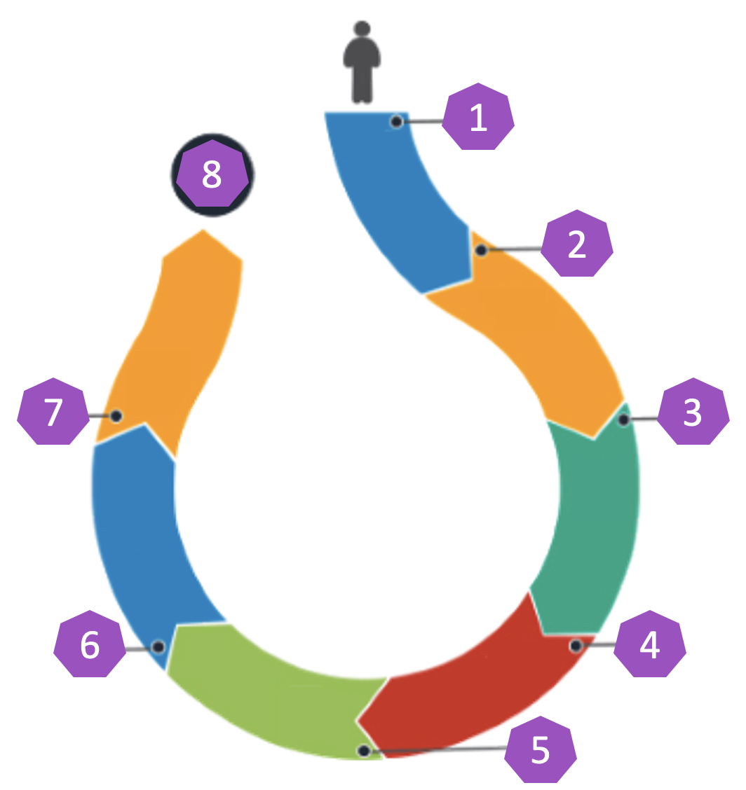
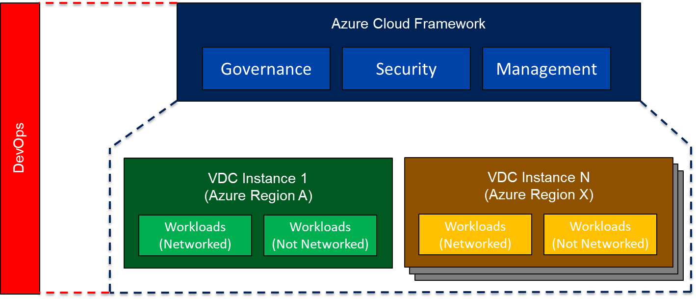

# Introduction

The purpose of this document is to describe the platform that will be deployed in Microsoft Azure to host workloads and data with governance, security, and management.

This document is the basis of the design. The document will remain “live”; the deployment will likely alter from the original design. As a result, the design document will be maintained to include changes with new versions of the document. The final release of the document from Innofactor will be included in the handover.

## Executive Summary

This document describes in detail a deployment in Microsoft Azure for a platform to host workloads and data. There are three parts to the deployment:

* **Azure Cloud Framework**: A single, global scale scaffold that provides governance, security, and management for Azure.
* **Virtual Data Centre instance**: A regional deployment that hosts Azure workloads and data. There is at least one Virtual Data Centre instance. All Virtual Data Centre instances are governed, secured, and managed by the single Azure cloud platform.
* **Workloads**: A standardised design is provided for all workloads that will be deployed. Several foundational workloads that are planned are also described.

## Document Scope

This document will include:

* The Azure Cloud Framework.
* The design for the first Virtual Data Centre instance.
* The foundational workloads that have been included in the scope of the project.

Other workloads that will later be migrated or created are not included in this document.

## Audience

The intended audience for this document includes:

* Stakeholders in the project
* IT Architects
* IT Security
* IT Governance
* IT Engineers
* IT Support Staff
* Developers that will work in the Azure environment

### Assumptions

There is an assumption that the reader of this document has basic Azure skills covering:

* Governance
* Security
* Management
* Networking
* Workload resources such as virtual machines, App Services, Key Vault, and so on.

This is a design document; it will describe functionality and technical configurations. The document will not be a form of training. Any required Azure skills development should have been completed before reading this document

## Constraints

The text of this document is limited to the previously described scope. Considerations are limited to the information that has been shared by the client with the authors of this document.

## Delivery Process

As this document lives trough the delivery process, it will be release at major milestones of the delivery.

1. Requirements and Statement of Work
2. High Level Design (Initial Pre-Workshop Version of this document)
3. Requirement Specification Workshop
4. Low Level Design (Documented architecture and deployment plan)
5. Design Deployment
6. Well Architected Review
7. Service Delivery, and Knowledge Transfer
8. Detailed Design Sign off ()

::: note
This version of the design document is a Low Level Design, or *minimally viable product*.

The purpose of this early release is to gain approval for the design and to start the necessary Azure implementation work that is a prerequisite for workload migration from on-premises to Azure.
:::

## Concept Overview

This section of the document will describe some of the concepts that have shaped the design that is described.

### Well-Architected Framework

The Microsoft Well-Architected Framework is a set of checks that are commonly done after deployment is completed. Innofactor implements as many of the checks as a part of the design before the deployment, ensuring a higher quality design and implementation.

### Azure Cloud Framework

The term, Azure Cloud Framework, is used to describe an architecture that is used to govern, secure, deploy and manage workloads with its associated data that are hosted in Microsoft Azure. The Azure Cloud Framework is deployed once, providing services that are available globally. These services are:

* **Governance:** A hierarchy for organising subscriptions, called Management Groups, enables central deployment and inheritance of Role-Based Access Control (RBAC) and Azure Policy. Storage for the auditing of Azure is provided, and a self hosted, governance service called The Concierge assists with the provisioning of Azure services.
* **Security:** The foundations of security are laid with the Azure Cloud Framework. The Role-Based Access Control framework from Governance controls who can do what and where. The monitoring system from Management collects security signals that can be used for alerting and investigations. The update management solution from Management can deliver anti-malware and security updates to virtual machines. The capability to deploy custom security solutions is provided.
* **Management:** Monitoring services with alerting capabilities are deployed for the platform and custom-developed applications. Configuration management includes update management and inventory/change tracking for virtual machines.

### Virtual Data Centre instance

A Virtual Data Centre instance is a regional deployment that is treated as an independent boundary to host workloads and or data.

A Virtual Data Centre instance may host both Platform-as-a-Service (PaaS) and Infrastructure-as-a-Service (IaaS) workloads. Delivering a Zero-trust network architecture, with deny by default flow rules, supporting private network options offered by many PaaS workloads; to deliver the required security and/or compliance classification demands of each workload.

The Virtual Data Centre instance is regional; this means that the Virtual Data Centre instance is deployed to one of the Azure regions. All resources (some exceptions may be required because of Azure requirements) must be located in the region of that Virtual Data Centre instance. This alignment is enforced using Azure Policy - overrides in the policy are used to enable required exceptions.

The boundary of the Virtual Data Centre instance serves several purposes:

* **Unit of administration**: Access to all of the resources of the Virtual Data Centre instance may be granted at the VDC level.
* **Border for compliance:** Organisations may need to keep data within a certain geography, such as Norway. A Virtual Data Centre instance is bound to an Azure region so all resources within the instance are in the country of that region.
* **Zone of governance:** All subscriptions and resources for a Virtual Data Centre instance are in a common Azure Management Group; this allows Azure Policy and RBAC to be deployed easily to all subscriptions and resources of a Virtual Data Centre instance.
* **Network connectivity:** A Virtual Data Centre instance contains a collection of virtual networks that are connected to a common core. All ingress/egress and inter-workload traffic will pass through this core. Keeping the core local to the workloads (the same Azure region) improves performance and reduces costs. Workloads, depending on their classification, can optionally be connected to these networks.
* **Security blast area:** Each instance has network firewall(s) to isolate them from other Virtual Data Centre instances in the organisation, the Internet, on-premises networks, and other cloud networks (Azure or otherwise). If there is a successful breach, inside or outside the instance, it should be mostly contained by the firewall and access should be mostly restricted by the firewalls of other instances.
* **Resilience:** The functions of a Virtual Data Centre instance should not depend on the workloads or functions of anything outside of the instance. A Virtual Data Centre instance should continue to work even if something fails in the outside world - there are limits on what can be achieved here, but this is an ambition.

### Workloads

A workload is a collection of resources that provide some functionality to the organisation. These workloads are most often defined as ‘Services’ within the business, and encapsulate the technologies required to expose a solution to its relevant customers or end users.

To assist in clarification, consider the following examples:

* A SQL database is a resource. By itself, it has technical value but has little value to the business as a useful tool service.
* An eCommerce application made up of a website, content delivery network, application tier, and databases when integrated, defines a workload (or service).

Workloads are deployed as units of governance, security and management. Workloads are deployed to a dedicated subscription, enabling easier governance, security, and management. The workload may be classified in an environment:

* Production
* Acceptance Test
* Development

The workload is associated with a Virtual Data Centre instance, thus placing the workload (and its resources) in the same region as the Virtual Data Centre instance.

Depending on the classification and technical needs of the workload, it may be connected to the network of the Virtual Data Centre instance or not. This means that PaaS resources without any private network connection are still eligible to be contained within the boundaries of a Virtual Data Centre instance for reasons other than network connectivity.

### Edge Data Centre

The term, Edge Data Centre (EDC), is taken from Microsoft nomenclature. In the context of this design, an EDC is a special workload that does not fit within the boundaries of a Virtual Data Centre instance. There are many possible reasons for this, but some may be:

* A workload requires a special form of isolation.
* A nearby Virtual Data Centre instance is in a region that does not support an Azure feature that is required by a workload.

An EDC is not a member of a Virtual Data Centre instance, but it optionally can be connected to Virtual Data Centre instances through Azure networking, the Azure backbone, or the Internet.

### Hybrid or Multi-Cloud

The use of this design does not prevent multi-cloud or hybrid deployments. This design provides a structured approach to workload/data placement, governance, security and management inside of Microsoft Azure.

The use of the Internet or private connectivity will enable multi-cloud connectivity with AWS, Oracle, Google Compute or others (not in the scope of this design).

Much of the governance, security and management platform that is included in this design may be extended to other clouds or on-premises locations through solutions such as Azure Arc (not in the scope of this design).
