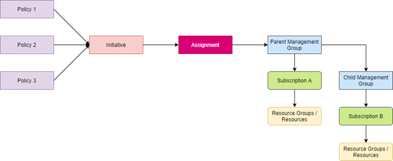
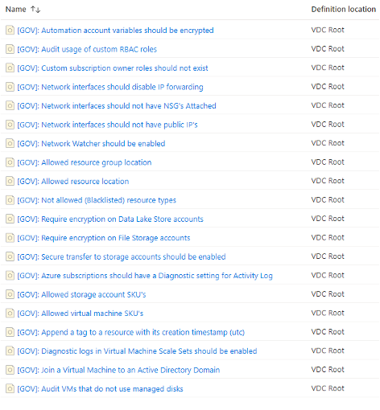
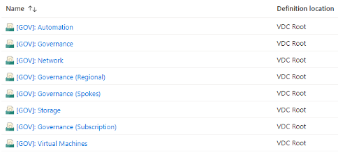
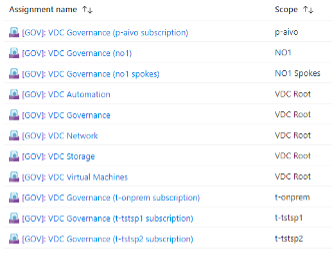

git ## Azure Policy

Business and legal requirements, recommended configurations and architecture concepts can be audited, restricted and enforced using Azure Policy.

Once defined, policies can be assigned to a scope, like a Management Group or a subscription.

To reduce number of assignments, policy definitions can be grouped into policy initiatives.

Most policies and initiatives have parameters to specialize the configuration.

If the assignment is scoped to a Management Group, then the policies contained within that assignment are effective to:

* The Management Group.
* Child Management Groups.
* All subscriptions under the Management Group.
* All resource groups and resources under the Management Group.

If the assignment is scoped to a subscription then the policies contained within that assignment are effective only to that subscription.



The policies below do not cover all aspects of auditing and policy enforcements that may be needed. They are intended as a starting point.

Policies must be reviewed and customized on a regular basis.

::: Note
All custom policy definitions and initiatives in the data center are prefixed with "\[GOV]: ".
This prefix has been omitted from the names in the tables below.
:::

### Policy definitions

The following list is an overview of all custom policy definitions in the data center.



#### Allowed resource group location

This policy enables you to restrict the locations your organization can create resource groups in. Use it to enforce your geo-compliance requirements.

One of the core concepts of the virtual data center is that workloads will be in the same region as the data center. This policy will allow you to audit for or enforce that pattern.

The following parameters are present:

* listOfAllowedLocations
  * Type: Array
  * Required: Yes
  * DisplayName: Allowed locations
  * Description: The list of locations that resource groups can be created in.
* effect
  * Type: String
  * Required: No
  * Allowed values:
    * Audit
    * Deny
    * Disabled
  * Default value: Audit
  * Description: Enable or disable the execution of the policy

::: tip
The value for locations can be obtained by running **Get-AzLocation** in PowerShell or **az account list-locations** in Azure CLI.
:::

#### Allowed resource location

This policy enables you to restrict the locations your organization can specify when deploying resources.
Use it to enforce your geo-compliance requirements.

This policy will not affect resources that use the 'global' region and the
Microsoft.AzureActiveDirectory/b2cDirectories resource type.

One of the core concepts of the virtual data center is that workloads will be in the same region as the
data center. This policy will allow you to audit for or enforce that pattern.

The following parameters are present:

* listOfAllowedLocations
  * Type: Array
  * Required: Yes
  * DisplayName: Allowed locations
  * Description: The list of locations that can be specified when deploying resources.
* effect
  * Type: String
  * Required: No
  * Allowed values:
    * Audit
    * Deny
    * Disabled
  * Default value: Audit
  * Description: Enable or disable the execution of the policy.

#### Allowed storage account SKU's

This policy enables you to specify a set of storage account SKUs that your organization can deploy.

Storage account types can affect data replication and pricing. Replication can be local, across
availability zones in a region, or between paired regions. Replication may be required by some
organizations, and that replication may be to a neighbouring data center or to the paired region
(possibly another country). Replication may be undesirable if the data is leaving a country/zone.
Choice of storage account SKU may also affect consumption costs.

The following parameters are present:

* listOfAllowedSKUs
  * Type: Array
  * Required: Yes
  * DisplayName: Allowed SKUs
  * Description: The list of SKUs that can be specified for storage accounts.
* effect
  * Type: String
  * Required: No
  * Allowed values:
    * Audit
    * Deny
    * Disabled
  * Default value: Audit
  * Description: Enable or disable the execution of the policy.

::: note
Note that the selection of available SKUs will depend on the Azure region.
:::

References:

* [Cross-region replication in Azure: Business continuity and disaster recovery](https://docs.microsoft.com/en-us/azure/availability-zones/cross-region-replication-azure#azure-regional-pairs).
* [List of possible storage account SKUs](https://docs.microsoft.com/en-us/azure/templates/microsoft.storage/storageaccounts?tabs=json#sku).

#### Allowed virtual machine SKU's

This policy enables you to specify a set of virtual machine SKUs that your organization can deploy.

The choice of virtual machine deployed can impact:

* Cost.
* The features included, which may impact security/compliance, such as secure enclave-based applications.

The following parameters are present:

* listOfAllowedSKUs
  * Type: Array
  * Required: Yes
  * DisplayName: Allowed SKUs
  * Description: The list of SKUs that can be specified for virtual machines.
* effect
  * Type: String
  * Required: No
  * Allowed values:
    * Audit
    * Deny
    * Disabled
  * Default value: Audit
  * Description: Enable or disable the execution of the policy.

::: Tip
To determine the possible virtual machine SKUs in a specific location run **Get-AzVmSize -Location {location}** in Azure PowerShell or **az vm list-sizes --location {location}** in Azure CLI.
:::

#### Append a tag to a resource with its creation timestamp (utc)

Appends the creation date and time (UTC) when the resource group was created.

The policy will not modify the tags of resources created before the policy was applied, unless the resource is changed.

It can be difficult to identify when a resource was created without investigating the activity log.
This policy, if enabled, will automatically tag resources with the date and time (UTC) of resource creation.

The following parameters are present:

* tagName
  * Type: String
  * Required: Yes
  * DisplayName: Tag Name
  * Description: Name of the tag, such as 'CreatedBy'.

#### Audit usage of custom RBAC roles

Audit usage of custom roles. They should be treated as an exception and only be used after a rigorous review.

Custom roles can be created in Azure AD to create custom permissions. Without careful planning, implementation, and control, these roles can create security vulnerabilities.

The following parameters are present:

* effect
  * Type: String
  * Required: No
  * Allowed values:
    * Audit
    * Disabled
  * Default value: Audit
  * Description: Enable or disable the execution of the policy.

#### Audit VMs that do not use managed disks

This policy audits virtual machine disks to ensure that managed disks are used.

Managed disk is the recommended form of storage for virtual machines in Azure. Unmanaged disks offer fewer recoverability, availability, performance, and operational features, and will eventually go end-of-life.  This policy will scan virtual machines to audit for or deny the usage of unmanaged disks.

Note that some third-party appliances from the Azure marketplace will use unmanaged disks.

The following parameters are present:

* effect
  * Type: String
  * Required: No
  * Allowed values:
    * Audit
    * Deny
    * Disabled
  * Default value: Audit
  * Description: Enable or disable the execution of the policy.

#### Automation account variables should be encrypted

This policy will audit that automation account variables are encrypted to ensure sensitive data are protected.

The following parameters are present:

* effect
  * Type: String
  * Required: No
  * Allowed values:
    * Audit
    * Deny
    * Disabled
  * Default value: Audit
  * Description: Enable or disable the execution of the policy.

#### Azure subscriptions should have a Diagnostic setting for Activity Log

This policy ensures if a Diagnostic setting is enabled for exporting activity logs. It audits if there is no Diagnostic setting created to export the logs to a storage account.

Activity log records the [activities](https://docs.microsoft.com/en-us/azure/azure-monitor/essentials/activity-log-schema#categories)
that occur within the boundaries of a subscription.

The data is retained for 90 days. Some organisations may require data to be retained for longer. Azure storage accounts can offer an affordable location to store such data with automated deletion to comply with data retention laws. This policy can audit each subscription to ensure that it is exporting data to a storage account.

The following parameters are present:

* effect
  * Type: String
  * Required: No
  * Allowed values:
    * AuditIfNotExists
    * Disabled
  * Default value: AuditIfNotExists
  * Description: Enable or disable the execution of the policy.

#### Custom subscription owner roles should not exist

This policy ensures that no custom subscription owner roles exist.

Custom roles can be created in Azure AD to create custom permissions. Without careful planning, implementation, and control, these roles can create security vulnerabilities.

The following parameters are present:

* effect
  * Type: String
  * Required: No
  * Allowed values:
    * Audit
    * Deny
    * Disabled
  * Default value: Audit
  * Description: Enable or disable the execution of the policy.

#### Diagnostic logs in Virtual Machine Scale Sets should be enabled

It is recommended to enable logs so that activity trail can be recreated when investigations are required in the event of an incident or a compromise.

This policy will audit to see if virtual machines are configured for diagnostic logging.

The following parameters are present:

* effect
  * Type: String
  * Required: No
  * Allowed values:
    * AuditIfNotExists
    * Disabled
  * Default value: AuditIfNotExists
  * Description: Enable or disable the execution of the policy.

#### Join a Virtual Machine to an Active Directory Domain

Many legacy and cloud-first workloads require virtual machines that are domain joined. This policy, if assigned and configured, can automatically join virtual machines.

The following parameters are present:

* domainFQDN
  * Type: String
  * Required: Yes
  * DisplayName: Domain name
  * Description: The fully qualified domain name of the Active Directory Domain Services domain.
* ouPath
  * Type: String
  * Required: Yes
  * DisplayName: OU Path
  * Description: The LDAP format path to the OU that the computer object will reside in.
* listOfImageIdToInclude
  * Type: Array
  * Required: Yes
  * DisplayName: Marketplace image IDs
  * Description: A list of marketplace images that will be subject to this policy.

#### Network interfaces should disable IP forwarding

This policy denies the network interfaces which enable IP forwarding. The setting of IP forwarding disables Azure's check of the source and destination for a network interface. This should be reviewed by the network security team.

IP Forwarding allows a virtual machine to function as a router (including firewall appliances).

This allows the virtual machine to act as a person-in-the-middle, receiving packets from a source, and forwarding those packets with the original sender information in the packet. In the wrong hands, this can be used to breach security and governance. This functionality should be strictly limited to appliances that perform router (including firewall appliances) functions. Any approval or override of this policy should be reviewed and strictly controlled.

The following parameters are present:

* effect
  * Type: String
  * Required: No
  * Allowed values:
    * Audit
    * Deny
    * Disabled
  * Default value: Audit
  * Description: Enable or disable the execution of the policy.

#### Network interfaces should not have NSG's Attached

This policy checks to ensure an NSG is not allocated to every virtual network interface.

The best practice for implementing NSGs is to create them and associate them with subnets.
Associating NSGs with virtual machine NICs:

* Can be done but it is not scalable.
* Does not account for the need to implement NSGs for PaaS resources at the subnet level.
* Leads to possible complexity and troubleshooting issues when NSGs are deployed to both subnets and NICs.

Note that this policy can negatively affect some resource deployments that must have a NIC-assigned NSG, such as a Citrix worker pool. In those approved cases, the policy should be overridden in the assignment.

The following parameters are present:

* effect
  * Type: String
  * Required: No
  * Allowed values:
    * Audit
    * Deny
    * Disabled
  * Default value: Audit
  * Description: Enable or disable the execution of the policy.

#### Network interfaces should not have public IP's

This policy denies the network interfaces which are configured with any public IP. Public IP addresses allow internet resources to communicate inbound to Azure resources, and Azure resources to communicate outbound to the internet. This should be reviewed by the network security team.

Public IP addresses (or PIPs) provide an entry into a workload that can bypass the security and governance systems of a Microsoft Azure network such as a data center. This policy will allow control over public IP addresses.

Note that this policy can negatively affect some resource deployments that must have a public IP address. In those approved cases, the policy should be overridden in the assignment.

The following parameters are present:

* effect
  * Type: String
  * Required: No
  * Allowed values:
    * Audit
    * Deny
    * Disabled
  * Default value: Audit
  * Description: Enable or disable the execution of the policy.

#### Network Watcher should be enabled

Network watcher is a regional service that monitor traffic in and out of Azure virtual networks and provides useful troubleshooting tools to aid in diagnosing network problems.

A feature of network watcher is NSG flow logs, enabling each flow (conversation, not packet) that attempts to pass through an NSG to be logged to a storage account. An extension of NSG flow logs is log analytics traffic analytics (in supported Azure regions) that will periodically consume the hourly logs into traffic analytics for additional work:

* Classification of flows as benign or malicious.
* Easy query using KQL.
* Reporting through workbooks or Power BI.
* Forwarding data to Microsoft Sentinel for threat analytics and complex incident detection.

Network watcher must be enabled on a per-subscription basis for each required Azure region. This policy will allow you to audit that network watcher is enabled in necessary regions for each subscription.

The following parameters are present:

* listOfLocations
  * Type: Array
  * Required: Yes
  * DisplayName: Locations
  * Description: List of regions where network watcher should be enabled.
* effect
  * Type: String
  * Required: No
  * Allowed values:
    * AuditIfNotExists
    * Disabled
  * Default value: AuditIfNotExists
  * Description: Enable or disable the execution of the policy.

#### Not allowed (Blacklisted) resource types

This policy can audit or deny specified resource types from being deployed to the scopes where the policy is assigned.

An organization may decide that some resource types are unsuitable for deployment for many reasons, for example:

* Lack of compliance with industrial/legal requirements.
* Excessive cost.
* Security concerns.

The following parameters are present:

* listOfResourceTypesNotAllowed
  * Type: Array
  * Required: Yes
  * DisplayName: Not allowed resource types
  * Description: The list of resource types that cannot be deployed.
* effect
  * Type: String
  * Required: No
  * Allowed values:
    * Audit
    * Deny
    * Disabled
  * Default value: Audit
  * Description: Enable or disable the execution of the policy.

References:

* [Azure Resource Graph table and resource type reference](https://docs.microsoft.com/en-us/azure/governance/resource-graph/reference/supported-tables-resources).

#### Require encryption on Data Lake Store accounts

This policy ensures encryption is enabled on all Data Lake Store accounts.

The large amount of data stored in a Data Lake Store may be subject to encryption requirements in your governance policy. This policy can be used to audit for or enforce compliance.

The following parameters are present:

* effect
  * Type: String
  * Required: No
  * Allowed values:
    * Audit
    * Deny
    * Disabled
  * Default value: Audit
  * Description: Enable or disable the execution of the policy.

#### Require encryption on File Storage accounts

The large amount of data stored in Azure file shares may be subject to encryption requirements. This policy can be used to audit for or enforce compliance.

The following parameters are present:

* effect
  * Type: String
  * Required: No
  * Allowed values:
    * Audit
    * Deny
    * Disabled
  * Default value: Audit
  * Description: Enable or disable the execution of the policy.

#### Secure transfer to storage accounts should be enabled

Audit or deny storage account that don't have secure transfer enabled. This is an option that force a storage account to accept requests only from secure connections (HTTPS). Use of HTTPS ensures authentication between the server and the service and protects data in transit from network layer attacks such as man-in-the-middle, eavesdropping, and session-hijacking.

Data being transferred to and from a storage account can cross the public backbone of Microsoft Azure, the Internet, or your private networks in clear text, depending on the client location. You may wish to force encryption for privacy or for in-transit compliance, even in a private data transfer scenario.

The following parameters are present:

* effect
  * Type: String
  * Required: No
  * Allowed values:
    * Audit
    * Deny
    * Disabled
  * Default value: Audit
  * Description: Enable or disable the execution of the policy.

### Policy Initiatives

The following is an overview of all custom policy initiatives in the data center.



#### Automation initiative

Policies to enable cloud automation governance standards.

Policy definitions included:

* Automation account variables should be encrypted.

The following parameters are present:

* auditEffect
  * Type: String
  * Required: No
  * Allowed values:
    * Audit
    * Deny
    * Disabled
  * Default value: Audit
  * Description: Enable or disable the execution of the policy. Audit, Deny or Disabled.

#### Governance initiative

Policies to enable core cloud governance standards.

Policy definitions included:

* Append a tag to a resource with its creation timestamp (utc).
* Audit usage of custom RBAC roles.
* Azure subscriptions should have a Diagnostic setting for Activity Log
* Custom subscription owner roles should not exist

The following parameters are present:

* tagName
  * Type: String
  * Required: No
  * DisplayName: Tag Name
  * Default value: CreatedOn
  * Description: Name of the tag, such as 'CreatedBy'.
* auditEffect
  * Type: String
  * Required: No
  * Allowed values:
    * Audit
    * Deny
    * Disabled
  * Default value: Audit
  * Description: Enable or disable the execution of the policy.
* existEffect
  * Type: String
  * Required: No
  * Allowed values:
    * AuditIfNotExists
    * Disabled
  * Default value: AuditIfNotExists
  * Description: Enable or disable the execution of the policy.

#### Governance (Regional) initiative

Policies to enable core cloud governance for data center regions.

Policy definitions included:

* Allowed resource group location.
* Allowed resource location.
* Network Watcher should be enabled.

The following parameters are present:

* listOfLocations
  * Type: Array
  * Required: Yes
  * DisplayName: Allowed locations
  * Description: The list of allowed locations.
* auditEffect
  * Type: String
  * Required: No
  * Allowed values:
    * Audit
    * Deny
    * Disabled
  * Default value: Audit
  * Description: Enable or disable the execution of the policy.
* existEffect
  * Type: String
  * Required: No
  * Allowed values:
    * AuditIfNotExists
    * Disabled
  * Default value: AuditIfNotExists
  * Description: Enable or disable the execution of the policy.

#### Governance (Spokes) initiative

Policies to enable core cloud governance for data center spokes.

Policy definitions included:

* Not allowed (Blacklisted) resource types.

The following parameters are present:

* listOfResourceTypesNotAllowed
  * Type: Array
  * Required: Yes
  * DisplayName: Not allowed resource types
  * Description: The list of resource types that cannot be deployed.
* effect
  * Type: String
  * Required: No
  * Allowed values:
    * Audit
    * Deny
    * Disabled
  * Default value: Audit
  * Description: Enable or disable the execution of the policy.

#### Governance (Subscription) initiative

Policies to enable core cloud governance for data center spoke subscriptions.

* Allowed storage account SKU's.
* Allowed virtual machine SKU's.

The following parameters are present:

* listOfAllowedStoreSKUs
  * Type: Array
  * Required: Yes
  * DisplayName: Allowed Storage SKUs
  * strongType: StorageSKUs
  * Description: The list of SKUs that can be specified for storage accounts.
* listOfAllowedVMSKUs
  * Type: Array
  * Required: Yes
  * DisplayName: Allowed VM SKUs
  * strongType: VMSKUs
  * Description: The list of SKUs that can be specified for virtual machines.
* existEffect
  * Type: String
  * Required: No
  * Allowed values:
    * Audit
    * Deny
    * Disabled
  * Default value: Audit
  * Description: Enable or disable the execution of the policy.

#### Network initiative

Policies to enable cloud network governance standards.

Policy definitions included:

* Network interfaces should disable IP forwarding.
* Network interfaces should not have NSG's Attached.
* Network interfaces should not have public IP's.

The following parameters are present:

* auditEffect
  * Type: String
  * Required: No
  * Allowed values:
    * Audit
    * Deny
    * Disabled
  * Default value: Audit
  * Description: Enable or disable the execution of the policy.

#### Storage initiative

Policies to enable cloud storage governance standards.

Policy definitions included:

* Require encryption on Data Lake Store accounts.
* Require encryption on File Storage accounts.
* Secure transfer to storage accounts should be enabled.

The following parameters are present:

* auditEffect
  * Type: String
  * Required: No
  * Allowed values:
    * Audit
    * Deny
    * Disabled
  * Default value: Audit
  * Description: Enable or disable the execution of the policy.

#### Virtual Machines initiative

Policies to enable cloud automation governance standards for virtual machines.

Policy definitions included:

* Audit VMs that do not use managed disks.
* Diagnostic logs in Virtual Machine Scale Sets should be enabled.

The following parameters are present:

* existEffect
  * Type: String
  * Required: No
  * Allowed values:
    * Audit
    * Deny
    * Disabled
  * Default value: Audit
  * Description: Enable or disable the execution of the policy.
* auditEffect
  * Type: String
  * Required: No
  * Allowed values:
    * AuditIfNotExists
    * Disabled
  * Default value: AuditIfNotExists
  * Description: Enable or disable the execution of the policy.

### Policy assignments



#### VDC Automation

Organizational wide policies for the operations and audit of the virtual data center automation.

initiative: Automation

Scope: Management Group **VDC Root**

The following parameters are present:

* existEffect
  * Type: String
  * Assigned value: Audit

#### VDC Governance

Organizational wide policies for the operations and audit of the virtual data center.

initiative: Governance

Scope: Management Group **VDC Root**

The following parameters are present:

* auditEffect
  * Type: String
  * Assigned value: Audit
* existEffect
  * Type: String
  * Assigned value: AuditIfNotExists
* tagName
  * Type: String
  * Assigned value: CreatedOn

#### VDC Governance (data center name)

Regional policies for the operations and audit of the virtual data center.

initiative: Governance (Regional)

Scope: Each individual data center Management Group, for example **WE1**

The following parameters are present:

* auditEffect
  * Type: String
  * Assigned value: Deny
* existEffect
  * Type: String
  * Assigned value: AuditIfNotExists
* listOfLocations
  * Type: Array
  * Assigned value: The data center location, for example:

```json
[
  "westeurope"
]
```

#### VDC Governance ({data center name} Spokes)

Regional policies for the operations and audit of the virtual data center spokes.

initiative: Governance (Spokes)

Scope: Each individual data center Spokes Management Group, for example **WE1 Spokes**

The following parameters are present:

* auditEffect
  * Type: String
  * Assigned value: Deny
* listOfResourceTypesNotAllowed
  * Type: Array
  * Assigned value:

```json
[
  "Microsoft.Network/publicIPAddresses",
  "Microsoft.Network/azureFirewalls",
  "Microsoft.Network/virtualNetworkGateways",
  "Microsoft.Network/applicationGateways"
]
```

#### VDC Governance ({subscription name} subscription)

Regional policies for the operations and audit of the virtual data center subscription.

initiative: Governance (Subscription)

Scope: Each individual subscription, for example **t-tstsp1**

The following parameters are present:

* existEffect
  * Type: String
  * Assigned value: Deny
* listOfAllowedVMSKUs
  * Type: Array
  * Assigned value:

```json
[
  "Standard_A1_v2", "Standard_A2_v2", "Standard_A4_v2",
  "Standard_B1s", "Standard_B1ms", "Standard_B2s",
  "Standard_B2ms", "Standard_B4ms", "Standard_D1_v2",
  "Standard_D2s_v3", "Standard_D2s_v4", "Standard_D4s_v4",
  "Standard_DS1_v2", "Standard_DS2_v2", "Standard_D3_v2",
  "Standard_DS3_v2", "Standard_F1s", "Standard_F2s_v2",
  "Standard_F4s_v2"
]
```

* listOfAllowedStoreSKUs
  * Type: Array
  * Assigned value:

```json
[
  "Standard_LRS", "Standard_GRS", "Standard_ZRS",
  "Premium_LRS", "Premium_ZRS"
]
```

#### VDC Network

Organizational wide policies for the operations and audit of the virtual data center networks.

initiative: Network

Scope: Management Group **VDC Root**

The following parameters are present:

* existEffect
  * Type: String
  * Assigned value: Deny

#### VDC Storage

Organizational wide policies for the operations and audit of the virtual data center storage.

initiative: Storage

Scope: Management Group **VDC Root**

The following parameters are present:

* existEffect
  * Type: String
  * Assigned value: Audit

#### VDC Virtual Machines

Organizational wide policies for the operations and audit of the virtual data center virtual machines.

initiative: Virtual Machines

Scope: Management Group **VDC Root**

The following parameters are present:

* existEffect
  * Type: String
  * Assigned value: Audit
* auditEffect
  * Type: String
  * Assigned value: AuditIfNotExists

### Overriding a policy assignment

A policy assignment, such as VDC Governance ({data center name} Spokes) will prevent the deployment of **Azure Bastion** and public IP addresses (required by Azure Bastion). To deploy Azure Bastion with a workload, a precise override is required for the assignment.

If using infrastructure as code, the override must be added in code. For example, if the code is stored in a file called `policy.json` and in that file there is a deployment called **mg.arm.policyassignment.1**, then to allow Bastion and a public IP to be deployed the resource group ID can be added in the notScopes list like this:

```json
"notScopes": [
  "/subscriptions/ffffffff-1111-cccc-2222-dddddddddddd/resourceGroups/p-app-network"
]
```

This approach restricts the overrides to that exact resource group. To be even more restrictive, use the full resource ID of the Bastion resources and the public IP. This will ensure that only specific resource instances of the restricted resource type will be allowed, e.g. only one Bastion can be deployed to that resource group and it must have that specific name.

```json
"notScopes": [
  "/subscriptions/ffffffff-1111-cccc-2222-dddddddddddd/resourceGroups/p-app-network/providers/Microsoft.Network/publicIPAddresses/p-no1bst-network-bastion-pip001"
]
```
