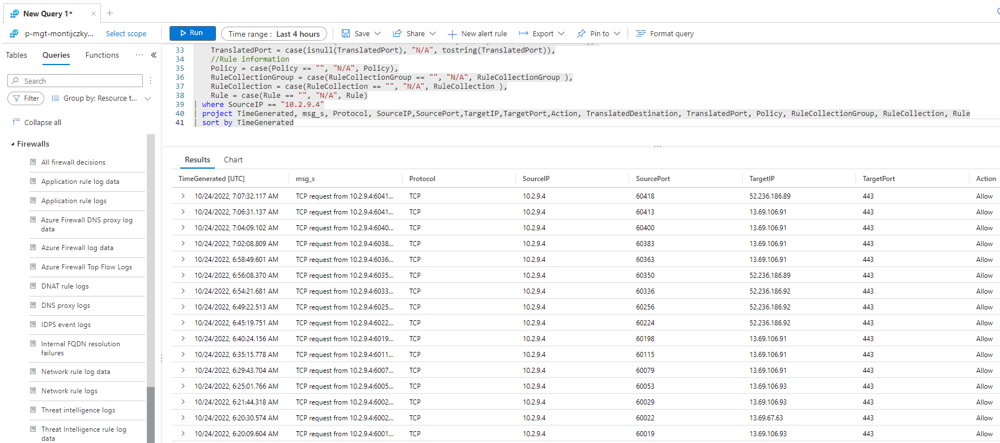

## Management (`p-mgt`)

The `p-mgt` subscription hosts components related to systems management.

### Subscription Configuration

The configuration of the subscription is described below.

#### Role-Based Access Control

Access to this subscription should be restricted to those supporting and operating the contained components. There are 3 Azure AD access groups to control access to the subscription and the contained resource groups and resources.:

| Group Name                    | Role        | Description                                                                                            |
| ----------------------------- | ----------- | ------------------------------------------------------------------------------------------------------ |
| AZ RBAC sub p-mgt Owner       | Owners      | Members have full permissions, including permissions. This group is ideally empty.                     |
| AZ RBAC sub p-mgt Contributor | Contributor | Members have full permissions, excluding permissions. This group has as few human members as possible. |
| AZ RBAC sub p-mgt Reader      | Reader      | Members are limited to read permissions only. Ideally, this is where most human members are placed.    |

#### Diagnostics Settings

The diagnostics settings of the subscription are configured to send the Activity Log data of this subscription to two destinations:

* **Long-term audit logging**: Blob storage in the `p-gov-log` resource group in the `p-gov` subscription that is configured for read only, economic, long-term storage for legal and compliance purposes.
* **Platform monitoring**: A Log Analytics Workspace in the `p-mgt-mon` resource group in the `p-mgt` subscription for query-enabled functionality such as searching, reporting, and security monitoring.

The diagnostics setting for the subscription is configured as follows:

* Logs:
  * Categories:
    * Administrative: `Enabled`
    * Security: `Enabled`
    * ServiceHealth: `Enabled`
    * Alert: `Enabled`
    * Recommendation: Enabled
    * Policy: Enabled
    * Autoscale: Enabled
    * ResourceHealth: Enabled
* Destination Details:
  * Send To Log Analytics Workspace: Enabled
    * Subscription: `p-mgt`
    * Log Analytics Workspace: `p-mgt-montijczky7je-ws`
  * Archive To Storage Account: Enabled
    * Subscription: `p-gov`
    * Storage Account: `pgovlogauditxnlolmbkkxb`

#### Microsoft Defender for Cloud

Security and compliance features are provided by Microsoft Defender for Cloud. There are two tiers:

* **Free**: Basic features and configurations are possible.
* **Paid**: Special security monitoring features for resources can be enabled per-support resource type.

The configurations for this subscription are configured as follows:

##### Defender Plans

The plans are configure as follows:

* Cloud Security Posture management: Grey Out
* Servers: Off
* App Service: Off
* Databases: Off
* Storage: On
* Containers: Off
* Kubernetes: Off
* Container Registries: Off
* Key Vault: `Off`
* Resource Manager: On
* DNS: Off

##### Auto Provisioning

The deployment of extensions is configured as follows:

* Log Analytics Agent/Azure Monitor Agent: On
  * Agent Type: Log Analytics
  * Custom Workspace: p-mgt-montijczky7je-ws
  * Security Events Storage: Minimal
* Vulnerability Assessment for Machines: Off
* Guest Configuration Agent: Off
* Microsoft Defender for Containers Components: Off

##### Email Notifications

Notifications are configured as follows:

* Email Recipients:
  * All Users With The Following Roles: Owner, Contributor
  * Additional Email Addresses: A distribution list to be provided
* Notification Types:
  * Notify About Alerts With The Following Severity (Or Higher): Medium

##### Integrations

The following integrations are configured:

* Enable Integrations:
  * Allow Microsoft Defender for Cloud Apps To Access My Data: True
  * Allow Microsoft Defender for Endpoint To Access My Data: True

#### Workflow Automation

No configurations are included.

##### Continuous Export

No configurations are included.

### Components

The following components are hosted in the subscription:

* Platform Monitoring (`p-mgt-mon`)
* Application Monitoring (`p-mgt-apm`)
* Configuration management (`p-mgt-auto`)
* Cloud Shell (`p-mgt-shl`)

#### Platform Monitoring (`p-mgt-mon`)

The purpose of Platform Monitoring is to provide a central place to store metrics and logs related to the monitoring of Azure subscriptions and resources.

##### Overview

Azure subscriptions and resources can produce metrics and logs for auditing and monitoring purposes. This data is configured in each source subscription and resource to be sent to a central Log Analytics Workspace. Here, the data can be queried for:

* Troubleshooting
* Alerting
* Workbooks
* Integration into other services, such as Microsoft Sentinel

There are many sources of data. They typically break down into two categories:

* **Azure Subscriptions**: The Activity Log data is sent to the Log Analytics Workspace. Here the data can be used for querying, alerting, visualisations, and shared with Microsoft Sentinel for Unified Entity Behaviour Analysis.
* **Resource**: Resources such as Azure Firewall produce metrics data that can be used to measure performance and logs to understand past actions and successes/failures.

A central repository has advantages:

* A unified view with complex queries across subscriptions and resources is possible.
* Alerts that must otherwise be created in each/every subscription can be created once, based on a query of the data in the Log Analytics Workspace. For example, this can simplify the detection of maintenance or health alerts in Azure subscriptions (Activity Log).

Alerts of the type, Scheduled Query Rules (alerts), can be created in the Log Analytics Workspace. When a query produces an unwanted result, an alert can trigger an Action Group in Azure Monitor for a desired automated response, such as sending an email or sending a secure webhook.

The platform monitoring Log Analytics Workspace is also used to store data for other components, including:

* Microsoft Sentinel (if used)
* Azure Automation Inventory & Change Tracking
* Azure Automation Update Management

##### Resource Groups

The resource group, `p-mgt-mon`, is created in the `p-mgt` subscription, which is in the Management Group called `Management`.

A lock is placed on the resource group:

* **Resource Group Lock**: resourceGroupDoNotDelete
  * Lock Type: Delete

The resources in this resource group are:

* **Log Analytics Workspace**: `p-mgt-montijczky7je-ws`
  * Purpose: `Store and process metrics and logs data for the platform - Azure subscriptions and resources`
  * Pricing Tier: `Pay-as-you-go (PerGB2018)`
  * Access Control: `Use resource or workspace permissions`
  * Retention In Days: `365`
* **Solutions**:
  * Purpose: `Provide Microsoft solutions for features used in the Workspace`
  * Solutions:
    * `AzureActivity`
    * `ChangeTracking`
    * `InfrastructureInsights`
    * `KeyVaultAnalytics`
    * `Security`
    * `SecurityCentreFree`
    * `ServiceMap`
    * `Updates`
    * `VMInsights`
* **Workbooks**:
  * Purpose: Innofactor-created workbooks to visualise metrics and logs via Azure Monitor.
  * Workbooks:
    * `Azure Resource Changes`
    * `Azure Firewall`
    * `Azure Inventory`
    * `Azure Network`
    * `Azure Virtual Machines`

##### Scheduled Query Rules

The following alerts are deployed to p-mgt-mon to enabled centralised alerting based on the data stored in the Platform Monitoring Log Analytics Workspace.

* **Scheduled Query Rule**: `Azure emergency maintenance`
  * Query: `AzureActivity|where CategoryValue=='ServiceHealth' and Level!='Informational'|extend IncidentType=tostring(parse_json(tostring(parse_json(Properties).eventProperties)).incidentType)|extend Stage=tostring(parse_json(tostring(parse_json(Properties).eventProperties)).stage)|where IncidentType=='Maintenance' and Stage!='Canceled' and Stage!='Resolved' and Stage!='Complete'|extend StartTime=tostring(parse_json(tostring(parse_json(Properties).eventProperties)).impactStartTime)|extend IssueName=tostring(parse_json(tostring(parse_json(Properties).eventProperties)).defaultLanguageTitle)|extend TrackingId=tostring(parse_json(tostring(parse_json(Properties).eventProperties)).trackingId)|extend Service=tostring(parse_json(tostring(parse_json(Properties).eventProperties)).service)|extend Region=tostring(parse_json(tostring(parse_json(Properties).eventProperties)).region)|extend Communication=tostring(parse_json(tostring(parse_json(Properties).eventProperties)).communication)|project StartTime,IssueName,TrackingId,Stage,SubscriptionId,Service,Region,Communication`
  * Conditions: `Table Rows > 0`
  * Actions:
    * `p-mgt-mon-ops-warning-ag`
  * Alert Rule Details:
    * Description: `Azure has upcoming or ongoing emergency maintenance that can affect the availability of services. Please investigate.`
    * Severity: `2 - Warning`
* **Scheduled Query Rule**: `Azure health advisory (Action required)`
  * Query: `AzureActivity|where CategoryValue=='ServiceHealth'|extend IncidentType=tostring(parse_json(tostring(parse_json(Properties).eventProperties)).incidentType)|extend Stage=tostring(parse_json(tostring(parse_json(Properties).eventProperties)).stage)|where IncidentType=='ActionRequired' and Stage=='Active'|extend StartTime=tostring(parse_json(tostring(parse_json(Properties).eventProperties)).impactStartTime)|extend IssueName=tostring(parse_json(tostring(parse_json(Properties).eventProperties)).defaultLanguageTitle)|extend TrackingId=tostring(parse_json(tostring(parse_json(Properties).eventProperties)).trackingId)|extend Service=tostring(parse_json(tostring(parse_json(Properties).eventProperties)).service)|extend Region=tostring(parse_json(tostring(parse_json(Properties).eventProperties)).region)|extend Communication=tostring(parse_json(tostring(parse_json(Properties).eventProperties)).communication)|project StartTime,IssueName,TrackingId,SubscriptionId,Service,Region,Communication`
  * Conditions: `Table Rows > 0`
  * Actions:
    * `p-mgt-mon-ops-info-ag`
  * Alert Rule Details:
    * Description: `Administrator action is required to prevent impact to existing services. Please investigate.`
    * Severity: `3 - Informational`
* **Scheduled Query Rule**: `Azure health advisory (Informational)`
  * Query: `AzureActivity|where CategoryValue=='ServiceHealth'|extend IncidentType=tostring(parse_json(tostring(parse_json(Properties).eventProperties)).incidentType)|extend Stage=tostring(parse_json(tostring(parse_json(Properties).eventProperties)).stage)|where IncidentType=='Informational' and Stage=='Active'|extend StartTime=tostring(parse_json(tostring(parse_json(Properties).eventProperties)).impactStartTime)|extend IssueName=tostring(parse_json(tostring(parse_json(Properties).eventProperties)).defaultLanguageTitle)|extend TrackingId=tostring(parse_json(tostring(parse_json(Properties).eventProperties)).trackingId)|extend Service=tostring(parse_json(tostring(parse_json(Properties).eventProperties)).service)|extend Region=tostring(parse_json(tostring(parse_json(Properties).eventProperties)).region)|extend Communication=tostring(parse_json(tostring(parse_json(Properties).eventProperties)).communication)|project StartTime,IssueName,TrackingId,SubscriptionId,Service,Region,Communication`
  * Conditions: `Table Rows > 0`
  * Actions:
    * `p-mgt-mon-ops-info-ag`
  * Alert Rule Details:
    * Description: `Administrator may be required to prevent impact to existing services. Please investigate.`
    * Severity: `3 - Informational`
* **Scheduled Query Rule**: `Azure Policy is not compliant (Audit)`
  * Query: `AzureActivity|where CategoryValue=='Administrative' and Type=='AzureActivity' and OperationNameValue contains '/policies/'|extend p=todynamic(Properties)|where p.isComplianceCheck=='False'|extend policies=todynamic(tostring(p.policies))|mvexpand policy=policies|where policy.policyDefinitionEffect=~'Audit'|extend Policy=iff(isnull(tolong(policy.policyDefinitionReferenceId)),policy.policyDefinitionReferenceId,policy.policyDefinitionName)|project TimeGenerated,PolicyAssignment=policy.policyAssignmentName,Policy,Subscription=p.subscriptionId,ResourceGroup=tolower(p.resourceGroup),ResourceProvider=tolower(p.resourceProviderValue),Resource=p.resource,Caller,CallerIpAddress`
  * Conditions: `Table Rows > 0`
  * Actions:
    * `p-mgt-mon-ops-critical-ag`
  * Alert Rule Details:
    * Description: `Azure Policy found Non-compliant resource(s) during audit.`
    * Severity: `0 - Critical`
* **Scheduled Query Rule**: `Azure Recommendation`
  * Query: `AzureActivity|where CategoryValue=='Recommendation'|extend p=todynamic(Properties)|extend Category=tostring(parse_json(Properties).recommendationCategory)|extend Impact=tostring(parse_json(Properties).recommendationImpact)|extend Recommendation=tostring(parse_json(Properties).recommendationName)|extend ResourceLink=tostring(parse_json(Properties).recommendationResourceLink)|project TimeGenerated,Category,Impact,Recommendation,ResourceLink,Subscription=p.subscriptionId,ResourceGroup=tolower(p.resourceGroup),ResourceProvider=tolower(p.resourceProviderValue),Resource=p.resource`
  * Conditions: `Table Rows > 0`
  * Actions:
    * `p-mgt-mon-ops-info-ag`
  * Alert Rule Details:
    * Description: `Azure has one or more recommendation you should consider.`
    * Severity: `3 - Informational`
* **Scheduled Query Rule**: `Azure Resource is degraded`
  * Query: `AzureActivity|where CategoryValue=='ResourceHealth'|extend p=todynamic(Properties)|extend Cause=tostring(parse_json(tostring(p.eventProperties)).cause)|extend Status=tostring(parse_json(tostring(p.eventProperties)).currentHealthStatus)|extend PreviousStatus=tostring(parse_json(tostring(p.eventProperties)).previousHealthStatus)|extend EventType=tostring(parse_json(tostring(p.eventProperties)).type)|extend Event=tostring(parse_json(tostring(p.eventProperties)).details)|extend ep=tostring(p.eventProperties)|extend i1=indexof(ep,'title')+8|extend s1=substring(ep,i1)|extend i2=indexof(s1,'"')|extend Description=substring(s1,0,i2)|where Cause!='UserInitiated' and PreviousStatus=='Available' and Status=='Degraded'|project TimeGenerated,ActivityStatus=p.activityStatusValue,Cause,Status,Description,EventType,Event,Subscription=p.subscriptionId,ResourceGroup=tolower(p.resourceGroup),ResourceProvider=tolower(p.resourceProviderValue),Resource=p.resource`
  * Conditions: `Table Rows > 0`
  * Actions:
    * `p-mgt-mon-ops-warning-ag`
  * Alert Rule Details:
    * Description: `One or more Azure resource(s) have changed from being available to become degraded.`
    * Severity: `2 - Warning`
* **Scheduled Query Rule**: `Azure Resource is not available`
  * Query: `AzureActivity|where CategoryValue=='ResourceHealth'|extend p=todynamic(Properties)|extend Cause=tostring(parse_json(tostring(p.eventProperties)).cause)|extend Status=tostring(parse_json(tostring(p.eventProperties)).currentHealthStatus)|extend PreviousStatus=tostring(parse_json(tostring(p.eventProperties)).previousHealthStatus)|extend EventType=tostring(parse_json(tostring(p.eventProperties)).type)|extend Event=tostring(parse_json(tostring(p.eventProperties)).details)|extend ep=tostring(p.eventProperties)|extend i1=indexof(ep,'title')+8|extend s1=substring(ep,i1)|extend i2=indexof(s1,'"')|extend Description=substring(s1,0,i2)|where Cause!='UserInitiated' and PreviousStatus=='Available' and Status=='Unavailable'|project TimeGenerated,ActivityStatus=p.activityStatusValue,Cause,Status,Description,EventType,Event,Subscription=p.subscriptionId,ResourceGroup=tolower(p.resourceGroup),ResourceProvider=tolower(p.resourceProviderValue),Resource=p.resource`
  * Conditions: `Table Rows > 0`
  * Actions:
    * `p-mgt-mon-ops-critical-ag`
  * Alert Rule Details:
    * Description: `One or more Azure resource(s) have changed from being available to become unavailable.`
    * Severity: `0 - Critical`
* **Scheduled Query Rule**: `Azure Resource status is unknown`
  * Query: `AzureActivity|where CategoryValue=='ResourceHealth'|extend p=todynamic(Properties)|extend Cause=tostring(parse_json(tostring(p.eventProperties)).cause)|extend Status=tostring(parse_json(tostring(p.eventProperties)).currentHealthStatus)|extend PreviousStatus=tostring(parse_json(tostring(p.eventProperties)).previousHealthStatus)|extend EventType=tostring(parse_json(tostring(p.eventProperties)).type)|extend Event=tostring(parse_json(tostring(p.eventProperties)).details)|extend ep=tostring(p.eventProperties)|extend i1=indexof(ep,'title')+8|extend s1=substring(ep,i1)|extend i2=indexof(s1,'"')|extend Description=substring(s1,0,i2)|where Cause!='UserInitiated' and PreviousStatus=='Available' and Status=='Unknown'|project TimeGenerated,ActivityStatus=p.activityStatusValue,Cause,Status,Description,EventType,Event,Subscription=p.subscriptionId,ResourceGroup=tolower(p.resourceGroup),ResourceProvider=tolower(p.resourceProviderValue),Resource=p.resource`
  * Conditions: `Table Rows > 0`
  * Actions:
    * `p-mgt-mon-ops-warning-ag`
  * Alert Rule Details:
    * Description: `One or more Azure resource(s) have changed from being available to a unknown status.`
    * Severity: `2 - Warning`
* **Scheduled Query Rule**: `Azure security advisory (Action required)`
  * Query: `AzureActivity|where CategoryValue=='ServiceHealth' and Level!='Informational'|extend IncidentType=tostring(parse_json(tostring(parse_json(Properties).eventProperties)).incidentType)|extend Stage=tostring(parse_json(tostring(parse_json(Properties).eventProperties)).stage)|where IncidentType=='Security' and Stage=='Active'|extend StartTime=tostring(parse_json(tostring(parse_json(Properties).eventProperties)).impactStartTime)|extend IssueName=tostring(parse_json(tostring(parse_json(Properties).eventProperties)).defaultLanguageTitle)|extend TrackingId=tostring(parse_json(tostring(parse_json(Properties).eventProperties)).trackingId)|extend Service=tostring(parse_json(tostring(parse_json(Properties).eventProperties)).service)|extend Region=tostring(parse_json(tostring(parse_json(Properties).eventProperties)).region)|extend Communication=tostring(parse_json(tostring(parse_json(Properties).eventProperties)).communication)|project StartTime,IssueName,TrackingId,SubscriptionId,Service,Region,Communication`
  * Conditions: `Table Rows > 0`
  * Actions:
    * `p-mgt-mon-ops-warning-ag`
  * Alert Rule Details:
    * Description: `Azure has security advisory that affects existing services and may require administrator action. Please investigate.`
    * Severity: `2 - Warning`
* **Scheduled Query Rule**: `Azure security advisory (Informational)`
  * Query: `AzureActivity|where CategoryValue=='ServiceHealth' and Level=='Informational'|extend IncidentType=tostring(parse_json(tostring(parse_json(Properties).eventProperties)).incidentType)|extend Stage=tostring(parse_json(tostring(parse_json(Properties).eventProperties)).stage)|where IncidentType=='Security' and Stage=='Active'|extend StartTime=tostring(parse_json(tostring(parse_json(Properties).eventProperties)).impactStartTime)|extend IssueName=tostring(parse_json(tostring(parse_json(Properties).eventProperties)).defaultLanguageTitle)|extend TrackingId=tostring(parse_json(tostring(parse_json(Properties).eventProperties)).trackingId)|extend Service=tostring(parse_json(tostring(parse_json(Properties).eventProperties)).service)|extend Region=tostring(parse_json(tostring(parse_json(Properties).eventProperties)).region)|extend Communication=tostring(parse_json(tostring(parse_json(Properties).eventProperties)).communication)|project StartTime,IssueName,TrackingId,SubscriptionId,Service,Region,Communication`
  * Conditions: `Table Rows > 0`
  * Actions:
    * `p-mgt-mon-ops-info-ag`
  * Alert Rule Details:
    * Description: `Azure has security advisory that affects existing services. Please investigate.`
    * Severity: `3 - Informational`
* **Scheduled Query Rule**: `Azure service issue (Critical)`
  * Query: `AzureActivity|where CategoryValue=='ServiceHealth' and Level=='Critical'|extend IncidentType=tostring(parse_json(tostring(parse_json(Properties).eventProperties)).incidentType)|extend Stage=tostring(parse_json(tostring(parse_json(Properties).eventProperties)).stage)|where IncidentType=='Incident' and Stage=='Active'|extend StartTime=tostring(parse_json(tostring(parse_json(Properties).eventProperties)).impactStartTime)|extend IssueName=tostring(parse_json(tostring(parse_json(Properties).eventProperties)).defaultLanguageTitle)|extend TrackingId=tostring(parse_json(tostring(parse_json(Properties).eventProperties)).trackingId)|extend Service=tostring(parse_json(tostring(parse_json(Properties).eventProperties)).service)|extend Region=tostring(parse_json(tostring(parse_json(Properties).eventProperties)).region)|extend Communication=tostring(parse_json(tostring(parse_json(Properties).eventProperties)).communication)|project StartTime,IssueName,TrackingId,SubscriptionId,Service,Region,Communication`
  * Conditions: `Table Rows > 0`
  * Actions:
    * `p-mgt-mon-ops-critical-ag`
  * Alert Rule Details:
    * Description: `This may indicate that an application or system has failed or stopped responding. Please investigate.`
    * Severity: `0 - Critical`
* **Scheduled Query Rule**: `Azure service issue (Error)`
  * Query: `AzureActivity|where CategoryValue=='ServiceHealth' and Level=='Error'|extend IncidentType=tostring(parse_json(tostring(parse_json(Properties).eventProperties)).incidentType)|extend Stage=tostring(parse_json(tostring(parse_json(Properties).eventProperties)).stage)|where IncidentType=='Incident' and Stage=='Active'|extend StartTime=tostring(parse_json(tostring(parse_json(Properties).eventProperties)).impactStartTime)|extend IssueName=tostring(parse_json(tostring(parse_json(Properties).eventProperties)).defaultLanguageTitle)|extend TrackingId=tostring(parse_json(tostring(parse_json(Properties).eventProperties)).trackingId)|extend Service=tostring(parse_json(tostring(parse_json(Properties).eventProperties)).service)|extend Region=tostring(parse_json(tostring(parse_json(Properties).eventProperties)).region)|extend Communication=tostring(parse_json(tostring(parse_json(Properties).eventProperties)).communication)|project StartTime,IssueName,TrackingId,SubscriptionId,Service,Region,Communication`
  * Conditions: `Table Rows > 0`
  * Actions:
    * `p-mgt-mon-ops-error-ag`
  * Alert Rule Details:
    * Description: `This may indicate a problem, but do not require immediate attention. Please investigate.`
    * Severity: `1 - Error`
* **Scheduled Query Rule**: `Azure service issue (Informational)`
  * Query: `AzureActivity|where CategoryValue=='ServiceHealth' and Level=='Informational'|extend IncidentType=tostring(parse_json(tostring(parse_json(Properties).eventProperties)).incidentType)|extend Stage=tostring(parse_json(tostring(parse_json(Properties).eventProperties)).stage)|where IncidentType=='Incident' and Stage=='Active'|extend StartTime=tostring(parse_json(tostring(parse_json(Properties).eventProperties)).impactStartTime)|extend IssueName=tostring(parse_json(tostring(parse_json(Properties).eventProperties)).defaultLanguageTitle)|extend TrackingId=tostring(parse_json(tostring(parse_json(Properties).eventProperties)).trackingId)|extend Service=tostring(parse_json(tostring(parse_json(Properties).eventProperties)).service)|extend Region=tostring(parse_json(tostring(parse_json(Properties).eventProperties)).region)|extend Communication=tostring(parse_json(tostring(parse_json(Properties).eventProperties)).communication)|project StartTime,IssueName,TrackingId,SubscriptionId,Service,Region,Communication`
  * Conditions: `Table Rows > 0`
  * Actions:
    * `p-mgt-mon-ops-info-ag`
  * Alert Rule Details:
    * Description: `Issues impacting management operations and/or latency, not impacting service availability. Please investigate.`
    * Severity: `3 - Informational`
* **Scheduled Query Rule**: `Azure service issue (Warning)`
  * Query: `AzureActivity|where CategoryValue=='ServiceHealth' and Level=='Warning'|extend IncidentType=tostring(parse_json(tostring(parse_json(Properties).eventProperties)).incidentType)|extend Stage=tostring(parse_json(tostring(parse_json(Properties).eventProperties)).stage)|where IncidentType=='Incident' and Stage=='Active'|extend StartTime=tostring(parse_json(tostring(parse_json(Properties).eventProperties)).impactStartTime)|extend IssueName=tostring(parse_json(tostring(parse_json(Properties).eventProperties)).defaultLanguageTitle)|extend TrackingId=tostring(parse_json(tostring(parse_json(Properties).eventProperties)).trackingId)|extend Service=tostring(parse_json(tostring(parse_json(Properties).eventProperties)).service)|extend Region=tostring(parse_json(tostring(parse_json(Properties).eventProperties)).region)|extend Communication=tostring(parse_json(tostring(parse_json(Properties).eventProperties)).communication)|project StartTime,IssueName,TrackingId,SubscriptionId,Service,Region,Communication`
  * Conditions: Table Rows > 0
  * Actions:
    * `p-mgt-mon-ops-warning-ag`
  * Alert Rule Details:
    * Description: `This may indicate that a resource is not in an ideal state (may degrade later). Please investigate.`
    * `Severity: 2 - Warning`
* **Scheduled Query Rule**: `Azure standard planned maintenance`
  * Query: `AzureActivity|where CategoryValue=='ServiceHealth' and Level=='Informational'|extend IncidentType=tostring(parse_json(tostring(parse_json(Properties).eventProperties)).incidentType)|extend Stage=tostring(parse_json(tostring(parse_json(Properties).eventProperties)).stage)|where IncidentType=='Maintenance' and Stage=='Planned'|extend StartTime=tostring(parse_json(tostring(parse_json(Properties).eventProperties)).impactStartTime)|extend IssueName=tostring(parse_json(tostring(parse_json(Properties).eventProperties)).defaultLanguageTitle)|extend TrackingId=tostring(parse_json(tostring(parse_json(Properties).eventProperties)).trackingId)|extend Service=tostring(parse_json(tostring(parse_json(Properties).eventProperties)).service)|extend Region=tostring(parse_json(tostring(parse_json(Properties).eventProperties)).region)|extend Communication=tostring(parse_json(tostring(parse_json(Properties).eventProperties)).communication)|project StartTime,IssueName,TrackingId,SubscriptionId,Service,Region,Communication`
  * Conditions: `Table Rows > 0`
  * Actions:
    * `p-mgt-mon-ops-info-ag`
  * Alert Rule Details:
    * Description: `Azure has upcoming planned maintenance that can affect the availability of services in the future. Please investigate.`
    * Severity: `3 - Informational`

##### Action Groups

The following Action Groups are deployed to p-mgt-mon to provide an automated response to an alert.

Each Action Group will require customisation to become useful.

* **Action Group**: p-mgt-mon-budget-ag
  * Purpose: Action(s) in response to central budget alerts
  * Notifications:
    * None enabled
  * Actions:
    * None enabled
* **Action Group**: p-mgt-mon-ops-critical-ag
  * Purpose: Action(s) in response to central critical operations alerts
  * Notifications:
    * None enabled
  * Actions:
    * None enabled
* **Action Group**: p-mgt-mon-ops-error-ag
  * Purpose: Action(s) in response to central error operations alerts Notifications:
    * None enabled
  * Actions:
    * None enabled
* **Action Group**: p-mgt-mon-ops-info-ag
  * Purpose: Action(s) in response to central informational operations alerts Notifications:
    * None enabled
  * Actions:
    * None enabled
* **Action Group**: p-mgt-mon-ops-warning-ag
  * Purpose: Action(s) in response to central warning operations alerts
  * Notifications:
    * None enabled
  * Actions:
    * None enabled

#### Application Monitoring (`p-mgt-apm`)

The `p-mgt-apm` component provides a central Log Analytics Workspace for application monitoring.

##### Overview

Application Monitoring, using sources such as Azure Application Insights, can produce a lot of data. Costs of gathering that data to the same Log Analytics Workspace as platform monitoring can be excessive if Microsoft Sentinel is associated with that Workspace - Sentinel charges based on per-GB of data in the Workspace.

For this reason, all Application Insights instances should forward their data to a dedicated Application Monitoring Log Analytics Workspace.

##### Resource Groups

The resource group, `p-mgt-apm`, is created in the `p-mgt` subscription, which is in the Management Group called `Management`.

A lock is placed on the resource group:

* **Resource Group Lock**: `resourceGroupDoNotDelete`
  * Lock Type: `Delete`

The resources in this resource group are:

* **Log Analytics Workspace**: `p-mgt-apmpfdxpugzrb-ws`
  * Purpose: `Store and process metrics and logs data for the platform - Azure subscriptions and resources`
  * Pricing Tier: `Pay-as-you-go (PerGB2018)`
  * Access Control: `Use resource or workspace permissions`
  * Retention In Days: `365`

#### Configuration Management (`p-mgt-auto`)

Configuration management provides functionality targeted towards the systems management of Windows or Linux virtual machines hosted in Microsoft Azure.

##### Overview

Two types of functionality are provided in this component to manage Linux/Windows virtual machines:

* Inventory & Change Tracking: An inventory of the guest OS of virtual machines is taken and changes can be identified as they happen.
* Update Management: Updates for Windows and Linux are deployed on a scheduled basis to managed virtual machines.

Virtual machines must be enrolled to avail of the services.

Inventory & Change tracking will collect data on:

* Software installed
* Files (selected files)
* Windows registry (selected Registry Keys)
* Windows Services
* Linux Daemons

Data can be queried and reports can be generated. Changes can also be identified.

Update Management allows patches for Windows/Linux to be deployed using a Deployment Schedule.

This functionality is implemented using a central Azure Automation Account, dedicated to these tasks. This Automation Account is not intended to execute runbooks for workloads - if a workload requires a runbook, then the workload should have its own Automation Account.

::: Note
Configuration Management Automation Account must be integrated with the Platform Management Log Analytics Workspace (`p-mgt-mon`) to store data and to retrieve data.
:::

##### Resource Groups

The resource group, `p-mgt-auto`, is created in the `p-mgt` subscription, which is in the Management Group called `Management`.

A lock is placed on the resource group:

* **Resource Group Lock**: `resourceGroupDoNotDelete`
  * Lock Type: `Delete`

The resources in this resource group are:

* **Automation Account**: `p-mgt-auto-auto`
  * Purpose: `Provide configuration management services to all Windows/Linux virtual machines.`

##### Deployment Schedules

Updates are deployed to virtual machines based on a deployment schedule. For updates to be deployed to a virtual machine, the virtual machine must be:

* Registered with the Update Management feature of the Automation Account.
* Assigned to a Deployment Schedule.

By default, seven Deployment Schedules are deployed to cover the "West Europe" time zone:

* **Deployment Schedule**: `WE, H6, 00, Windows (Weekly, Hour 6, Starting Midnight, Windows)`
  * Update Classifications:
    * `Definition Updates`
  * Schedule Settings:
    * Time Zone: `Norway - Central European Time`
    * Recurrence: `Recurring`
    * Recur Every: `6 Hour`
    * Set Expiration: `No`
* **Deployment Schedule**: `WE, W6, 20, Windows (Weekly, Saturday, Starting 20:00, Windows)`
  * Update Classifications:
    * `All`
  * Schedule Settings:
    * Time Zone: `Norway - Central European Time`
    * Recurrence: `Recurring`
    * Recur Every: `1 Week`
    * On These Days:
      * `Saturday`
    * Set Expiration: `No`
* **Deployment Schedule**: `WE, W6, 23, Windows (Weekly, Saturday, Starting 23:00, Windows)`
  * Update Classifications:
    * `All`
  * Schedule Settings:
    * Time Zone: `Norway - Central European Time`
    * Recurrence: `Recurring`
    * Recur Every: `1 Week`
    * On These Days:
      * `Saturday`
    * Set Expiration: `No`
* **Deployment Schedule**: `WE, W6, 23, Linux (Weekly, Saturday, Starting 23:00, Linux)`
  * Update Classifications:
    * `All`
  * Schedule Settings:
    * Time Zone: `Norway - Central European Time`
    * Recurrence: `Recurring`
    * Recur Every: `1 Week`
    * On These Days:
      * `Saturday`
    * Set Expiration: `No`
* **Deployment Schedule**: `WE, W7, 20, Windows (Weekly, Sunday, Starting 20:00, Windows)`
  * Update Classifications:
    * `All`
  * Schedule Settings:
    * Time Zone: `Norway - Central European Time`
    * Recurrence: `Recurring`
    * Recur Every: `1 Week`
    * On These Days:
      * `Sunday`
    * Set Expiration: `No`
* **Deployment Schedule**: `WE, W7, 23, Windows (Weekly, Saturday, Starting 23:00, Windows)`
  * Update Classifications:
    * `All`
  * Schedule Settings:
    * Time Zone: `Norway - Central European Time`
    * Recurrence: `Recurring`
    * Recur Every: `1 Week`
    * On These Days:
      * `Sunday`
    * Set Expiration: `No`
* **Deployment Schedule**: `WE, W7, 23, Linux (Weekly, Saturday, Starting 23:00, Linux)`
  * Update Classifications:
    * `All`
  * Schedule Settings:
    * Time Zone: `Norway - Central European Time`
    * Recurrence: `Recurring`
    * Recur Every: `1 Week`
    * On These Days:
      * `Sunday`
    * Set Expiration: `No`

Definition Updates for Microsoft Defender are deployed every six hours.

Domain Controllers are patched at 20:00 local time. Domain Controller 2 in a domain should be patched on Saturday. Domain Controller 1 in a domain should be patched on a Sunday.

Workload virtual machines are patched at 23:00 local time. If a workload tier has more than one virtual machine then their updates should be evenly split between Saturday and Sunday. If a workload has only one virtual machine per tier then it should be updated on Saturday.

Workloads may have unique requirements that dictate the creation of specific deployment schedules.

If there are Virtual Data Centre instances in other time zones then additional deployment schedules should be created to cater for those local times.

#### Cloud Shell Storage (`p-mgt-shl`)

The Cloud Shell Storage component provides Azure Files storage for users of Azure Cloud Shell.

##### Overview

Azure Cloud Shell provides a running environment hosted in Microsoft Azure for executing command line actions or scripts. An Azure Storage Account can be used to provide reusable storage in the form of Azure Files - each user gets their own Azure Files share where they can store files and data.

This component provides an Azure Storage Account where users, authorised to use the storage account, can create a share for this purpose.

##### Resource Groups

The resource group, `p-mgt-shl`, is created in the `p-mgt` subscription, which is in the Management Group called `Management`.

A lock is placed on the resource group:

* **Resource Group Lock**: `resourceGroupDoNotDelete`
  * Lock Type: `Delete`

The resources in this resource group are:

* **Storage Account**: `pmgtshldatamoobtszc5sdd`
  * Purpose: `Provides Azure Files storage to store data & files for Azure Cloud Shell.`
  * Performance: `Standard`
  * Replication: `GRS`
  * Account Kind: `StorageV2`
