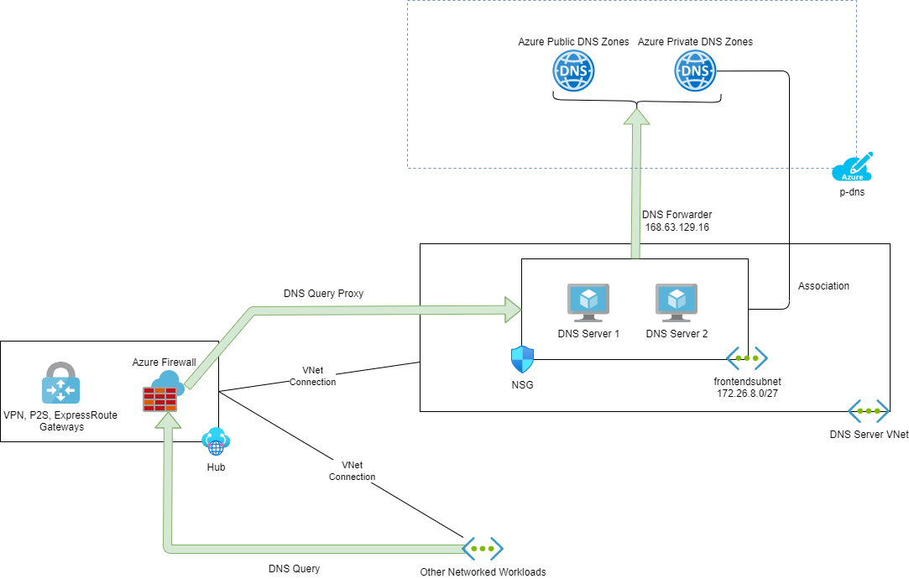

## DNS

DNS, or the Domain Name System, translates human readable domain names (for example, www.microsoft.com) to machine readable IP addresses (for example, 192.0.2.44).

### Split Brain DNS

Split-brain DNS is a Domain Name System (DNS) configuration method that enables proper name resolution of local resources from both internal and external consumers of your service.

Split-brain DNS ensures that when users at the office on the local network (internal users) type in `www.mydomain.com`, the DNS record returned contains the internal private IP address of the website you’ve set up. However, when users away from the office’s local network (external users) try to access `www.mydomain.com`, the DNS record returned contains the external public IP address of the website.

### Private Link

By default, platform resources typically use a public endpoint: a public DNS name that resolves to a public IP address that is accessed over The Internet. The security or compliance classification of a workload may require that the resources use private endpoints (private DNS names and private IP addresses) that are connected to virtual networks instead of The Internet.

Private Link is a method where a platform resource or a workload that is fronted by a standard tier Azure Load Balancer may be connected to an Azure Virtual Network using a Private Endpoint.

### Private Endpoint

Private endpoint is a network interface that uses a private IP address from your virtual network. This network interface connects you privately and securely to a service that's powered by Azure Private Link. By enabling a private endpoint, you're bringing the service into your virtual network. The resource or workload that are connected by the Private Endpoint will require a private DNS record. If the Private Endpoint is for an Azure platform resource, then the DNS record must be in a Microsoft-mandated DNS zone name.

### DNS Functional Design

Following the split-brain DNS concepts, there are two types of DNS to consider:

* Public DNS
* Private DNS

#### Public DNS

When an Internet client requires access to a organisation-hosted resource, the organisation must host a DNS record that will resolve the name. The DNS zone must be public to the Internet. The public DNS zone should also be:

* Replicated for availability.
* Close to the client to reduce the time of name resolution request-to-connection.
* Secured.
* Governed.
* Fall under a mature administration model.

##### Azure Public DNS

Azure provides the ability to host DNS zones that are purchased elsewhere. The process of enablement is:

1. Purchase the DNS zone (if not already done) via a registrar
1. Create an **Azure Public DNS** zone in Azure
1. Obtain the Name Server records from the Azure DNS Zone
1. Configure the Name Servers with the registrar
1. Start using the Azure DNS Zone

::: Tip
For Zone already in use, the DNS records in the original name server must be re-created before changing Azure Public DNS to Active Name Server
:::

The benefits of using Azure Public DNS are:

* You are managing Azure resources, so the governance, security, and management model applies to DNS.
  * Azure logging
  * Azure Policy
  * Role-based access control
  * Resource locks
  * Microsoft Defender for Cloud
* A consistent administrative experience that is managed, instead of a “control panel” that 1 or 2 people have access to - and eventually causes issues when the person(s) are sick or leave the organisation.
* DNS domains in Azure DNS are hosted on Azure's global network of DNS name servers, not just 2-3 servers in the same data centre or city.
* Azure Public DNS uses anycast networking to connect DNS clients to the closest replica for rapid name resolution.
* Infrastructure-as-code and/or DevSecOps can be introduced to enable self-service management of DNS records for each workload - subject to review by code pull requests.

::: Warning
Azure Public DNS does not support DNSSEC. If DNSSEC is or will be required, then Azure Public DNS should not be used.
:::

The Azure Public DNS Zones are kept in the `p-dns-pub` component.

#### Private DNS

Network-connected resources will need to be able to resolve DNS names for internal resources. Examples may include:

* API Management accessing an on-premises workload
* Virtual machines communicating with each other
* The use of Private Link/Private Endpoint

By default, Azure provides a simple private DNS service, but this will not be sufficient. Private DNS services will be required in the form of a DNS service. The design is layered.

##### Azure Private DNS Zones

The use of **Azure Private Link** and **Azure Private Endpoint** will require **private DNS zones** to be configured so we can correctly resolve Microsoft-mandated DNS names or aliases for each of Azure resource types supported. These zones can be hosted on any DNS server, but typically the chosen host service will prevent agile technologies and methodologies from being used.

**Azure Private DNS zones** will be deployed in a central location in the Azure Cloud Framework (`p-dns-pri`). DNS administrators may add/remove zones and manage DNS records, ideally using infrastructure-as-code.

Workload developers/security/operators may also manage DNS records in the zones. For example, a workload will deploy three new Private Endpoints to secure platform resources. The code to add the DNS records can be added to a branch of the workload repository. If the code passes the pull request review, the code is deployed and the DNS records are created. The result is:

* The workload team was able to configure the DNS zones without raising tickets.
* The change request was reviewed and controlled.
* The code for the workload is a more complete service definition.

##### Active Directory Integrated DNS Servers

Active Directory Domain Services (ADDS) provides many functions through its services as core to its role of being called Domain Controllers. ADDS offers:

* Authentication for legacy workloads
* Authorisation for legacy workload
* Group Policy to configure settings
* Private DNS

The DNS services of Domain Controllers are typically a knowledge base of the entire network - if you require to find the IP address of a known service, then the Domain Controllers probably know where to go. In the case of a network that uses ADDS, the Domain Controllers become an essential part of a Virtual Data Centre instance - each ADDS domain should have 2 Domain Controllers in each Virtual Data Centre instance that hosts members of that domain.

The domain controllers are deployed into a dedicated virtual network that is a spoke of the hub in the Virtual Data Centre instance. The virtual network is linked to each of the Azure Private DNS Zones in the `p-dns-pri` component. This means that any DNS request sent to the Azure “**virtual IP address**” (`168.63.129.16`) follow this path:

1. The Azure Private DNS resolvers
2. The Azure Public DNS resolvers
3. Zone on the Internet through Azure DNS

Each domain controller is configured with a default forwarder of `168.63.129.16`. With this single configuration, the domain controllers can now resolve:

* DNS records in the zones that they maintain and replicate.
* Records in Azure Private DNS zones.
* Public DNS names, hosted in Azure or anywhere on The Internet, without opening firewall rules for DNS to/from The Internet (using Azure as a DNS proxy).

##### Azure Firewall

The Azure Firewall enables two DNS features which are configured:

* **DNS Proxy**
  
  Azure Firewall can receive DNS client requests and send them to its DNS servers (**Azure DNS** by default). The client IP address is included in the forwarded request. Azure Firewall sees the response and caches it to ensure consistent implementation of Network (firewall) Rules that use an FQDN as the destination).
  
  This feature is enabled.

* **DNS Servers**:
  
  This feature is configured to override the default DNS servers of the Azure Firewall.
  
  In the **Active Directory Integrated DNS Servers** structure, the domain controllers are defined as the DNS servers

  The result is that when the Azure Firewall receives a DNS request, it will forward the request to the domain controllers.

##### Virtual Networks

Each virtual network has a **DNS Servers** setting. By default, each Virtual Network uses Azure DNS. This setting is changed to use the private IP Address of the Azure Firewall in the hub.

##### Azure Resources

Most Azure resources will consume the DNS settings from the virtual network. There are rare occasions where this value either will not work or should not be applied. One example is the ADDS Domain Controllers where the DNS server settings are configured in the Azure Virtual NIC for the virtual machine (not the guest OS network settings):

* Domain Controller 1 (DC01): Should use itself as the primary DNS server and Domain Controller 2 (DC02) as the secondary DNS server.
* Domain Controller 2 (DC02): Should use itself as the primary DNS server and Domain Controller 1 (DC01) as the secondary DNS server.

##### DNS Request Flow Overview

An Azure resource wants to resolve an DNS name for an on-premises (or Azure) domain member:

1. The request is sent to the Azure Firewall.
1. The firewall forwards the request to one of the domain controllers.
1. The domain controller resolves the request and responds to the firewall.
1. The firewall responds to the Azure resource.
1. The Azure resource makes a connection attempt using the resolved IP address.

An Azure resource wants to resolve the DNS name for a platform resource using Private Link:

1. The request is sent to the Azure Firewall.
1. The firewall forwards the request to one of the domain controllers.
1. The domain controller forwards the request to Azure DNS.
1. Azure DNS resolves the request using the Azure Private DNS Zone for the platform resource type and responds to the domain controller.
1. The domain controller responds to the firewall.
1. The firewall responds to the Azure resource.
1. The Azure resource makes a connection attempt using the resolved IP address.

An Azure resource wants to resolve the DNS name for an Internet service:

1. The request is sent to the Azure Firewall.
1. The firewall forwards the request to one of the domain controllers.
1. The domain controller forwards the request to Azure DNS.
1. Azure DNS forwards the request to the hosting DNS zone on the Internet.
1. The hosting DNS zone on the Internet responds resolves the request and responds to Azure DNS.
1. Azure DNS responds to the domain controller.
1. The domain controller responds to the firewall.
1. The firewall responds to the Azure resource.
1. The Azure resource makes a connection attempt using the resolved IP address.
