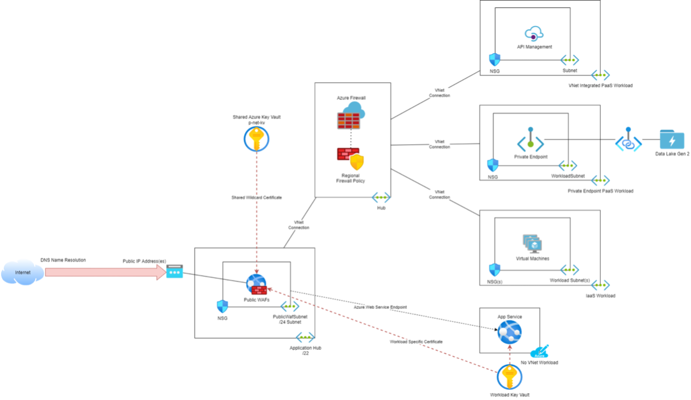

## Web Application Firewall (WAF)

A **Web Application Firewall (WAF)** is a dedicated firewall to handle workloads that present themselves to the Internet using HTTP/HTTPS.

### Overview

A Web Application Firewall (WAF) is dedicated to the inspection of external web client requests that are destined to services hosted in the Virtual Data Centre instance. The WAF inspects traffic at the application layer with an understanding of HTTP and HTTPS. Threats such as SQL injection and protocol misuse are searched for and blocked.

### Web Application Firewall (WAF) Options

There are many options for implementing a Web Application Firewall (WAF) including Azure and non-Azure ones. The Azure options are:

* **Application Gateway with Web Application Firewall (WAF)**
* **Front Door Premium with Web Application Firewall (WAF)** (Optional - With The Workload)

Both have the OWASP rule set and the Bot protection rule set.

#### Application Gateway with Web Application Firewall (WAF)

The Application Gateway is a Layer-7 load balancer that is deployed to an Azure Virtual Network. The Web Application Firewall (WAF) function is added to the Application Gateway to add a security layer. It can be deployed in two ways in the Virtual Data Centre instance:

* **Central (standard)**
  
  A set of centrally maintained Application Gateways. This is suitable for workloads that do not appear/disappear/change frequently and where cost sharing is important. The internal structure of the Application Gateway is not suitable for breakout for DevSecOps so it must be centrally managed.

* **Workload-specific (optional - with the workload)**
  
  A workload that is constantly changing, such as Azure Kubernetes Service, may have a dedicated Application Gateway. This will allow the developers/security/operators of the workload to maintain their own configuration (DevSecOps) without the need to involve central IT/security staff.

The OWASP rule set of the Application Gateway Web Application Firewall (WAF) can be customised - this is required to deal with false positives.

#### Front Door with Web Application Firewall (WAF) (Optional - With The Workload)

Azure Front Door is a service that is hosted by Microsoft in hundreds of global locations around the planet. HTTP/HTTPS applications can be shared on the Internet using Front Door. When a client attempts a connection, they are directed to the closest Microsoft data centre (accomplished by DNS and Anycast). From there, their connection is routed across the Microsoft WAN to the workload. This approach reduces the latency of making a connection from the client, across the Internet, to the Azure region that hosts the workload.

Front Door offers Web Application Firewall (WAF) functionality.

* The Standard SKU offers a ruleset that cannot be overridden - this is not recommended.
* The Premium SKU offers a ruleset that can be customised - this is required to deal with false positives.

Another benefit of Front Door is that the resource is typically associated with a single workload. From an Azure resource perspective, this makes Front Door more suitable for DevSecOps than a centrally placed Application Gateway with Web Application Firewall (WAF).

### Central Web Application Firewall (WAF) Deployment

The Central Web Application Firewall (WAF) is deployed as a part of a Virtual Data Centre instance.

#### Architecture

Each Virtual Data Centre instance has a central deployment of Application Gateways with Web Application Firewall (WAF) functionality.

#### Network

A single Web Application Firewall (WAF) resource instance, dedicated to sharing workloads to the Internet, is deployed by default. The public Web Application Firewall (WAF) is connected to a `/24` subnet dedicated to public Web Application Firewall (WAF) resource instances. The subnet is deployed to a `/22` virtual network that is dedicated to hosting central **Web Application Firewall (WAF)** resource instances. The intention of this design is to allow flexibility to alter the design at a later stage, if required.

The Virtual Network for the central **Web Application Firewall (WAF)** is technically deployed as a spoke - it is peered with the hub. However, each **Web Application Firewall (WAF)** resource instance has a **Public IP Address**, making it an entry point for HTTP/HTTPS traffic into the Virtual Data Centre instance.

The subnet each have a **Network Security Group** to limit the traffic to the absolute minimum required for the Web Application Firewall (WAF) to function (as documented by Microsoft).

Each **Web Application Firewall (WAF)** instance has a defined capacity.

* **Support limits**
  
  A **Web Application Firewall (WAF)** resource instance has certain limits placed on it and documented by Microsoft. Additional resource instances in the same subnet can be deployed if capacity is reached.

* **Performance**
  
  A **Web Application Firewall (WAF)** resource instance is made up of 1 or more compute instances in the platform. The number of compute instances can be manually or automatically controlled. Each compute instance provides more throughput. Additional compute instances can be added or removed if more oir less performance is required.

Scaling is subject to the number of IP addresses available in the environment subnet (251) and the consumption of IP addresses:

* 1 per resource instance plus
* 1 per compute instance

The Virtual Network if peered or connected with the hub, will imply the definition that the next hop for each subnet in the virtual network is configured to use the address space of the Virtual Data Centre instance for its hub firewall. This means that a Web Application Firewall (WAF) must route through the hub firewall to reach the workload resources.

Each subnet of the Virtual Network has the following Service Endpoints enabled to redirect traffic to public endpoints across the Azure private backbone:

* **Azure Key Vault**: For secret retrieval.
* **App Services**: For applications with public endpoints.
* **Storage Accounts**: For static web sites with public endpoints.

#### SSL Offload

Part of the function of the Azure Application Gateway is to offload SSL to conserve CPU on the backend (the workload hosting the HTTP/HTTPS service). The concept is that the client connects to the Web Application Firewall (WAF) using HTTPS, where the traffic is unencrypted using the private certificate for the workload. The traffic can optionally (for regulated scenarios such as health or payment data transfer) be re-encrypted using a client certificate that matches a private certificate on the workload.

The private certificate for the client-Web Application Firewall (WAF) connection can be stored in a Key Vault:

* Wildcard certificates should be stored in the `p-net-kv` component.
* Unique certificates should be stored in a Key Vault placed and managed with the workload.

Each **Web Application Firewall (WAF)** resource instance is deployed with an **Azure Managed Identity**. This Managed Identity can be granted secret *list/get* permissions to the **Key Vault** to gain access to the secret of the certificate. The application is shared as a HTTPS workload with the certificate.

If the flow should be re-encrypted between the **Web Application Firewall (WAF)** and the workload, the workload developers/security/operators team should generate a certificate pair. The private certificate will be used at the workload. The public certificate will be uploaded to the **Web Application Firewall (WAF)** and used to connect to the backend.

#### Client Connection

An application is shared to the Internet by a **Web Application Firewall (WAF)** resource instance. The **Web Application Firewall (WAF)** resource instance has a unique **Azure Public IP Address**. An application will have a public DNS name. The DNS name will resolve to the Public IP Address of the **Web Application Firewall (WAF)**. The Web Application Firewall (WAF) is configured with a listener that will respond to application connection attempts to the DNS name.

The Web Application Firewall (WAF) will process a client connection. A backend pool is configured to identity the application resource(s) that host the HTTP/HTTPS service. An optional health probe will test the resource(s) for availability. A HTTP setting and routing rule will redirect the traffic to the backend pool.

::: Note
A routing rule can spread the traffic for a large/complex HTTP/HTTPS service to different resources that handle specific parts of the service. For example, `biztalk.com` might be sent to backend A, `biztalk.com/media` might go to a backend B, and `biztalk.com/payments` might go to backend C.
:::

#### Flows

All client requests to the workload are attempted after DNS resolves the URI of the workload to the public IP address of the Web Application Firewall (WAF).

##### Inbound Flows

The inbound flow will work as follows for network-connected workloads:

1. The client attempts a connection to the **Web Application Firewall (WAF)** through the **Public IP Address.**
1. A **Network Security Group (NSG)** associated with the **Web Application Firewall (WAF) subnet** inspects the network flow and *permits* or *denies*.
1. If permitted, the connection attempt reaches the Web Application Firewall (WAF), which then passes the request through the active **rule set(s)**.
1. If the request passes the **rule sets**, the rules of the Application Gateway are processed to determine the correct **backend pool** to route the request to and the method of that request.
1. The traffic is routed to the hub via VNet peering.
1. The hub firewall inspects the traffic.
1. If the hub firewall permits the request, it is routed via VNet peering to the backend pool.
1. A NSG associated with the workload resource(s) subnet will inspect the traffic to ensure that it came from the correct Web Application Firewall (WAF) subnet.
1. If the NSG permits the traffic, the traffic reaches the resource, where a resource firewall (such as Windows/Linux firewall) may also inspect the traffic.

The request reaches the backend pool as a request from the IP address of the Web Application Firewall (WAF) compute instance. The response is sent back to the Web Application Firewall (WAF) using the above path (in reverse). The Web Application Firewall (WAF) responds to the client using the Public IP Address.

##### Workload Flows

The flow for the following workloads is slightly modified:

* App Services with public endpoints
* Static websites on Azure Storage Accounts with public endpoints

The flow is as follows:

1. The client attempts a connection to the **Web Application Firewall (WAF)** through the **Public IP Address.**
1. A **Network Security Group (NSG)** associated with the **Web Application Firewall (WAF) subnet** inspects the network flow and *permits* or *denies*.
1. If permitted, the connection attempt reaches the Web Application Firewall (WAF), which then passes the request through the active **rule set(s)**.
1. If the request passes the **rule sets**, the rules of the Application Gateway are processed to determine the correct **backend pool** to route the request to and the method of that request.
1. The traffic is routed to the backend resources across the private Azure Backbone via the Web Application Firewall (WAF) subnet Service Endpoint.
1. The backend resource firewall (optionally - recommended) ensures that the request comes from the correct Web Application Firewall (WAF) subnet.

The request reaches the backend pool as a request from the IP address of the Web Application Firewall (WAF) compute instance. The response is sent back to the Web Application Firewall (WAF) using the above path (in reverse). The Web Application Firewall (WAF) responds to the client using the Public IP Address.

#### Test Workloads

Each Virtual Data Centre instance is deployed with two test workloads

1. Workload based on virtual machines
2. Workload based on an Azure App Service with a public endpoint.

The default public Web Application Firewall (WAF) is configured to share each workload on the Internet using HTTP. This allows for testing of the Web Application Firewall (WAF) and the end-to-end network connections from client to backend pool.

To complete end-to-end testing, a DNS record needs to be created for each workload, resolving to the public IP address of the Web Application Firewall (WAF):

* Workload 1: `vdc-{test workload 1 name}.{company DNS name}` -> Web Application Firewall (WAF) public IP address
* Workload 2: `vdc-{test workload 2 name}.{company DNS name}` -> Web Application Firewall (WAF) public IP address

## WE1 Public WAF

This section documents the configuration of the Public WAF deployed to the WE1 VDC instance.

### Subscription Configuration

The **Web Application Firewall (WAF)** component is deployed into a subscription called `p-we1waf`. The subscription is placed into a Management Group called `WE1`, which is a member of a Management Group called `Virtual Data Centre Instance`.

The configuration of the subscription is described below.

#### Role-Based Access Control

Access to this subscription should be restricted to those supporting and operating the contained components. There are 3 Azure AD access groups to control access to the subscription and the contained resource groups and resources:

| Group Name                                             | Role        | Description                                                                                            |
| ------------------------------------------------------ | ----------- | ------------------------------------------------------------------------------------------------------ |
| `AZ RBAC sub p-we1waf Owner`       | Owners      | Members have full permissions, including permissions. This group is ideally empty.                     |
| `AZ RBAC sub p-we1waf Contributor` | Contributor | Members have full permissions, excluding permissions. This group has as few human members as possible. |
| `AZ RBAC sub p-we1waf Reader`      | Reader      | Members are limited to read permissions only. Ideally, this is where most human members are placed.    |

#### Diagnostics Settings

The diagnostics settings of the subscription are configured to send the Activity Log data of this subscription to two destinations:

* **Long-term audit logging**: Blob storage in the `p-gov-log` resource group in the `p-gov` subscription that is configured for read only, economic, long-term storage for legal and compliance purposes.
* **Platform monitoring**: A Log Analytics Workspace in the `p-mgt-mon` resource group in the `p-mgt` subscription for query-enabled functionality such as searching, reporting, and security monitoring.

The diagnostics setting for the subscription is configured as follows:

* Logs:
  * Categories:
    * Administrative: `Enabled`
    * Security: `Enabled`
    * ServiceHealth: `Enabled`
    * Alert: `Enabled`
    * Recommendation: `Enabled`
    * Policy: `Enabled`
    * Autoscale: `Enabled`
    * ResourceHealth: `Enabled`
* Destination Details:
  * Send To Log Analytics Workspace: `Enabled`
    * Subscription: `p-mgt`
    * Log Analytics Workspace: `p-mgt-montijczky7je-ws`
  * Archive To Storage Account: `Enabled`
    * Subscription: `p-gov`
    * Storage Account: `pgovlogauditxnlolmbkkxb`

#### Microsoft Defender for Cloud

Security and compliance features are provided by Microsoft Defender for Cloud. There are two tiers:

* **Free**: Basic features and configurations are possible.
* **Paid**: Special security monitoring features for resources can be enabled per-support resource type.

The configurations for this subscription are configured as follows:

##### Defender Plans

The plans are configure as follows:

* Cloud Security Posture management: Grey Out
* Servers: Off
* App Service: Off
* Databases: Off
* Storage: `Off`
* Containers: Off
* Kubernetes: Off
* Container Registries: Off
* Key Vault: `Off`
* Resource Manager: On
* DNS: On

##### Auto Provisioning

The deployment of extensions is configured as follows:

* Log Analytics Agent/Azure Monitor Agent: `On`
  * Agent Type: `Log Analytics`
  * Custom Workspace: `p-mgt-montijczky7je-ws`
  * Security Events Storage: `Minimal`
* Vulnerability Assessment for Machines: `Off`
* Guest Configuration Agent: `Off`
* Microsoft Defender for Containers Components: `Off`

##### Email Notifications

Notifications are configured as follows:

* Email Recipients:
  * All Users With The Following Roles: Owner, Contributor
  * Additional Email Addresses: A distribution list to be provided
* Notification Types:
  * Notify About Alerts With The Following Severity (Or Higher): Medium

##### Integrations

The following integrations are configured:

* Enable Integrations:
  * Allow Microsoft Defender for Cloud Apps To Access My Data: True
  * Allow Microsoft Defender for Endpoint To Access My Data: True

##### Integrations

The following integrations are configured:

* Enable Integrations:
  * Allow Microsoft Defender for Cloud Apps To Access My Data: True
  * Allow Microsoft Defender for Endpoint To Access My Data: True

##### Workflow Automation

No configurations are included.

##### Continuous Export

No configurations are included.

### Resource Groups

There are two resource groups:

* `p-we1waf-network`
* `p-we1waf-pub`

#### WAF Network (`p-we1waf-network`)

The purpose of this resource group is to supply the networking for the Web Application Firewall (WAF) resource instances.

The resource group, `p-we1waf-networking`, is created in the `p-we1waf` subscription, which is in the management group called `we1`.

A lock is placed on the resource group:

* **Resource Group Lock**: resourceGroupDoNotDelete
  * Lock Type: Delete

The following resources are deployed to the resource group:

* **Network Watcher**: `p-we1waf-network-networkwatcher`
  * Purpose: `Enable network watcher for the subscription in the region.`
* **Virtual Network**: `p-we1waf-network-vnet`
  * Purpose: `Provide a virtual network that the Web Application Firewall (WAF) resources connect to.`
  * Address Space: **The second /22 in the Virtual Data Centre instance /16**
  * DNS Servers: **10.100.4.0/22**
  * Subnets:
    * PublicWafSubnet:
      * Address Space: **10.100.4.0/24**
      * Network Security Group: `p-we1waf-network-vnet-PublicWafSubnet-nsg`
      * Route Table: `p-we1waf-network-vnet-PublicWafSubnet-rt`
      * Service Endpoints:
        * `Microsoft.KeyVault`
        * `Microsoft.Storage`
        * `Microsoft.Web`
      * DDoS Protection Standard: `Disabled`
  * Peerings:
    * `p-we1net-network-vnet`:
      * Traffic To Remote Virtual Network: `Allow`
      * Traffic Forwarded From Remote Virtual Network: `Allow`
      * Virtual Network Gateway Or Route Server: `Use the remote virtual network gateway or Route Server`
* **Network Security Group**: `p-we1waf-network-vnet-PublicWafSubnet-nsg`
  * Purpose: `Protect the PulbicWafSubnet`
  * Inbound Security Rules (Custom):
    * `AllowWAFProbeFromInternetToPublicwafsubnet`:
      * Source: `Service Tag`
      * Source Service Tag: `GatewayManager`
      * Source Port Ranges: `*`
      * Destination: `Any`
      * Service: `Custom`
      * Destination Port Ranges: `65200-65535`
      * Protocol: `TCP`
      * Action: `Allow`
      * Priority: `1000`
    * `AllowHttpFromInternetToPublicwafsubnet`:
      * Source: `Service Tag`
      * Source Service Tag: `Internet`
      * Source Port Ranges: `*`
      * Destination: `IP Addresses`
      * Destination IP Addresses: **10.100.4.0/24**
      * Service: `HTTP`
      * Destination Port Ranges: `80`
      * Protocol: `TCP`
      * Action: `Allow`
      * Priority: `1100`
    * `AllowHttpsFromInternetToPublicwafsubnet`:
      * Source: `Service Tag`
      * Source Service Tag: `Internet`
      * Source Port Ranges: `*`
      * Destination: `IP Addresses`
      * Destination IP Addresses: **10.100.4.0/24**
      * Service: `HTTPS`
      * Destination Port Ranges: `443`
      * Protocol: `TCP`
      * Action: `Allow`
      * Priority: `1200`
    * `AllowProbeFromAzureloadbalancerToPublicwafsubnet`:
      * Source: `Service Tag`
      * Source Service Tag: `AzureLoadBalancer`
      * Source Port Ranges: `*`
      * Destination: `IP Addresses`
      * Destination IP Addresses: **10.100.4.0/24**
      * Service: `Custom`
      * Destination Port Ranges: `*`
      * Protocol: `Any`
      * Action: `Allow`
      * Priority: `3900`
    * `DenyAll`:
      * Source: `Any`
      * Source Port Ranges: `*`
      * Destination: `IP Addresses`
      * Destination IP Addresses: **10.100.4.0/24**
      * Service: Custom
      * Destination Port Ranges: `*`
      * Protocol: `Any`
      * Action: `Allow`
      * Priority: `4000`
  * Outbound Security Rules (Custom): None
  * Diagnostic Settings:
    * `p-mgt-montijczky7je-ws`
      * Logs: `All Logs`
      * Destination Details:
        * Send To Log Analytics: `Enabled`
          * Subscription: `p-mgt`
          * Log Analytics Workspace: `p-mgt-montijczky7je-ws`
        * Archive To A Storage Account: `Enabled`
          * Subscription: `p-we1waf`
          * Storage Account: `pwe1wafnetworkdiagrb2os`
  * NSG Flow Logs:
    * `PublicWafSubnet-flowlog`
* **Route Table**: `p-we1waf-network-vnet-PublicWafSubnet-rt`
  * Purpose: `Override default and BGP routing for the PublicWafSubnet`
  * Propagate Gateway Routes: `No`
  * Routes:
    * `Internet`:
      * Address Prefix Destination: `IP Addresses`
      * Destination IP Addresses: `0.0.0.0/0`
      * Next Hop Type: `Internet`
    * `WE1`:
      * Address Prefix Destination: `IP Addresses`
      * Destination IP Addresses: `10.100.0.0/16`
      * Next Hop Type: `Virtual Appliance`
      * Net Hop IP Address: `10.100.1.4`
* **NSG Flow Log**: `PublicWafSubnet-flowlog`:
  * Purpose: `Enable Traffic Analytics for PublicWafSubnet`
  * Flow Logs Version: `Version 2`
  * Select Storage Account:
    * Subscription: `p-we1waf`
    * Storage Account: `pwe1wafnetworkdiagrb2os`
    * Retention (Days): `30`
  * Traffic Analytics: `Enabled`
    * Traffic Analytics Processing Interval: `Every 10 mins`
    * Subscription: `p-mgt`
    * Log Analytics Workspace: `p-mgt-montijczky7je-ws`
* [Storage Account] `pwe1wafnetworkdiagrb2os`
  * Purpose: `Provides blob storage for Azure Firewall and Gateway logs`
  * Performance: `Standard`
  * Replication: `ZRS`
  * Account Kind: `StorageV2`

#### Public WAF Instance (`p-we1waf-pub`)

The resources of the **Web Application Firewall (WAF)** resource instances are deployed in this resource group. By default, a single Web Application Firewall (WAF) resource instance is deployed.

The resource group, `p-we1waf-pub`, is created in the `p-we1waf` subscription, which is in the management group called `WE1`.

A lock is placed on the resource group:

* **Resource Group Lock**: resourceGroupDoNotDelete
  * Lock Type: Delete

The following resources are deployed to the resource group:

* **Application Gateway**: `p-we1waf-pub-waf01`
  * Purpose: `The basis of the first Web Application Firewall (WAF) resource instance`
  * Availability Zones: `1, 2, 3`
  * Virtual Network: `p-we1waf-network-vnet`
    * Subnet: `PublicWafSubnet`
  * Frontend Public IP Address: `p-we1waf-pub-waf01-pip`
  * Frontend Private IP Address: `None`
  * Tier: `WAF V2`
  * Configuration:
    * Capacity Type: `Manual`
    * (Compute) Instance Count: `2`
    * HTTP2: `Disabled`
  * Web Application Firewall Policy: `pwe1wafpubwaf01policy`
  * Backend Pools:
    * `t-tstsp1`:
      * Add Backend Pool Without Targets: `No`
      * Backend Targets:
        * Target Type: `IP Address or FQDN`
          * Target: `<IP Address of VM01 in Test Workload 1>`
        * Target Type: `IP Address or FQDN`
          * Target: `<IP Address of VM02 in Test Workload 1>`
    * `t-tstsp2`:
      * Add Backend Pool Without Targets: `No`
      * Backend Targets:
        * Target Type: `IP Address or FQDN`
          * Target: `t-tstsp226b4sxu7wv-web.azurewebsites.net`
  * Backend (HTTP) Settings:
    * `http-vdc-t-tstsp1.<company DNS name>`:
      * Backend Protocol: `HTTP`
      * Backend Port: `80`
      * Additional Settings:
        * Cookie Based Affinity: `Disable`
        * Connection Draining: `Disable`
        * Request Time Out (Seconds): `20`
        * Override Backend Path: `Blank`
      * Host Name:
        * Override With New Host Name: `Yes`
        * Host Name Override: `Pick host name from backend target`
        * Host Name: `Greyed Out`
        * Use Custom Probe: `Yes`
        * Custom Probe: `http-vdc-t-tstsp1.<company DNS name>`
    * `http-vdc-t-tstsp2.<company DNS name>`:
      * Backend Protocol: `HTTPS`
      * Backend Port: `443`
      * Trusted Root Certificate:
        * Use Well Known CA Certificate: `Yes`
      * Additional Settings:
        * Cookie Based Affinity: `Disable`
        * Connection Draining: `Disable`
        * Request Time Out (Seconds): `20`
        * Override Backend Path: `Blank`
      * Host Name:
        * Override With New Host Name: `Yes`
        * Host Name Override: `Override with specific domain name`
        * Host Name: `https://t-tstsp226b4sxu7wv-web.azurewebsites.net`
        * Use Custom Probe: `Yes`
        * Custom Probe: `http-vdc-t-tstsp2.<company DNS name>`
  * Frontend IP Configurations:
    * Public: `appGwPublicFrontendIp`
      * Public IP Address: `p-we1waf-pub-waf01-pip`
    * Private: No Configured
  * Listeners:
    * `http-vdc-t-tstsp1.<company DNS name>`:
      * Frontend IP: `Public`
      * Protocol: `HTTP`
      * Port: `80`
      * Additional Settings:
        * Listener Type: `Multi Site`
        * Host Type: `Single`
        * Host Name: `http-vdc-t-tstsp1.<company DNS name>`
        * Error Page URL: `No`
    * `http-vdc-t-tstsp2.<company DNS name>`:
      * Frontend IP: `Public`
      * Protocol: `HTTP`
      * Port: `80`
      * Additional Settings:
        * Listener Type: `Multi Site`
        * Host Type: `Single`
        * Host Name: `http-vdc-t-tstsp2.<company DNS name>`
        * Error Page URL: `No`
  * Rules:
    * `http-vdc-t-tstsp1.<company DNS name>:`
      * Priority: `10`
      * Listener: `http-vdc-t-tstsp1.<company DNS name>`
      * Target Type: `Backend Pool`
      * Backend Target: `t-tstsp1`
      * Backend Settings: `http-vdc-t-tstsp1.<company DNS name>`
    * `http-vdc-t-tstsp2.<company DNS name>`:
      * Priority: `20`
      * Listener: `http-vdc-t-tstsp2.<company DNS name>`
      * Target Type: `Backend Pool`
      * Backend Target: `t-tstsp2`
      * Backend Settings: `http-vdc-t-tstsp2.<company DNS name>`
  * Health Probes:
    * `http-vdc-t-tstsp1.<company DNS name>`:
      * Protocol: `HTTP`
      * Host: `127.0.0.1`
      * Pick Host Name From Backend Settings: `No`
      * Pick Port From Backend Settings: `Yes`
      * Path: `/`
      * Interval (Seconds): `30`
      * Timeout (Seconds): `30`
      * Unhealthy Threshold: `3`
      * Use Probe Matching Conditions: `Yes`
      * HTTP Response Status Code Match: `200-399`
      * HTTP Response Body Match: `Blank`
      * Backend Settings: `http-vdc-t-tstsp1.<company DNS name>`
    * `http-vdc-t-tstsp2.<company DNS name>`:
      * Protocol: `HTTPS`
      * Host: `<default URI of the Workload 2 App Service>`
      * Pick Host Name From Backend Settings: `No`
      * Pick Port From Backend Settings: `Yes`
      * Path: `/`
      * Interval (Seconds): `30`
      * Timeout (Seconds): `30`
      * Unhealthy Threshold: `3`
      * Use Probe Matching Conditions: `Yes`
      * HTTP Response Status Code Match: `200-399`
      * HTTP Response Body Match: `Blank`
      * Backend Settings: `http-vdc-t-tstsp2.<company DNS name>`
  * Diagnostic Settings:
    * `p-mgt-montijczky7je-ws`
      * Logs: `All Logs`
      * Destination Details:
        * Send To Log Analytics: `Enabled`
          * Subscription: `p-mgt`
          * Log Analytics Workspace: `p-mgt-montijczky7je-ws`
* **Managed Identity**: `p-we1waf-pub-waf01-id`
  * Purpose: `Provides an identity for p-we1waf-pub-waf01 to access certificate secrets in Azure Key Vaults`
  * Type: `User assigned managed identity`
* **Public IP Address**: `p-we1waf-pub-waf01-pip`
  * Purpose: `Enables Azure management plane and allows clients to reach the Application Gateway.`
  * IP Address: **`20.93.194.223`**
  * Availability Zones: `1, 2, 3`
  * SKU: `Standard`
  * Tier: `Regional`
  * Configuration:
    * Idle Timeout: `4 minutes`
    * DNS Name: `p-we1waf-pub-waf01-pip-b6j6ecyqrbvxa.westeurope.cloudapp.azure.com`
* **Application Gateway WAF Policy**: `pwe1wafpubwaf01policy`
  * Purpose: `Manage Web Application Firewall (WAF) functionality in the Application Gateway.`
  * Policy Mode: `Prevention`
  * Policy Settings:
    * Inspect Request Body: `On`
    * Max Request Body Size (KB): `128`
    * Max File Upload Size (MB): `100`
  * Managed Rule Sets:
    * Default Rule Set
      * `OWASP_3.1`
    * Additional Rule Sets:
      * `Microsoft_BotManagerRuleSet_0.1`
    * Disabled Rules: `None`
    * Exclusions: `None`
  * Custom Rules: `None`
