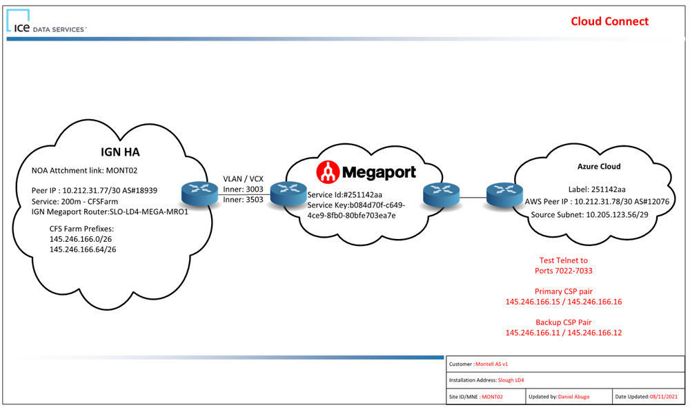

# Connect WE1 to ICE

## Introduction

This document will describe the options and method of connecting the ICE feeder, hosted in the WE1 VDC instance, with ICE over the existing ExpressRoute circuit.

## Assumptions

The following assumptions are made:

* The existing ExpressRoute circuit will be retained. A new circuit is not required - the existing circuit, called
mnt-h-default-expressroute-01 (in the mnt-h-euw-default-expressroute-rg resource group in the Ironstone-CSP-Montel-Hub subscription) may be used in Azure up to 10 times in the Azure European geography.
* The CSP agreement with previous provider of Azure will be ended. The subscription, Ironstone-CSP-Montel-Hub, should be transferred to the Innofactor CSP to retain the ExpressRoute reources.
* Disruptions will be minimised.
* NAT is required between ICE and Montel. The Azure ExpressRoute Virtual Network Gateway cannot provide NAT functionality natively (unlike the VPN Virtual Network Gateway). This is currently enabled by a Palo Alto network virtual appliance (NVA) configured as a virtual machine scale set.

## How The Solution Is Currently Implemented

### Existing Network Architecture

ICE provided basic instructions for the connection:

Traffic from Montel should exit the Montel network using a source IP address from the address space of 10.205.123.56/29. According to [documentation](https://montelgroup.eu.itglue.com/2518588339028120/docs/2924640468762818#version=published&documentMode=view) in ITGlue, connections will be made on TCP 7022-7033 to:

* Primary pair: 156.48.15.23 / 156.48.15.24
* Backup pair: 156.48.15.25 / 156.48.15.26

To accomplish this connection, a transit virtual network was created in Microsoft Azure. A Palo Alto network virtual appliance (NVA) implements NAT to forward the traffic with the correct source IP address. The ICE Feeder, located in the Montel head office, connects to ICE as follows:

* The connection is routed over a site-to-site VPN to the transit virtual network in Azure.
* The GatwaySubnet of the transit virtual network directs traffic, via a User-Defined Route to the Primary and Backup Pairs via the the NVA IP address in the snet-h-weu-transit-private subnet.
* The Palo Alto NVA (this has to be confirmed by Montel) performs NAT on the connection and routes it out via the NVA interface in the snet-h-weu-transit-ICE subnet.
* The snet-h-weu-transit-ICE interface uses an IP address of 10.205.123.60, which is in the 10.205.123.56/29 address space required by ICE for the connection.
* A BGP (Virtual Network Gateway) route directs the outbound connection from snet-h-weu-transit-ICE to an ExpressRoute Virtual Network Gateway.
* A Standard Tier ExpressRoute circuit carries the connection to ICE.

The reply follows the same path.

---

A remaining question is "how is NAT implemented in the Palo Alto NVA?". Is there a 1:1 relationship from the ICE feeder to 10.205.123.60? If so, some engineering will be required in the NVA. Or are all connections to the ICE Primary & Backup Pairs forwarded through 10.205.123.60? If so, the required NAT rules for a new feeder are already in place - all that might be required is a new firewall rule(s).

---

### Existing Route Tables

The following Route Tables control flows of traffic in the legacy transit virtual network:

**snet-h-weu-transit-public-routetable**

This route table is associated with the snet-h-weu-transit-public subnet. This subnet is the Palo Alto's exit point to The Internet. There is no Public IP Address so a random Azure IP address is used for outbound traffic and responses. No ingress traffic from The Internet is possible.

| Route Name                 | Address Prefix | Next Hop Type | Next Hop |
| -------------------------- | -------------- | ------------- | -------- |
| snet-h-weu-transit-mgmt    | 192.168.0.0/24 | None          |          |
| vnet-h-weu-transit-private | 10.254.0.0/16  | None          |          |
| mnt-d-euw-default-vnet     | 10.3.0.0/16    | None          |          |
| mnt-h-euw-default-vnet     | 10.0.0.0/16    | None          |          |
| mnt-p-euw-default-vnet     | 10.2.0.0/16    | None          |          |
| mnt-t-euw-default-vnet     | 10.4.0.0/16    | None          |          |

**snet-h-weu-transit-private-routetable**

This route table is associated with the snet-h-weu-transit-private subnet. This subnet hosts the Azure Load Balancer that is the "back end" of the Palo Alto - the entry point to the firewall to reach ICE.

| Route Name                | Address Prefix | Next Hop Type     | Next Hop     |
| ------------------------- | -------------- | ----------------- | ------------ |
| snet-h-weu-transit-public | 192.168.0.0/24 | None              |              |
| INTERNET                  | 0.0.0.0/0      | Virtual appliance | 10.254.1.254 |

**snet-h-weu-transit-mgmt-routetable**

This route table is associated with the snet-h-weu-transit-mgmt subnet, which is normally used to remotely configure a Palo Alto firewall.

| Route Name                | Address Prefix | Next Hop Type | Next Hop |
| ------------------------- | -------------- | ------------- | -------- |
| snet-h-weu-transit-public | 192.168.0.0/24 | None          |          |
| mnt-d-euw-default-vnet    | 10.3.0.0/16    | None          |          |
| mnt-h-euw-default-vnet    | 10.0.0.0/16    | None          |          |
| mnt-p-euw-default-vnet    | 10.2.0.0/16    | None          |          |
| mnt-t-euw-default-vnet    | 10.4.0.0/16    | None          |          |

**snet-h-weu-transit-private-ICE-routetable**

This route table is associated with the snet-h-weu-transit-ICE subnet. This subnet is the front end for reaching ICE. Traffic, after NAT, leaves the Palo Alto via this subnet and routes to the ExpressRoute Gateway in the GatewaySubnet with the IP address that ICE requires.

*This route table has no routes. All required routes for the subnet are propagated from the ExpressRoute Gateway via BGP.*

**snet-h-weu-transit-gateway-routetable**

This route table is associated with the GatewaySubnet. The purpose of the route table is to force all remote traffic to enter the Palo Alto Firewall.

| Route Name                | Address Prefix  | Next Hop Type     | Next Hop     |
| ------------------------- | --------------- | ----------------- | ------------ |
| ICE-Backup-1              | 156.48.15.25/32 | Virtual appliance | 10.254.1.254 |
| ICE-Backup-2              | 156.48.15.26/32 | Virtual appliance | 10.254.1.254 |
| ICE-Primary-1             | 156.48.15.23/32 | Virtual appliance | 10.254.1.254 |
| ICE-Primary-2             | 156.48.15.24/32 | Virtual appliance | 10.254.1.254 |
| mnt-d-euw-default-vnet    | 10.3.0.0/16     | Virtual appliance | 10.254.1.254 |
| mnt-h-euw-default-vnet    | 10.0.0.0/16     | Virtual appliance | 10.254.1.254 |
| mnt-p-euw-default-vnet    | 156.48.15.25/32 | 10.2.0.0/16       | 10.254.1.254 |
| mnt-p-euw-sqlpoc-vnet     | 10.2.2.0/27     | Virtual network   |              |
| mnt-t-euw-default-vnet    | 10.4.0.0/16     | Virtual appliance | 10.254.1.254 |
| snet-h-weu-transit-public | 192.168.0.0/24  | Virtual appliance | 10.254.1.254 |

### Existing Network Security Groups (NSGs)

The following NSGs control which flows are permitted (custom rules only are documented):

**PA-Transit-Internal-NSG**

The NSG is associated with the:

* snet-h-weu-transit-private subnet, controlling which traffic from internal networks can enter the Palo Alto firewall.
* snet-h-weu-transit-ICE, controlling which traffic from ICE may enter the Palo Alto firewall.

| Direction | Priority | Name              | Port | Protocol | Source | Destination | Action |
| --------- | -------- | ----------------- | ---- | -------- | ------ | ----------- | ------ |
| Inbound   | 100      | Allow_Inbound_Any | Any  | Any      | Any    | Any         | Allow  |
| Outbound  | 100      | Allow_Inbound_Any | Any  | Any      | Any    | Any         | Allow  |

**Default*-NSG**

The NSG is associated with the snet-h-weu-transit-mgmt subnet, controlling which traffic enter the Management subnet/NICs of the Palo Alto firewall.

| Direction | Priority | Name                  | Port | Protocol | Source            | Destination | Action |
| --------- | -------- | --------------------- | ---- | -------- | ----------------- | ----------- | ------ |
| Inbound   | 100      | Allow-Outside-From-IP | Any  | Any      | 185.55.105.194/32 | Any         | Allow  |
|           | 101      | Allow-Intra           | Any  | Any      | 10.254.0.0/16     | Any         | Allow  |
|           | 200      | Default-Deny          | Any  | Any      | Any               | Any         | Deny   |

**mnt-h-euw-poc-sql-nsg**

The NSG is associated with the SqlPoc subnet, controlling which traffic enter the subnet/NICs. This subnet is no longer used - it appears to be asosciated with a proof-of-concept associated with the ICE feeder connection.

| Direction | Priority | Name                            | Port                 | Protocol | Source      | Destination    | Action |
| --------- | -------- | ------------------------------- | -------------------- | -------- | ----------- | -------------- | ------ |
| Inbound   | 100      | AzureBastionSubnet              | 3389                 | Any      | Any         | Any            | Allow  |
|           | 110      | Allow-on-prem-users             | 443,53,9354,         | Any      | 10.1.1.0/24 | VirtualNetwork | Allow  |
|           |          |                                 | 445,12000,1433       |          |             |                |        |
|           | 120      | Allow-On-Prem-Palo-AltoFirewall | 53,88,123,137,       | Any      | Any         | Any            | Allow  |
|           |          |                                 | 138,389,464,636,     |          |             |                |        |
|           |          |                                 | 49152-65535,135,139, |          |             |                |        |
|           |          |                                 | 445,3268,32693269    |          |             |                |        |
|           | 130      | AllowICEFeeder_SQLInbound       | 1433                 | TCP      | 10.4.0.5.   | Any            | Allow  |

## Connecting The New ICE Feeder

A new ICE feeder will be deployed in the p-we1dat workload in the WE1 VDC instance. It has been agreed that a short term solution for ICE connectivity will be used: the new VM will communicate with ICE via the existing transit virtual network in the legacy Azure deployment. This will require configuration to be deployed.

The flow from the ICE Feeder to ICE will be:

1. From the VM NIC across VNet Peering from the spoke to the Azure Firewall in the WE1 VDC instance hub.
2. From the Azure Firewall across VNet Peering to the Azure Load Balancer, lb-h-weu-transit_private, in the legacy transit virtual network.
3. Into the Palo Alto Firewall where NAT is applied.
4. Exiting the Palo Alto Firewall into the snet-h-weu-transit-ICE subnet with an IP address of 10.205.123.60.
5. Routed to the Palo Alto Firewall to the ExpressRoute Circuit to ICE via the GatewaySubnet.

The route from ICE to the ICE Feeder will be:

1. Into the GatewaySubnet via the ExpressRoute Circuit.
2. From the ExpressRoute GatewaySubnet to the Palo Alto firewall NIC (10.205.123.60) in the snet-h-weu-transit-ICE subnet.
3. The flow will exit the Palo Alto firewall in the snet-h-weu-transit-private subnet.
4. The flow will enter the WE1 VDC instance by crossing VNet peering to the Azure Firewall in the hub.
5. The hub will reroute the flow across VNet Peering from the hub to the spoke hosting the ICE Feeder.
6. Through the NSG on the feeder subnet and into the ICE feeder VM.

### Peerings

A Virtual Network Peering will be created between the legcy transit virtual network, vnet-h-weu-transit, and the VDC instance hub, p-we1net-network-vnet. Note that this will update routing in the network fabric to allow the subnets of each of the two virtual networks to directly communicate with each other. This must be controlled by user-defined routing in Route Tables.

### Updated Route Tables

The following Route Tables will be modified:

**snet-h-weu-transit-public-routetable**

Traffic should not route from the "Internet NIC" of the Palo Alto to WE1. All traffic to WE1 will be dropped.

| Route Name                 | Address Prefix | Next Hop Type | Next Hop |
| -------------------------- | -------------- | ------------- | -------- |
| snet-h-weu-transit-mgmt    | 192.168.0.0/24 | None          |          |
| vnet-h-weu-transit-private | 10.254.0.0/16  | None          |          |
| mnt-d-euw-default-vnet     | 10.3.0.0/16    | None          |          |
| mnt-h-euw-default-vnet     | 10.0.0.0/16    | None          |          |
| mnt-p-euw-default-vnet     | 10.2.0.0/16    | None          |          |
| mnt-t-euw-default-vnet     | 10.4.0.0/16    | None          |          |
| WE1                        | 10.100.0.0/16  | None          |          |

**snet-h-weu-transit-private-routetable**

Traffic returning from ICE will be sent to WE1 via the Azure Firewall in the VDC instance hub.

| Route Name                | Address Prefix | Next Hop Type     | Next Hop     |
| ------------------------- | -------------- | ----------------- | ------------ |
| snet-h-weu-transit-public | 192.168.0.0/24 | None              |              |
| INTERNET                  | 0.0.0.0/0      | Virtual appliance | 10.254.1.254 |
| WE1                       | 10.100.0.0/16  | Virtual appliance | 10.100.1.4   |

**snet-h-weu-transit-mgmt-routetable**

Traffic should not route from the "management NIC" of the Palo Alto to WE1. All traffic to WE1 will be dropped.

| Route Name                | Address Prefix | Next Hop Type | Next Hop |
| ------------------------- | -------------- | ------------- | -------- |
| snet-h-weu-transit-public | 192.168.0.0/24 | None          |          |
| mnt-d-euw-default-vnet    | 10.3.0.0/16    | None          |          |
| mnt-h-euw-default-vnet    | 10.0.0.0/16    | None          |          |
| mnt-p-euw-default-vnet    | 10.2.0.0/16    | None          |          |
| mnt-t-euw-default-vnet    | 10.4.0.0/16    | None          |          |
| WE1                       | 10.100.0.0/16  | None          |          |

**snet-h-weu-transit-private-ICE-routetable**

*This route table has no routes. All required routes for the subnet are propagated from the ExpressRoute Gateway via BGP.*

**snet-h-weu-transit-gateway-routetable**

Traffic to WE1 from the ExpressRoute circuit (or site-to-site VPN) will be directed to the Azure Firewall in the WE1 VDC instance hub.

| Route Name                | Address Prefix  | Next Hop Type     | Next Hop     |
| ------------------------- | --------------- | ----------------- | ------------ |
| ICE-Backup-1              | 156.48.15.25/32 | Virtual appliance | 10.254.1.254 |
| ICE-Backup-2              | 156.48.15.26/32 | Virtual appliance | 10.254.1.254 |
| ICE-Primary-1             | 156.48.15.23/32 | Virtual appliance | 10.254.1.254 |
| ICE-Primary-2             | 156.48.15.24/32 | Virtual appliance | 10.254.1.254 |
| mnt-d-euw-default-vnet    | 10.3.0.0/16     | Virtual appliance | 10.254.1.254 |
| mnt-h-euw-default-vnet    | 10.0.0.0/16     | Virtual appliance | 10.254.1.254 |
| mnt-p-euw-default-vnet    | 156.48.15.25/32 | 10.2.0.0/16       | 10.254.1.254 |
| mnt-p-euw-sqlpoc-vnet     | 10.2.2.0/27     | Virtual network   |              |
| mnt-t-euw-default-vnet    | 10.4.0.0/16     | Virtual appliance | 10.254.1.254 |
| snet-h-weu-transit-public | 192.168.0.0/24  | Virtual appliance | 10.254.1.254 |
| WE1                       | 10.100.0.0/16   | Virtual appliance | 10.254.1.254 |

### Existing Network Security Groups (NSGs)

No changes are required to the NSGs.
