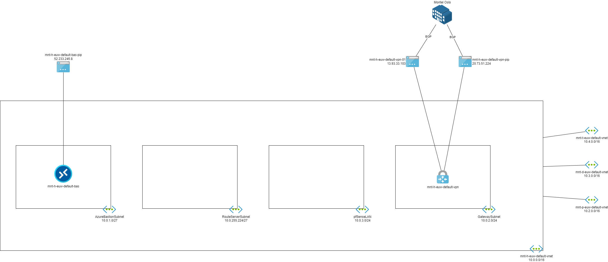
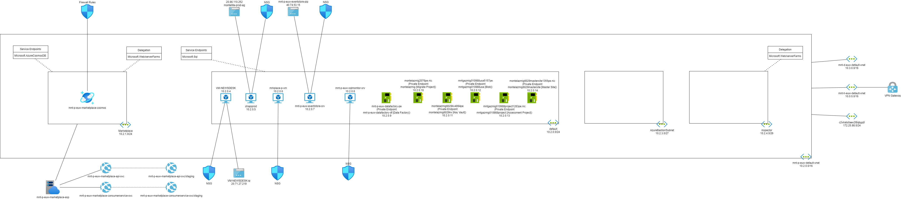
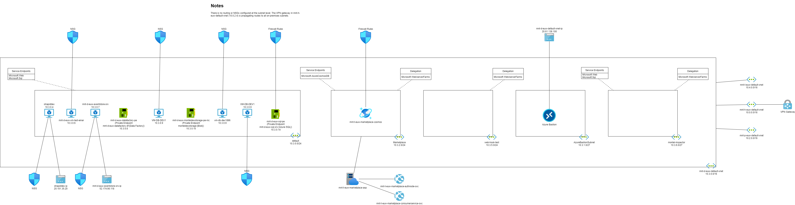
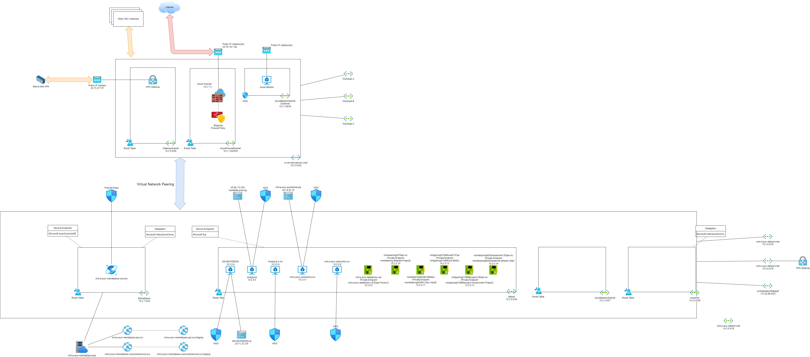

# Connection To Legacy Azure Networks

## Introduction

The purpose of this document is to:

1. Describe the existing "legacy" Azure networks.
2. Describe how the new VDC instance networks can connect to the legaxy Azure resources.

There are three objectives:

1. Do not disrupt production systems.
2. Enable connectivity to legacy systems, enabling connections in both directions where resource types allow it and where business requirements demand it.
3. Security is a primary requirement - the new VDC instance will not trust the legacy production systems.

In summary, the existing networks are of a poor security standard, exibiting traits of a deployment that did not include good cloud or security practices. The networks cannot be trusted.

A simple connection can be made from the exisitng VDC instnce. The existing VDC instance will route all connections through its own Firewall, requiring detailed firewall rules to be produced for each required service connection. Routing must be configured in the existing legacy networks to force synchronous paths via the firewall - no firewall or user-defined is present in the legacy networks. Modification of routng to the WE1 VDC instance will not impact any other flows or connections.

## Assumptions

It has been assumed that only production workloads in the legacy networks are necessary. All legacy networks have been diagrammed, however, this document will only go into detail on the hub and production virtual network

*The document can be updated if legacy development or test workloads will also require connections.*

## Audit of Legacy Networks

It was necessary to audit the existing legacy networks to understand what their structure is and what resource types are connected. The structure will determine:

* The most efficient way to connect, minimising configurations and complexity.
* The level of security already in place.

### The Hub

The legacy Azure networks are deployed in a simple hub & spoke architecture. The hub, mnt-h-euw-default-vnet, is built as shown in the following diagram.

The hub virtual network details are as follows:

* Name: mnt-h-euw-default-vnet
  * Address space: 10.0.0.0/16
  * Subnets:
    * GatewaySubnet
      * Purpose: Site-to-site connections.
      * Address space: 10.0.2.0/24
    * pfSenseLAN
      * Purpose: Unused. Probably created for a pfSense router/appliance.
      * Address space: 10.0.3.0/24
    * RouteServerSubnet
      * Purpose: Unused. Probably created to host Azure Route Server for BGP propagation between a virtual appliance and the virtual network.
      * Address space: 10.0.255.224/27
    * AzureBastionSubnet
      * Purpose: A central, shared Azure Bastion for SSH/RDP connections to virtual machines.
      * Address space: 10.0.1.0/27
  * Peering connections (the spokes):
    * mnt-t-euw-default-vnet: Test legacy virtual network.
    * mnt-d-euw-default-vnet: Development legacy virtual network.
    * mnt-p-euw-default-vnet: Production legacy virtual network.

#### Site-to-Site VPN

The hub has an active/active VPN Virtual Network Gateway, placed in the GatewaySubnet that is connected to the head office in Oslo. BGP is configured to enable route propation between the on-premises location and Azure.

#### pfSense & Azure Route Server Subnets

It appears that there was a plan to deploy a router appliance instead of the Azure Virtual Network Gateway. A virtual appliance cannot natively propagate routes to and from Azure via BGP. The plan appears to have been to use Azure Route Server for BGP route propagation. The use of the native Virtual Network Gateway eliminated the need for both of these resource types, while increasing reliability and reducing costs.

The pfSense subnet does not have an NSG.

#### Azure Bastion

Azure Bastion is deployed as a central, shared resource called mnt-h-euw-default-bas. The Bastion is deployed into the AzureBastionSubnet, as required.

This subnet does not have an NSG.

#### Routing

There is no user-defined (human defined) routing configured. THe only routing in place is system (for peering) and BGP (for VPN).

#### Peering Connections

The hub is connected to the three spokes:

* Production
* Test
* Development

### Production Network

The production virtual network, mnt-p-euw-default-vnet, is structured as diagramed below:

The hub virtual network details are as follows:

* Name: mnt-p-euw-default-vnet
  * Address space: 10.2.0.0/16
  * Subnets:
    * Marketplace
      * Purpose: Marketplace PaaS resources.
      * Address space: 10.2.1.0/24
    * default
      * Purpose: A number of virtual machines and private endpoints.
      * Address space: 10.2.0.0/24
    * AzureBastionSubnet
      * Purpose: Unused. Dedicated to Azure Bastion.
      * Address space: 10.2.3.0/27
    * inspector
      * Purpose: Unused.
      * Address space: 10.2.4.0/26
  * Peering connections (the spokes):
    * mnt-h-euw-default-vnet: The legacy hub virtual network.
    * mnt-d-euw-default-vnet: Development legacy virtual network.
    * c2vlrato0aev2t8qbgq0: Event Store Cloud (remote tenant)

#### Marketplace Subnet

This subnet appears unused at first. However, platform resources have integrations with this subnet:

* mnt-p-euw-marketplace-cosmos: This Cosmos DB database is connected to the virtual network and uses firewall rules.
* mnt-p-euw-marketplace-asp: This app service plan has regional VNet integration, enabling *outbound* connections via the subnet - the app services, mnt-p-euw-marketplace-api-svc & mnt-p-euw-marketplace-consumerservice-svc and their staging deployment slots use this integration. The app services do not have private endpoints and do not have access restrictions enabled.

This subnet does not have an NSG and does not have a route table.

#### default Subnet

A number of virtual machines are connected to this subnet. Note that:

* NSGs are associated with the NICs: This is considered a poor practice for management and scalability; NSGs should be associated with subnets.
* A number of the virtual machines have public IP addresses: This is considiered a poor security practice. No virtual machines should have a public IP address - all traffic from external sources should enter through a security resource.

| Virtual Machine Name     | Workload | NSG Associated | Public IP Address Associated |
| ------------------------ | -------- | -------------- | ---------------------------- |
| VM-NEWSDESK              | Unknown  | Yes            | *Yes*                        |
| strapiprod               | Unknown  | Yes            | *Yes*                        |
| mrkplace-p-vm            | Unknown  | Yes            | No                           |
| mnt-p-euw-eventstore-srv | Unknown  | Yes            | *Yes*                        |
| mnt-p-euw-sqlmonitor-srv | Unknown  | Yes            | No                           |

A number of platform resources have private endpoints in this subnet:

| Private Endpoint Name               | Resource Name             | Resource/API Type           | Workload |
| ----------------------------------- | ------------------------- | --------------------------- | -------- |
| mnt-p-euw-datafactory-pe            | mnt-p-euw-datafactory-df  | Data Factory                | Unknown  |
| montelazmig2076pe.nic               | montelazmig               | Azure Migrate / Project     | Unknown  |
| montelazmig6029kv4994pe             | montelazmig6029kv         | Key Vault                   | Unknown  |
| mntgazmig010988usa5157pe            | mntgazmig010988usa        | Storage Account / Blob      | Unknown  |
| mntgazmig010988project1283pe.nic    | mntgazmig010988project    | Azure Migrate / Assessment  | Unknown  |
| montelazmig6029mastersite1355pe.nic | montelazmig6029mastersite | Azure Migrate / Master Site | Unknown  |

No NSGs or route tables are associated with the subnet.

Azure Private Endpoint did not originally support NSGs for inbound rules or route tables. This should have resulted in a dedicated subnet for Private Endpoints, enabling asosciation of an NSG with the virtual machine subnet. Private Endpoint now supports both route tables and NSGs if subnet policies for private endpoint are disabled.

#### AzureBastionSubnet

This subnet is unused. The Azure Bastion in the hub is capable of being used with virtual machines in this virtual network.

#### inspector Subnet

The inspector subnet is not used. It is enabled for regional VNet integration, which suggests either past usage or potential future usage.

#### Routing

There is no user-defined (human defined) routing configured. THe only routing in place is system (for peering) and BGP (for VPN), which propagates to/from the hub.

#### Peering Connections

The hub is connected to the three spokes:

* The hub
* Development
* Event Store Cloud

### Test Network

The test virtual network, mnt-t-euw-default-vnet, is structured as diagramed below:

### Development Network

The development virtual network, mnt-d-euw-default-vnet, is structured as diagramed below:

## Connections to WE1

Normally, a connection would be made in a hub-to-hub fashion. The WE1 VDC instance has a hub; all ingress/egress traffic is designed to route via the firewall by default, simplifying connection configuration and maximising security.

The legacy virtual network hub & spoke architecture is has a central routing configuration only for site-to-site networking. Normally, a connection of one hub & spoke to another hub & spoke would be via a hub-to-hub peering. However, with no transitive routing in place (privided by a firewall) in the legacy hub, a more direct approach must be used.

The following approach will be used:

### Peering Connection

The hub virtual network of the VDC instance, p-we1dc, will be peered with the legacy production virtual network, mnt-p-euw-default-vnet.

The WE1-to-Legacy Production connection will be defined as code in the p-we1net code.

The Legacy Production-to-WE1 connection will be defined manually in the mnt-p-euw-default-vnet virtual network.

Gateway Sharing and Use Remote Gateway will not be enabled in either direction - this is not required and would break existing networking flows.

### Routing

A core concept of the VDC is that all external networks are considered untrusted. For all workloads in the WE1 VDC instance, all connections to/from the legacy virtual networks will be routed through the firewall in the WE1 hub. The only way to force these flows is by using routing.

#### WE1 Hub

The WE1-to-Legacy route will be automatically created as a System/Default route in the subnets of p-we1net-network-vnet (the WE1 hub) as a result of enabling virtual network peering. Each subnet will get a System Route with a prefix of 10.2.0.0/16 (the legacy production virtual network) via a next hop of Virtual Network Peering.

A User-Defined Route will be added to the GatewaySubnet with a prefix of 10.2.0.0/16 and a next hop of type Virtual Appliance and Next Hop IP Address of 10.100.1.4 (the Azure Firewall).

#### WE1 Spokes

All spokes use Azure Firewall as their next hop. Therefore, all flows from a spoke to the legacy production virtual network will be via the Azure Firewall with no changes required.

#### Legacy Production Virtual Network

Four Route Table resources will be added to the resource group, mnt-p-euw-default-vnet-rg, of the legacy production virtual network:

| Route Table Name                             | Subnet Association | User-Defined Route                             |
| -------------------------------------------- | ------------------ | ---------------------------------------------- |
| mnt-p-euw-Marketplace-vnet-MarketPlace-rt    | MarketPlace        | 10.100.0.0/16 > Virtual Appliance > 10.100.1.4 |
| mnt-p-euw-default-vnet-MarketPlace-rt        | default            | 10.100.0.0/16 > Virtual Appliance > 10.100.1.4 |
| mnt-p-euw-default-vnet-AzureBastionSubnet-rt | AzureBastionSubnet | 10.100.0.0/16 > Virtual Appliance > 10.100.1.4 |
| mnt-p-euw-default-vnet-inspector-rt          | inspector          | 10.100.0.0/16 > Virtual Appliance > 10.100.1.4 |

*Azure Bastion does not support a Route Table. The AzureBastionSubnet is not used by Azure Bastion. Adding a route table will prevent another resource type from being used and having an alternative route to the subnsets of the p-we1net-network-vnet virtual network.*

All flows from the legacy development virtual network resources will have a limited change:

* All existing routes to on-premises will continues to be sourced from the BGP propagation of the site-to-site VPN in the legacy hub virtual network.
* All routes to the other legacy hubs will continue to be system routes that are automatically generated by virtual network peering.
* Only the route to the WE1 VDC instance will be added, forcing all flows to 10.100.0.0/16 to travel via the Azure Firewall in the WE1 hub.

### Firewall and NSG Rules

#### WE1 VDC Instance

Each required service connection will require one or more firewall rules in the hub Azure Firewall to allow

* Inbound connections to a workload in the VDC instance.
* Outbound connections from a workload in the VDC instance.

The rules must be precise to maintain modern security practices:

* As precise as possible source IP adddress(es)
* As precise as possible destination IP address(es)
* The exact protocol of the connection
* The exact destination port number(s) of the connection

The rules will be created in an appropriate rules collection in the rules collection group of the affected workload in the WE1 VDC instance.

If an inbound connection is necessary to a workload in the WE1 VDC instance, then NSG rules must also be created to permit the connections. The rules must be as precise as possible:

* As precise as possible source IP adddress(es)
* As precise as possible destination IP address(es) or virtual machine application security group
* The exact protocol of the connection
* The exact destination port number(s) of the connection

### DNS

Private Endpoints are used in the legacy production virtual network - most of them are related to Azure Migrate and are no longer required. Some of the virtual machines in the legacy production virtual network have A records hosted in a private DNS zone called montelgroup.no.

The WE1 VDC instance resolves these names via Azure Private DNS Zones that are stored in the p-net subscription in the p-dns-pri resource group. All of the below records must be added to Azure Private DNS Zones in this location:

| VM/Private Endpoint Name | Resource/API Type | DNS Zone                          | DNS Record Type | DNS Record Name                     | DNS Record Value | TTL  |
| ------------------------ | ----------------- | --------------------------------- | --------------- | ----------------------------------- | ---------------- | ---- |
| mnt-p-euw-datafactory-pe | Data Factory      | privatelink.datafactory.azure.net | A               | mnt-p-euw-datafactory-df.westeurope | 10.2.0.9         | 10   |
| mnt-p-euw-eventstore-srv | N/A               | montelgroup.com                   | A               | eventstore                          | 10.2.0.7         | 3600 |
| mnt-p-euw-eventstore-srv | N/A               | montelgroup.com                   | A               | mnt-p-euw-eventstore-srv            | 10.2.0.7         | 10   |
| strapiprod               | N/A               | montelgroup.com                   | A               | strapiprod                          | 10.2.0.5         | 10   |
| VM-NEWSDESK              | N/A               | montelgroup.com                   | A               | vm-newsdesk                         | 10.2.0.4         | 10   |
