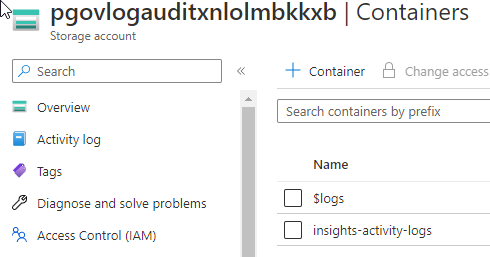

## Governance (`p-gov`)

The `p-gov` subscription hosts components related to governance.

### Subscription Configuration

The configuration of the subscription is described below.

#### Role-Based Access Control

Access to this subscription should be restricted to those supporting and operating the contained components. There are 3 Azure AD access groups to control access to the subscription and the contained resource groups and resources.:

| Group Name                      | Role        | Description                                                                                            |
| ------------------------------- | ----------- | ------------------------------------------------------------------------------------------------------ |
| `AZ RBAC sub p-gov Owner`       | Owners      | Members have full permissions, including permissions. This group is ideally empty.                     |
| `AZ RBAC sub p-gov Contributor` | Contributor | Members have full permissions, excluding permissions. This group has as few human members as possible. |
| `AZ RBAC sub p-gov Reader`      | Reader      | Members are limited to read permissions only. Ideally, this is where most human members are placed.    |

#### Diagnostics Settings

The diagnostics settings of the subscription are configured to send the Activity Log data of this subscription to two destinations:

* **Long-term audit logging**: Blob storage in the `p-gov-log` resource group in the `p-gov` subscription that is configured for read only, economic, long-term storage for legal and compliance purposes.
* **Platform monitoring**: A Log Analytics Workspace in the `p-mgt-mon` resource group in the `p-mgt` subscription for query-enabled functionality such as searching, reporting, and security monitoring.

The diagnostics setting for the subscription is configured as follows:

* Logs:
  * Categories:
    * Administrative: `Enabled`
    * Security: `Enabled`
    * ServiceHealth: `Enabled`
    * Alert: `Enabled`
    * Recommendation: Enabled
    * Policy: Enabled
    * Autoscale: Enabled
    * ResourceHealth: Enabled
* Destination Details:
  * Send To Log Analytics Workspace: Enabled
    * Subscription: `p-mgt`
    * Log Analytics Workspace: `p-mgt-montijczky7je-ws`
  * Archive To Storage Account: Enabled
    * Subscription: `p-gov`
    * Storage Account: `pgovlogauditxnlolmbkkxb`

#### Microsoft Defender for Cloud

Security and compliance features are provided by Microsoft Defender for Cloud. There are two tiers:

* Free: Basic features and configurations are possible.
* Paid: Special security monitoring features for resources can be enabled per-support resource type.

The configurations for this subscription are configured as follows:

##### Defender Plans

The plans are configure as follows:

* Cloud Security Posture management: Grey Out
* Servers: Off
* App Service: On
* Databases: Off
* Storage: On
* Containers: Off
* Kubernetes: Off
* Container Registries: Off
* Key Vault: On
* Resource Manager: On
* DNS: Off

##### Auto Provisioning

The deployment of extensions is configured as follows:

* Log Analytics Agent/Azure Monitor Agent: On
  * Agent Type: Log Analytics
  * Custom Workspace: `p-mgt-montijczky7je-ws`
  * Security Events Storage: Minimal
* Vulnerability Assessment for Machines: Off
* Guest Configuration Agent: Off
* Microsoft Defender for Containers Components: Off

##### Email Notifications

Notifications are configured as follows:

* Email Recipients:
  * All Users With The Following Roles: `Owner`, `Contributor`
  * Additional Email Addresses: A distribution list to be provided
* Notification Types:
  * Notify About Alerts With The Following Severity (Or Higher): Medium

##### Integrations

The following integrations are configured:

* Enable Integrations:
  * Allow Microsoft Defender for Cloud Apps To Access My Data: True
  * Allow Microsoft Defender for Endpoint To Access My Data: True

##### Workflow Automation

No configurations are included.

##### Continuous Export

No configurations are included.

### Components

The following components are hosted in the subscription:

* Long Term Audit Logging (`p-gov-log`)
* Concierge (`p-gov-cng`)
* Governance Azure Key Vault (`p-gov-kv`)

#### Long Term Audit Logging (`p-gov-log`)

The purpose of this component is to provide long-term storage for audit logs (primarily Azure, but potentially audit logs from other sources such as Azure AD) that is:

* Capable of storing data for many/long years.
* Tiers storage to reduce the effects of storage a lot of data for a long time.
* Sets the data to a read-only state so that it is tamper-proof.
* Data is deleted automatically when it is no longer required.
* The data is in a special place that few can access.

##### Overview

Audit log data can include personally identifiable information (such as names, email addresses, IP addresses); the above protections will ensure compliance with the GDPR.

The diagnostics logs of each subscription send the Activity Log data to two sources:

* **A central Log Analytics Workspace**: The platform monitoring workspace in the p-mgt subscription makes the data available for queries and reporting.
* **Blob storage in a central storage account**: This storage account is the purpose of this component.

Each subscription will create 1 log file for each hour of the day. That file is created and updated in the central storage account.

There is one parameter to configure the storage account: How many years should audit log data be retained for? Each year is calculated as 366 days (to account for leap years). Two simple formulas decide how long data is retained for and when data is automatically deleted:

* Days Retained (X) = Years * 366
* Deletion time (Y) = X + 1

The organisation has decided to retain audit logs for 10 years:

* Days Retained (X) = 10 Years * 366 = 3660
  * Data will be in a read-only state for 3660 days
* Deletion time (Y) = X + 1 = 3661
  * Individual hourly log files will be deleted when they reach an age of 3661 days

::: warning
A lock policy will be placed on the storage account based on the value X. Once the lock is set, it can only be increased a limited number of times.
:::

##### Resource Groups

The resource group, `p-gov-log`, is created in the `p-gov` subscription, which is in the Management Group called Governance.

A lock is placed on the resource group:

* **Resource Group Lock**: resourceGroupDoNotDelete
  * Lock Type: Delete

The following resources are deployed:

* **Storage Account**: `pgovlogauditxnlolmbkkxb`
  * Purpose: `Provides blob storage for long-term retention of audit logs`
  * Lock: `storageDoNotDelete`
    * Lock Type: `Delete`
  * Performance: `Standard`
  * Replication: `GRS`
  * Account Kind: `StorageV2`
  * Lifecycle Management:
    * Rule: `TieringRule`
* Details:
  * Rule Scope: `Apply rule to all blobs in your storage account`
  * Blob Type:
    * `Block Blobs`
  * Blob Subtype:
    * `Base Blobs`
    * `Snapshots`
* Base Blobs:
  * Move To Cool Storage: `14 days`
  * Move To Archive Storage: `32 days`
  * Delete The blob: `Yes`
* Snapshots:
  * Delete The  Blob Snapshot: `32 days`

##### Containers Configuration

Each audit log type that is sent to the storage account will generate a blob container structure for all sources of that type. Each container Access Policy should be configured as follows:

* Access Policy:
  * Immutable Blob Storage:
    * Policy:
      * Policy Type: Time-Based Retention
      * Set The Retention Period For: 3660 days
      * Allow Protected Append Writes To: None

#### Concierge (`p-gov-cng`)

The Innofactor Concierge is a set of Azure Functions that were created to assist with the governance of Microsoft Azure. It is important to note:

* Innofactor Concierge does not change how normal Azure resources function. The breakdown or removal of Innofactor Concierge will not impact services built on Microsoft Azure.
* The Azure Functions are written using PowerShell, making the code accessible to more people.

##### Overview

Innofactor Concierge is a function app used for automation and event handling in Azure
Details on this Function Application can be read in the Concierge documentation.

###### Resource Groups

The Innofactor Concierge is deployed into the `p-gov-cng` resource group, in the `p-gov` subscription, which is placed into the Management Group called Governance.

A lock is placed on the resource group:

* **Resource Group Lock**: `resourceGroupDoNotDelete`
  * Lock Type: `Delete`

The resources in this resource group are:

* **Log Analytics Query Pack**: `p-gov-cng-laqp`
  * Purpose: `Efficient storage for a number of Log Analytics queries.`
* **Key Vault**: `p-gov-cngvncswkq3-kv`
  * Purpose: `Stores secrets for the component.`
  * Lock: `keyvaultDoNotDelete`
    * Lock Type: `Delete`
  * SKU: `Premium`
  * Soft Delete: `Enabled`
  * Purge Protection: `Disabled`
* **App Service Plan**: `p-gov-cngvncswkq3oc-plan`
  * Purpose: `Provides compute for the Azure Functions`
  * SKU: `Y1`
  * Operating System: `Windows`
* **Function App**: `p-gov-cngvncswkq3oc-func`
  * Purpose: `Runs the Azure Functions that make up the Innofactor Concierge`
  * App Service Plan: `p-gov-cngvncswkq3oc-plan`
* **Application Insights**: `p-gov-cngvncswkq3oc-insights`
  * Purpose: `Enables monitoring of Innofactor Concierge`
  * Workspace: `The central application monitoring workspace in p-mgt-apm`
* **Storage Account**: `pgovcngdatavncswkq3oc3t`
  * Purpose: `Provides blob storage for the Azure Functions`
  * Performance: `Standard`
  * Replication: `LRS`
  * Account Kind: `StorageV2`

#### Governance Azure Key Vault (`p-gov-kv`)

The purpose of this component is to provide secure storage of secrets, primarily for governance purposes.

##### Overview

Governance can require a set of secrets that must not be shared outside of governance. This Azure Key Vault will store those secrets.

::: Note
This Key Vault can be used to store the first secrets that are required: the client IT, tenant ID, and secret for the Azure AD Application Registration (SPN or service principal) that is used by the DevOps pipelines.
:::

##### Resource Groups

The Governance Key Vault is deployed into the `p-gov-kv` resource group, in the `p-gov` subscription, which is placed into the Management Group called Governance.

This resource group and the resource are created manually before any pipelines are executed:

* **Key Vault**: `p-gov-<random string>-kv`
  * Purpose: `Stores secrets for Governance.`
  * SKU: `Standard`
  * Soft Delete: `Enabled`
  * Purge Protection: `Disabled`

##### Secrets

Three secrets are stored in the Key Vault to begin with. These secrets are stored manually before any pipelines are executed:

* **iacf-deployment-clientid**: The Client ID of the Azure AD Application Registration (SPN or service principal) that is used by the DevOps pipelines.
* **iacf-deployment-tenantid**: The tenant ID of the Azure AD Application Registration (SPN or service principal) that is used by the DevOps pipelines.
* **iacf-deployment-secret**: The secret of the Azure AD Application Registration (SPN or service principal) that is used by the DevOps pipelines.
