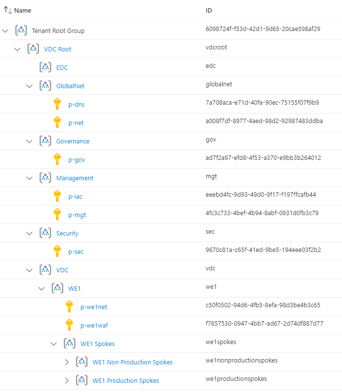

# Azure Cloud Framework
A single Azure Cloud Framework is deployed for the organisation, providing a single control plane of governance, security, and management for one or more globally located Virtual Data Center instances.

## Azure Region

The entire Azure Cloud Framework and the components that it contains are deployed to a single region. The choice of this region does not affect the choice of regions for Virtual Data Centre instances.

The Azure Cloud Framework is deployed to the **West Europe** region.

## Management Groups

A tenant always has a tenant root. It is considered by many to be unwise to deploy subscriptions and governance features at this level - organisation changes or rework may occur and require isolation from previous implementations.

A root-level Management Group provides the perfect starting point for all customisations and limits the scope of inheritance for RBAC and policy to the contents of this Management Group, therefore not affecting any other root-level Management Group that might be required to accommodate organisational changes or rework.

Additional child Management Groups will model the tenant based on governance needs, isolating subscriptions based on policy, RBAC, and security needs.

The framework comes with a prescribed architecture that has been designed to best apply Azure Policy and assign permissions using ##### Role-Based Access Control (RBAC) in a way that will scale. The main component of this design is an inheritance-based hierarchy of Management Groups.

The hierarchy is deployed under the tenant root to isolate it from all previous attempts of governance deployment and configuration

Roles that can manage all deployments (now or in the future) are placed at the top of the hierarchy. A repeatable subset of the design can be used to deploy many solutions within the scopes of the organization's management and governance. There is flexibility to include services under management and governance even if the service can't be placed into a data centre for business, technical, or Azure region support reasons.

### Management Group Structure

It should be noted that, just like with other container based hierarchies, a Management Group design is not an organizational chart that mimics how a human resources department views the organization. Instead, Management Groups represent how systems are managed within the business. Azure Policy and permission assignments are inherited. That means that when something is assigned to a Management Group, the subscriptions and Management Groups that are under that Management Group are included.

The Management Groups are as follows - note the Azure AD security groups that will be deployed for each Management Group to assign RBAC roles for those Management Groups, any child Management Groups, and any contained Subscriptions:

* **VDC Root:** This top-level Management Group provides isolation from the rest of the tenant for future proofing. Any access or policy that is assigned here will be inherited by all child Management Groups and their subscriptions.
  * `AZ RBAC mg vdc root Owners`: The Owners role of the VDC Root Management Group, providing all access to all deployed resources. Ideally this group will be empty.
  * `AZ RBAC mg vdc root Contributors`: The Contributors role of the VDC Root Management Group, providing all access, except permissions control, to all deployed resources. Ideally this group will contain limited numbers of central IT staff.
  * `AZ RBAC mg vdc root Readers`: The Readers role of the VDC Root Management Group, providing access to view resources and settings. Ideally this group will contain only staff that require auditing roles across all systems.
* **Governance**: Any subscriptions that offer governance features will be placed here, isolated from other Management Groups and subscriptions. Auditors or security officers may be granted access to observe or use deployed services within this Management Group.
  * `AZ RBAC mg governance Owners`: The Owners role of the Azure Root Management Group, providing all access to all deployed resources. Ideally this group will be empty.
  * `AZ RBAC mg governance Contributors`: The Contributors role of the Azure Root Management Group, providing all access, except permissions control, to all deployed resources. Ideally this group will contain limited numbers of central IT staff.
  * `AZ RBAC mg governance Readers`: The Readers role of the Azure Root Management Group, providing access to view resources and settings. Ideally this group will contain only staff that require auditing roles across all systems.
* **Security**: Centralised security services that span the entire deployment will be placed here. Access will be restricted because the contained data and reach of services will span workload boundaries.
  * `AZ RBAC mg Security Owners`: The Owners role of the security group, providing all access to all resources in this security group. Ideally this group will be empty.
  * `AZ RBAC mg Security Contributors`: The Contributors role of the security group, providing all access, except permissions control, to all resources in this security group.
  * `AZ RBAC mg Security Readers`: The Readers role of the security group, providing access to view all resources and settings in this security group.
* **Management**: Centralised management services that span the entire deployment will be placed here. Access will be restricted because the contained data and reach of services will span workload boundaries.
  * `AZ RBAC mg management Owners`: The Owners role of the Management Group, providing all access to all resources in this Management Group. Ideally this group will be empty.
  * `AZ RBAC mg management Contributors`: The Contributors role of the Management Group, providing all access, except permissions control, to all resources in this Management Group.
  * `AZ RBAC mg management Readers`: The Readers role of the Management Group, providing access to view all resources and settings in this Management Group.
* **WE1**: WE stands for West Europe, the Azure Region in Middenmeer, Netherlands. A structure of subscriptions will be a “data centre” in The Cloud called WE1 - the numeric value allows for the possibility of an WE2 if the need arises. All resources in the WE1 “data centre” will be contained within this Management Group or child Management Groups.
  * `AZ RBAC mg WE1 Owners`: The Owners role of the WE1 Management Group, providing all access to all resources in this Management Group. Ideally this group will be empty.
  * `AZ RBAC mg WE1 Contributors`: The Contributors role of the WE1 Management Group, providing all access, except permissions control, to all resources in this Management Group.
  * `AZ RBAC mg WE1 Readers`: The Readers role of the WE1 Management Group, providing access to view all resources and settings in this Management Group.
* **WE1 Workloads**: All workloads in the WE1 “data centre” will be contained within child Management Groups of the WE1 Workloads Management Group. Governance settings that must apply to all workloads will be assigned here.
  * `AZ RBAC mg WE1 workloads Owners`: The Owners role of the WE1 Workloads Management Group, providing all access to all resources in this Management Group. Ideally this group will be empty.
  * `AZ RBAC mg WE1 workloads Contributors`: The Contributors role of the WE1 Workloads Management Group, providing all access, except permissions control, to all resources in this Management Group.
  * `AZ RBAC mg WE1 workloads Readers`: The Readers role of the WE1 Workloads Management Group, providing access to view all resources and settings in this Management Group.
* **WE1 Production Workloads**: All production subscriptions/workloads will be deployed within this Management Group. Governance settings that should apply to all production workloads only should be deployed here.
  * `AZ RBAC mg WE1 production workloads Owners`: The Owners role of the WE1 Production Workloads Management Group, providing all access to all resources in this Management Group. Ideally this group will be empty.
  * `AZ RBAC mg WE1 production workloads Contributors`: The Contributors role of the WE1 Production Workloads Management Group, providing all access, except permissions control, to all resources in this Management Group.
  * `AZ RBAC mg WE1 production workloads Readers`: The Readers role of the WE1 Production Workloads Management Group, providing access to view all resources and settings in this Management Group.
* **WE1 Test Workloads**: All test subscriptions/workloads will be deployed within this Management Group. Governance settings that should apply to all test workloads only should be deployed here.
  * `AZ RBAC mg WE1 test workloads Owners`: The Owners role of the WE1 Test Workloads Management Group, providing all access to all resources in this Management Group. Ideally this group will be empty.
  * `AZ RBAC mg WE1 test workloads Contributors`: The Contributors role of the WE1 Test Workloads Management Group, providing all access, except permissions control, to all resources in this Management Group.
  * `AZ RBAC mg WE1 test workloads Readers`: The Readers role of the WE1 Test Workloads Management Group, providing access to view all resources and settings in this Management Group.
* **WE1 Dev Workloads**: All development subscriptions/workloads will be deployed within this Management Group. Governance settings that should apply to all development workloads only should be deployed here.
  * `AZ RBAC mg WE1 dev workloads Owners`: The Owners role of the WE1 Dev Workloads Management Group, providing all access to all resources in this Management Group. Ideally this group will be empty.
  * `AZ RBAC mg WE1 dev workloads Contributors`: The Contributors role of the WE1 Dev Workloads Management Group, providing all access, except permissions control, to all resources in this Management Group.
  * `AZ RBAC mg WE1 dev workloads Readers`: The Readers role of the WE1 Dev Workloads Management Group, providing access to view all resources and settings in this Management Group.

## Role Based Access Control
This section will discuss how Role-Based Access Control is designed in this solution.

### Management Group Delegations

Access management is based on a top down hierarchy using the flow of the Management Group hierarchy. For example, an entity that is added to `AZ RBAC mg Virtual Data Centre Root Contributor` will obtain contributor rights to:

* The Virtual Data Centre Root Management Group.
* All Management Groups under Virtual Data Centre Root.
* All contained subscriptions and resources under Virtual Data Centre Root and child Management Groups.

Access to certain resources should be restricted. For example:

* Only those with a role of managing governance should be members of the `AZ RBAC mg Governance Contributor group`, limiting access to central governance resources to selected personnel.
* Only those with a role of managing an entire Virtual Data Center instance should be in the `AZ RBAC mg Virtual Data Centre instance {data centre name} Contributor group`, limiting access to the resources in that instance.
* Only those with a role of managing global networking should be in the `AZ RBAC mg GlobalNet Contributor group`, limiting access to global networking resources to selected personnel.

Each Management Group has three access control groups:

* **AZ RBAC mg {Management Group name} Owner**: This is a break glass privilege, not to be assigned outside of emergencies. Lets you manage everything in all contained Management Groups and subscriptions, including access to resources.

* **AZ RBAC mg {Management Group name} Contributor**: Lets you manage everything in all contained Management Groups and subscriptions, including access to resources, except for permissions.

* **AZ RBAC mg {Management Group name} Reader**: Lets you see everything in all contained Management Groups and subscriptions, including resources and their configurations, but not make any changes.

### Subscription Delegations

Access management for workloads is handled on a per-subscription basis, using the subscription as the security and governance boundary for the workload (one workload per subscription).

If a developer requires contributor access to a workload called **d-myaks** then they will be added to a security group called `AZ RBAC sub d-myaks Contributor`. This group has Contributor rights to the subscription. The developer will have full rights, except for managing permissions or Azure Policy, to this subscription and to no other subscriptions unless explicitly granted.

If an external support engineer requires read access to a workload called **p-bigacc** for remote access to virtual machines, they will be added to a security group called `AZ RBAC sub p-bigacc Reader`. This group has Reader rights to the subscription and membership of this group grants visibility of the subscription and the contained resources. The external support engineer can see the subscription and it's resources.

Each deployed subscription has three access control groups:

* **AZ RBAC sub {subscription name} Owner**: This is a break glass privilege, not to be assigned outside of emergencies. Permits you manage everything in a subscription, including access to resources.

* **AZ RBAC sub {subscription name} Contributor**: Lets you manage everything in a subscription, including access to resources, except for permissions.

* **AZ RBAC sub {subscription name} Reader**: Lets you see everything in a subscription, including resources and their configurations.

### Resource Group and Resource Delegations

A user or team that manage only a part of a workload can be delegated access to:

* A specific resource group.
* A specific resource.
* Specific type of data of a specific resource.
* For example, members of the group `AZ RBAC rg p-gov-cng Storage Blob Data Contributor` will get *Storage Blob Data Contributor* access to the resource group *p-gov-cng*.
* For example, members of the group `AZ RBAC res p-we1net-vnet-bastion Reader` will get read access to an Azure Bastion resource called *p-we1net-vnet-bastion*.
