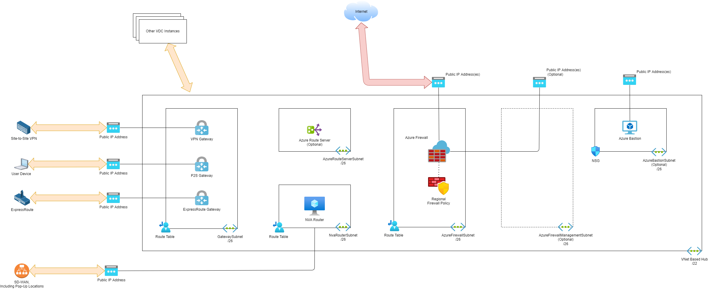
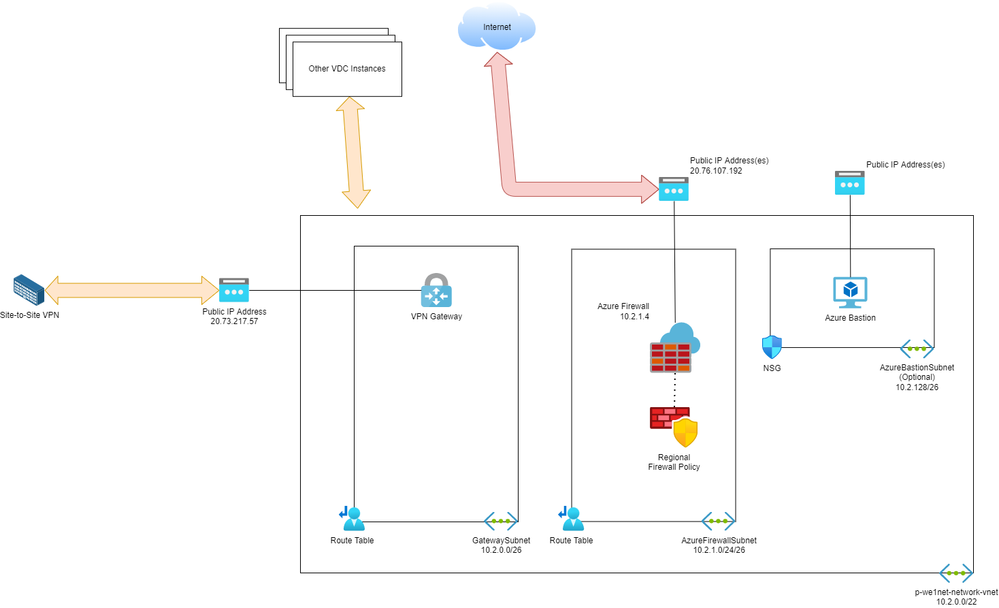

## The Hub (Virtual Network Hub)

The hub in this design is based on a traditional virtual network; this implementation requires the implementers and operators to build and control every aspect of the design, which includes extending control of routing down to the subnet of each networked workload (spoke).

The subnet design of a hub, with an address space of X.Y.0.0/22 is as follows below. The subnet addresses are reserved but the subnets deployed depend on the design:

* **GatewaySubnet X.Y.0.0/26**: Hosts Azure Virtual Network Gateways.
* **NvaSubnet X.Y.0.64/26**: Allows the use of third party Network Virtual Appliance (NVA) gateways.
* **AzureRouteServerSubnet X.Y.0.128/26**: Enables BGP propagation between the hub virtual network and NVA gateways.
* **AzureFirewallSubnet X.Y.1.0/26**: Hosts the Azure Firewall.
* **AzureFirewallManagementSubnet X.Y.1.64/26**: Enables Azure Firewall Basic SKU and tunneled configurations.
* **AzureBastionSubnet X.Y.3.128/26**: Deploy a shared, hub-based Azure Bastion.

### Gateways

A hub may be optionally connected to one or more external locations using a gateway.

There are several kinds of gateway that can be deployed to a hub:

* **Site-to-site VPN Virtual Network Gateway**: An encrypted IKEv1/IKEv2 tunnel is created across the Internet to the Azure Virtual Network Gateway in the hub. The connection is low cost but has higher latency.

* **ExpressRoute Virtual Network Gateway**: A SLA-protected circuit is provided by an ISP to provide a wired connection to a Microsoft router in a point-of-presence data centre. The Virtual Network Gateway in the hub (in the Azure region) connects to the Microsoft router to complete the connection from the on-premises location. The circuit is unencrypted (encryption requires encapsulated VPN or a higher SKU) but offers low latency and dedicated bandwidth.

* **Point-to-site VPN Virtual Network Gateway**: An Azure Virtual Network Gateway in the hub will enable devices to create an encrypted tunnel across the Internet to the hub.
  
  > All devices will get an IP address from a single pool - there is no way to create different routes or firewall rules for different devices/users. It is not recommended to use this feature for any user that should have restricted network access.

* **Third-Party SD-WAN Appliance**: A number of third party network virtualisation appliances (NVAs) are supported - enabling site-to-site VPN and SD-WAN implementations.

### Routing

There are two layers of routing that must be managed:

* Site-to-site routing
* Azure network routing
* Virtual Data Centre Instance to Virtual Data Centre Instance routing

#### Site-to-Site Routing

Site-to-site routing in Azure is built around BGP, even if an on-premises network appliance (the “VPN appliance”) does not use BGP to propagate routes.

* **Virtual Network Gateway**: Site-to-site VPN using the VPN Virtual Network Gateway (with or without VPN) propagates routes via BGP into the hub virtual network and, by default, to all spokes:
  * VPN with BGP simply propagate the routes into the virtual network(s).
  * VPN without BGP learns the on-premises network prefixes from the Local Network Gateway resource and propagates the routes into the virtual network(s).
* **Express Route**: ExpressRoute requires BGP and the ExpressRoute Virtual Network Gateway propagates routes into the virtual network(s).
* **Network Virtual Appliances**: A third-party NVA router cannot inject BGP routes into an Azure virtual network or receive routes. The solution to this is to either:
  * Create **user-defined routes** (UDRs) in the **Azure Firewall** subnet for the on-premises network prefixes with a next hop of the (internal) address of the Network Virtual Appliance (NVA). This does not scale well if there are many networks or the networks change frequently. This is a form of static routing.
  * Deploy **Azure Route Server** in the hub, integrating the Network Virtual Appliance (NVA) with the Azure Route Server to propagate BGP routes in two directions. This is dynamic routing and will scale more effectively. The maximum number of routes that an NVA can advertise to Azure Route Server is 1000.

The goal is to ensure that the **Azure Firewall** subnet is aware that the **Virtual Network Gateway** or the Network Virtual Appliance (NVA) is the next hop for any on-premises network.

#### Spoke Routes

Each of the spokes is connected to the hub via **virtual network peering**. The “Use Remote Gateway” feature is enabled in the spoke-to-hub connection. This results in the propagation of the spoke prefix to the hub.

All the prefixes of the hub and spokes are advertised either to the **Network Virtual Appliance (NVA)** or the **Virtual Network Gateway**, and then to the on-premises networks if BGP is used.

#### Azure Network Routing

The goal of the design is that all flow to/from spokes should pass through the hub firewall. This requires two flows to be controlled:

* Site-to-spoke
* Spoke-to-site

Virtual network peering creates a default or system route that forces traffic to take a direct path, bypassing the firewall. This must be modified.

A **Route Table** is associated with the subnet(s) hosting the gateway(s). A user-defined route is added to this Route Table for each spoke that is connected to the hub; the address space of the virtual network is directed to take a next hop using the private IP address of the firewall. This will force traffic coming in from site-to-site (VPN or ExpressRoute) or point-to-site connections to pass through the firewall before traversing virtual network peering to reach the spoke subnet(s).

A **Route Table** is associated with each spoke’s subnets. Route propagation is disabled, preventing BGP propagation from the Gateway Subnet. A user-defined route is added to the spoke subnet Route Table, defining that all traffic to `0.0.0.0/0` (“quad zero”) will take a next hop using the private IP address of the hub firewall. Traffic inside the spoke will stay inside the spoke. Traffic leaving the spoke will route over peering to the hub and pass through the firewall.

#### Virtual Data Centre Instance to Virtual Data Centre Instance Routing

It is possible for two Virtual Data Centre Instances, in the same region or in different regions, to communicate across the Microsoft or Azure networks. All routing should be via the hubs of the Virtual Data Centre Instances. The path between two spokes in different Virtual Data Centre Instances should be:

> **Spoke A** > **Hub in Virtual Data Centre Instance A** > **Hub in Virtual Data Centre Instance Z** > **Spoke Z**

The above flow maintains isolation between the Virtual Data Centre instances and enables administrators of a Virtual Data Centre instance to control the security boundaries of their Virtual Data Centre Instance.

Spokes in different Virtual Data Centre Instances should not have direct connections.

There are two ways to accomplish connectivity between Virtual Data Centre instance connections:

* **Shared ExpressRoute circuit**
  
  An ExpressRoute circuit should connect an on-premises location to the closes Azure ExpressRoute point-of-presence, reducing the latency of a connection to the Microsoft WAN. A single circuit can be used to connect to more than one Virtual Data Centre instance (10 for Standard in the same geography and 100 for Premium).

  BGP propagation is enabled between the Microsoft router in the point-of-presence location and the ExpressRoute Virtual Network Gateways in the Virtual Data Centre Instances.

  Each Virtual Data Centre instance learns the routes of the other instance’s spokes with a next hop of the Microsoft router. Automatically, each Virtual Data Centre instance can route to the other, although this is limited to the speed of the circuit.

* **Peering**

  If there is no shared ExpressRoute circuit or if you wish to have higher connection speeds, you can enable **VNet peering** between the hub virtual networks of two Virtual Data Centre Instances.
  
  The **Firewall Subnet** of each hub has a **Route Table**. A user-defined route should be added to the **Route Table** with the address of the other Virtual Data Centre instance as the prefix and the IP address of the other Virtual Data Centre Instance’s firewall as the next hop.

### Firewall

The firewall implemented in the hub is the **Azure Firewall**. The firewall has three components:

| Component              | Subscription                                    | Code Location |
| ---------------------- | ----------------------------------------------- | ------------- |
| Firewall               | `p-we1net`                      | The repo for `we1net` |
| Child Firewall Policy  | `p-we1net`                      | The repo for `we1net` |
| Rules Collection Group | A sub-resource of Child Firewall Policy         | With the workload that the rules are for |

The **Azure Firewall Policy** that is directly associated with the **Azure Firewall** is referred to as a child firewall policy. The **Azure Firewall Policy** inherits settings and rules from the parent Azure Firewall Policy in `p-net-azfw`, which is located in the `p-net` subscription, which is placed in the Management Group called `GlobalNet`.

The child **Azure Firewall Policy** has a 1:1 relationship with the firewall. Any settings or configurations that are unique to the Virtual Data Centre instance firewall should be implemented in this policy.

Firewall rules are added to **Rules Collection Groups**. A Rules Collection Group, which is deployed as a sub-resource of the firewall policy, has:

* A name.
* An action of `allow` or `deny`.
* A priority to dictate processing order.
* One or more firewall rules that act as a filter - traffic matching the filter apply the Rules Collection Group action.

A default **Rules Collection Group** that applies to the entire Virtual Data Centre instance is supplied. Each workload will have its own **Rules Collection Group**, supporting the concept of DevSecOps.

## WE1 VDC Instance

The VDC instance is deployed to Azure West Europe and is called WE1.

### Subscription Configuration

The Virtual Data Centre instance hub is deployed into a subscription called `p-we1net`. The subscription is placed into a Management Group called `WE1`, which is a member of a Management Group called `VDC`.

The configuration of the subscription is described below.

#### Role-Based Access Control

Access to this subscription should be restricted to those supporting and operating the contained components. There are 3 Azure AD access groups to control access to the subscription and the contained resource groups and resources:

| Group Name                                             | Role        | Description                                                                                            |
| ------------------------------------------------------ | ----------- | ------------------------------------------------------------------------------------------------------ |
| `AZ RBAC sub p-we1net Owner`       | Owners      | Members have full permissions, including permissions. This group is ideally empty.                     |
| `AZ RBAC sub p-we1net Contributor` | Contributor | Members have full permissions, excluding permissions. This group has as few human members as possible. |
| `AZ RBAC sub p-we1net Reader`      | Reader      | Members are limited to read permissions only. Ideally, this is where most human members are placed.    |

#### Diagnostics Settings

The diagnostics settings of the subscription are configured to send the Activity Log data of this subscription to two destinations:

* **Long-term audit logging**: Blob storage in the `p-gov-log` resource group in the `p-gov` subscription that is configured for read only, economic, long-term storage for legal and compliance purposes.
* **Platform monitoring**: A Log Analytics Workspace in the `p-mgt-mon` resource group in the `p-mgt` subscription for query-enabled functionality such as searching, reporting, and security monitoring.

The diagnostics setting for the subscription is configured as follows:

* Logs:
  * Categories:
    * Administrative: `Enabled`
    * Security: `Enabled`
    * ServiceHealth: `Enabled`
    * Alert: `Enabled`
    * Recommendation: `Enabled`
    * Policy: `Enabled`
    * Autoscale: `Enabled`
    * ResourceHealth: `Enabled`
* Destination Details:
  * Send To Log Analytics Workspace: `Enabled`
    * Subscription: `p-mgt`
    * Log Analytics Workspace: `p-mgt-montijczky7je-ws`
  * Archive To Storage Account: `Enabled`
    * Subscription: `p-gov`
    * Storage Account: `pgovlogauditxnlolmbkkxb`

#### Microsoft Defender for Cloud

Security and compliance features are provided by Microsoft Defender for Cloud. There are two tiers:

* **Free**: Basic features and configurations are possible.
* **Paid**: Special security monitoring features for resources can be enabled per-support resource type.

The configurations for this subscription are configured as follows:

##### Defender Plans

The plans are configure as follows:

* Cloud Security Posture management: Grey Out
* Servers: Off
* App Service: Off
* Databases: Off
* Storage: On
* Containers: Off
* Kubernetes: Off
* Container Registries: Off
* Key Vault: `Off`
* Resource Manager: On
* DNS: On

##### Auto Provisioning

The deployment of extensions is configured as follows:

* Log Analytics Agent/Azure Monitor Agent: `On`
  * Agent Type: `Log Analytics`
  * Custom Workspace: `p-mgt-montijczky7je-ws`
  * Security Events Storage: `Minimal`
* Vulnerability Assessment for Machines: `Off`
* Guest Configuration Agent: `Off`
* Microsoft Defender for Containers Components: `Off`

##### Email Notifications

Notifications are configured as follows:

* Email Recipients:
  * All Users With The Following Roles: Owner, Contributor
  * Additional Email Addresses: A distribution list to be provided
* Notification Types:
  * Notify About Alerts With The Following Severity (Or Higher): Medium

##### Integrations

The following integrations are configured:

* Enable Integrations:
  * Allow Microsoft Defender for Cloud Apps To Access My Data: True
  * Allow Microsoft Defender for Endpoint To Access My Data: True

##### Workflow Automation

No configurations are included.

##### Continuous Export

No configurations are included.

#### Resource Groups

The resource group, `p-we1net-network`, is created in the `p-we1net` subscription, which is in the management group called `we1`.

A lock is placed on the resource group:

* **Resource Group Lock**: `resourceGroupDoNotDelete`
  * Lock Type: `Delete`

The following resources are deployed to the resource group:

* **Network Watcher**: `p-we1net-network-networkwatcher`
  * Purpose: `Enable network watcher for the subscription in the region.`
* **Virtual Network**: `p-we1net-network-vnet`
  * Purpose: `Provide a virtual network that the hub resources connect to.`
  * Address Space: `The first /22 in the Virtual Data Centre InstanceVirtual Data Centre instance /16`
  * DNS Servers: `The IP address of the hub firewall`
  * Subnets:
    * `GatewaySubnet`:
      * Purpose: `Host the Virtual Network Gateways`
      * Address Space: **10.100.0.0/26**
      * Route Table: `p-we1net-network-vnet-GatewaySubnet-rt`
    * `AzureFirewallSubnet`:
      * Purpose: `Required for Azure FirewaLl`
      * Address Space: **10.100.1.0/22**
      * Route Table: `p-we1net-network-vnet-AzureFirewallSubnet-rt`
    * `AzureBastionSubnet`:
      * Purpose: `Required for a shared Azure Bastion in VNet-based hub where there is a firewall`
      * Address Space: **10.100.3.128**
      * Network Security Group: `p-we1net-network-vnet-AzureBastionSubnet-nsg`
  * DDoS Protection Standard: `Disabled`
* **Route Table**: `p-we1net-network-vnet-GatewaySubnet-rt`
  * Purpose: `Control the direction of inbound site-to-site flows`
  * Configuration: 
    * Propagate Gateway Routes: `Yes`
  * Routes: 
    * `PublicWafBlackhole`: 
      * Address Prefix: `10.100.4.0/24`
      * Next Hop Type: `None`
    * *All spokes will deploy a route, with a prefix of the spoke prefix, a next hop of Appliance and next hop IP address of the Azure Firewall*
* **Route Table**: `p-we1net-network-vnet-AzureFirewallSubnet-rt`
  * Purpose: `Control the direction of flows from the Azure Firewall`
  * Configuration: 
    * Propagate Gateway Routes: `Yes`
  * Routes: 
    * `Internet`: 
      * Address Prefix: `0.0.0.0/0`
      * Next Hop Type: `Internet`
    * *Additional routes will be added for each additional VDC instance, with a prefix of the VDC /16 prefix, a next hop of Appliance and next hop IP address of the remote VDC instance Azure Firewall*
* **Network Security Group**: `p-we1net-network-vnet-AzureBastionSubnet-nsg`
  * Purpose: `Protect the AzureBastionSubnet`
  * Inbound Security Rules:
    * `AllowHttpsFromInterntToAzurebastionsubnet`:
      * Source: `Service Tag`
      * Source Service Tag: `Internet`
      * Source Port Ranges: `*`
      * Destination: `Any`
      * Service: `HTTPS`
      * Destination Port Ranges: `443`
      * Protocol: `TCP`
      * Action: `Allow`
      * Priority: `1000`
    * `AllowHttpsFromGatewaymanagerToAzurebastionsubnet`:
      * Source: `Service Tag`
      * Source Service Tag: `GatewayManager`
      * Source Port Ranges: `*`
      * Destination: `Any`
      * Service: `HTTPS`
      * Destination Port Ranges: `443`
      * Protocol: `TCP`
      * Action: `Allow`
      * Priority: `1100`
    * `AllowHttpsFromAzureLoadBalancerToAzurebastionsubnet`:
      * Source: `Service Tag`
      * Source Service Tag: `AzureLoadBalancer`
      * Source Port Ranges: `*`
      * Destination: `Any`
      * Service: `HTTPS`
      * Destination Port Ranges: `443`
      * Protocol: `TCP`
      * Action: `Allow`
      * Priority: `1200`
    * `AllowBastionHostCommunicationToAzurebastionsubnet`:
      * Source: `Service Tag`
      * Source Service Tag: `VirtualNetwork`
      * Source Port Ranges: `*`
      * Destination: `ServiceTag`
      * Destination Service Tag: `VirtualNetwork`
      * Service: `Custom`
      * Destination Port Ranges: `8080,5701`
      * Protocol: `Any`
      * Action: `Allow`
      * Priority: `1300`
    * `DenyAll`:
      * Source: `Any`
      * Source Port Ranges: `*`
      * Destination: `Any`
      * Service: `Custom`
      * Destination Port Ranges: `*`
      * Protocol: `Any`
      * Action: `Deny`
      * Priority: `4000`
  * Outbound Security Rules:
    * `AllowSshRdpFromAzurebastionsubnetToVirtualNetwork`:
      * Source: `Any`
      * Source Port Ranges: `*`
      * Destination: `Service Tag`
      * Detination Service Tag: `VirtualNetwork`
      * Service: `Custom`
      * Destination Port Ranges: `22,3389`
      * Protocol: `Any`
      * Action: `Allow`
      * Priority: `1000`
    * `AllowHttpsFromAzurebastionsubnetToAzureCloud`:
      * Source: `Any`
      * Source Port Ranges: `*`
      * Destination: `Service Tag`
      * Detination Service Tag: `AzureCloud`
      * Service: `HTTPS`
      * Destination Port Ranges: `443`
      * Protocol: `Any`
      * Action: `Allow`
      * Priority: `1100`
    * `AllowBastionCommunicationFromAzurebastionsubnetToVirtualNetwork`:
      * Source: `Service Tag`
      * Source Service Tag: `VirtualNetwork`
      * Source Port Ranges: `*`
      * Destination: `Service Tag`
      * Detination Service Tag: `VirtualNetwork`
      * Service: `Custom`
      * Destination Port Ranges: `8080,5701`
      * Protocol: `Any`
      * Action: `Allow`
      * Priority: `1200`
    * `AllowGetSessionInformationFromAzurebastionsubnetToInternet`:
      * Source: `Any`
      * Source Port Ranges: `*`
      * Destination: `Service Tag`
      * Detination Service Tag: `Internet`
      * Service: `Custom`
      * Destination Port Ranges: `80`
      * Protocol: `Any`
      * Action: `Allow`
      * Priority: `1300`
* **Azure Firewall Policy**: `p-we1net-network-fw-firewallpolicy`
  * Purpose: `Configures the settings and rules of the firewall associated with this Virtual Data Centre instance.`
  * SKU: `Premium`
  * DNS: `Enabled`
    * DNS Servers: `10.100.8.4, 10.100.8.5`
    * DNS Proxy: `Enabled`
  * Threat Intelligence: `Alert And Deny`
  * TLS Inspection: `Disabled`
  * IDPS: `Alert And Deny`
    * Private IP Ranges
      * Inherit Private IP Ranges From Parent Policy: `True`
  * Secured Virtual Networks: `p-we1net-network-vnet/AzureFirewallSubnet`
* **Rules Collection Group**: `we1rules`
  * Purpose: `Firewall rules that affect all networks in the VDC instance.`
  * **Rules Collection**: Nat-Dnat-we1
      * Purpose: `Enable DNAT from The Internet to private IP addresses`
      * Type: `DNAT`
      * Priority: `100`
      * Action: `Allow`
      * Rules: `None`
  * **Rules Collection**: Network-Deny-we1
      * Purpose: `Create specific overrides for rules in Network-Allow-we1`
      * Type: `Network`
      * Priority: `200`
      * Action: `Deny`
      * Rules: `None`
  * **Rules Collection**: Network-Allow-we1
      * Purpose: `Allow TCP, UDP ICMP flows.`
      * Type: `Network`
      * Priority: `300`
      * Action: `Allow`
      * Rules: `None`
  * **Rules Collection**: Application-Deny-we1
      * Purpose: `Create specific overrides for rules in Application-Allow-we1`
      * Type: `Application`
      * Priority: `400`
      * Action: `Deny`
      * Rules: `None`
  * **Rules Collection**: Application-Allow-we1
      * Purpose: `Allow outbound flows to HTTP/HTTPS/SQL Server`
      * Type: `Application`
      * Priority: `500`
      * Action: `Allow`
      * Rules: `None`
* **Public IP Prefix**: `p-we1net-network-fw-pipprefix`
  * Purpose: `Reserve a contiguous block of IP addresses for the Azure Firewall`
  * IP Version: `IPv4`
  * Size: `/28 (16 IP addresses)`
  * Prefix Ownership: `Microsoft Owned`
  * Availability Zone: `Zone-redundant`
* **Public IP Address**: `p-we1net-network-fw-pip001`
  * Purpose: `The first public IP address for the firewall`
  * IP Address: `20.76.107.192`
  * Availability Zones: `1, 2, 3`
  * SKU: `Standard`
  * Tier: `Regional`
  * Configuration:
    * Idle Timeout: `4 minutes`
* **Azure Firewall**: `p-we1net-network-fw`
  * Purpose: `A firewall for the Virtual Data Centre instance`
  * Availability Zones: `1, 2, 3`
  * Firewall SKU: `Premium`
  * Firewall Policy: `p-we1net-network-fw-firewallpolicy`
* **Storage Account**: `pwe1netnetworkdiagff5bl`
  * Purpose: `Provides blob storage for Azure Firewall and Gateway logs`
  * Performance: `Standard`
  * Replication: `ZRS`
  * Account Kind: `StorageV2`
* **Azure Bastion**: p-we1net-network-bastion
  * Purpose: `Enable SSH and RDP access to virtual machines from a shared resource.`
  * Public DNS Name: `bst-ab5286a0-cdc8-46ec-abd4-b351771ac2f9.bastion.azure.com`
  * Public IP Address: `p-we1net-network-bastion-pip001`
  * Configuration:
    * Tier: `Standard`
    * Kerberos authentication: `Disabled`
    * Copy And Paste: `True`
    * Native Client Support: `True`
    * IP-Based Connection: `True`
    * Instance Count: `2`
* **Public IP Address**: `p-we1net-network-bastion-pip001`
  * Purpose: `Enable control and data plan for Azure Bastion`
  * IP Address: `20.31.6.28`
  * Availability Zones: `1, 2, 3`
  * SKU: `Standard`
  * Tier: `Regional`
  * Configuration:
    * Idle Timeout: `4 minutes`
* **VPN Virtual Network Gateway**: p-we1net-network-vpn
  * Purpose: `Enable site-to-site VPN connections`
  * Public IP Address:`p-we1net-network-vpn-pip001`
  * SKU: `VpnGw1AZ`
  * Gateway Type: `VPN`
  * VPN Type: `Route-based`
  * Active-Active Mode: `Disabled`
  * Gateway Private IPs: `Disabled`
  * Configure BGP: `True`
  * Autonomous System Number (ASN): `65515`
  * BGP Peer IP Address: `10.100.0.254`
* **Public IP Address**: `p-we1net-network-vpn-pip001`
  * Purpose: `The first public IP address for VPN Gateway`
  * IP Address: `20.73.217.57`
  * Availability Zones: `1, 2, 3`
  * SKU: `Standard`
  * Tier: `Regional`
  * Configuration:
    * Idle Timeout: `4 minutes`
* **VPN Local Network Gateway**: p-we1net-network-vpn-osl-lng
  * Purpose: `Define the on-premises network of the Oslo office`
* **VPN Connection**: p-we1net-network-vpn-osl-conn
  * Purpose: `Connect the Oslo office to the VPN Gateway`
