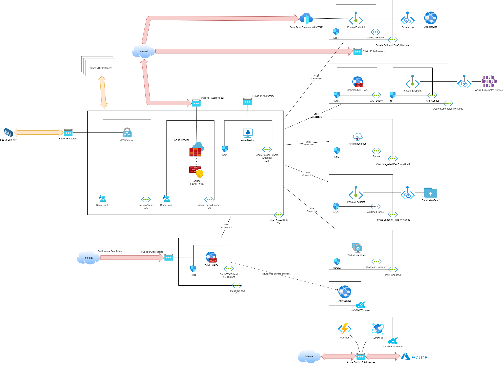

# Virtual Data Centre Instance

A Virtual Data Centre Instance is a regional deployment to host workloads, each made up of a subscription, resource group(s), and resources.

## Overview

A Virtual Data Centre instance is deployed for every Azure region that an organisation will adopt to deploy multiple workloads.

*If a one-off workload is required in an Azure region, a more cost effective option will be to a “micro-deployment” classified as an Edge Data Centre (EDC) in the Azure Cloud Framework.*

The boundary of the Virtual Data Centre instance supports governance, performance, and cost optimisation, whether the workload is network-connected or not. A large proportion of the  Virtual Data Centre instance design is network related. Some may view this as a “virtual machine” architecture; on the contrary, this architecture supports PaaS workloads that require network connections as well as virtual machines. Additionally, any PaaS workload that is not network connected will be a part of the Azure Management Group architecture of a Virtual Data Centre instance and therefore be subject to the governance of that Virtual Data Centre instance.

## Networking

Each Virtual Data Centre instance has its own network footprint. This ensures:

* The Virtual Data Centre Instance complies with the core concepts of resilience and security blast area restriction.
* Performance is maximised by preventing unnecessary routing between Azure regions.

### General Approach

The network is deployed as a hub (network core) and spoke (workload network or access network) model, as is recommended by Microsoft for enterprise deployments. This model promotes the reuse of expensive resources, such as site-to-site gateways and firewalls, and allows traffic to transit through a central security control point (the firewall in the hub).

Each Virtual Data Centre instance has a hub, containing essential transit resources such as:

* Site-to-site networking gateways
* Azure Firewall

Workloads are deployed into a dedicated Virtual Networks, commonly referred to as a spoke. The spoke is deployed as a resource in the workload subscription. The spoke is peered or connected with the hub; this results in routing being enabled from the hub to/from the spoke. The resources in the spoke can route through the hub to reach on-premises, other spokes, and The Internet - all subject to the firewall rules in the hub.

Routing is configured in the hub to ensure that all traffic from gateways (site-to-site or point-to-site) is routed through the firewall in the hub to reach the spokes. Routing of the spokes is configured to ensure that all traffic leaving the spoke must route through the firewall in the hub. The result is that the firewall sees, logs, and controls all flows:

* On-premises to/from spokes
* Internet to spokes (via DNAT rules in the firewall)
* Spokes to Internet
* Spoke to spoke

Azure Policy is used to ensure that public IP addresses are restricted - they are used only when required by PaaS resources for a necessary control or communications plane. This ensures that network-connected resources cannot connect directly to the Internet.

Modern workloads typically use HTTPS to make themselves available on the Internet - they will not be shared over a private site-to-site connection or via DNAT rules on the firewall. These workloads are shared using a Web Application Firewall (WAF). The Web Application Firewall (WAF) implements the OWASP ruleset to inspect the traffic at the application layer before permitting it in. The traffic is routed through the hub firewall and then on to the workload.

### IP Addressing

A Virtual Data Centre instance shares a single **/16** IPv4 address space, which is divided as follows:

* The first **/22**: The hub
* The second **/22**: The Application Firewall virtual network
* The rest: The workloads in the Virtual Data Centre instance

This approach will simplify routing:

* From on-premises if BGP is not used.
* Routing between more than one Virtual Data Centre instance if virtual network peering is used.
* Firewall rules with a target or source destination of an entire Virtual Data Centre instance.

Each network-connected workload shall have a dedicated virtual network. The address space of this virtual network will be based on the unique requirements of the workload. Some workloads will require a small address space. Some workloads will require a large address space.
