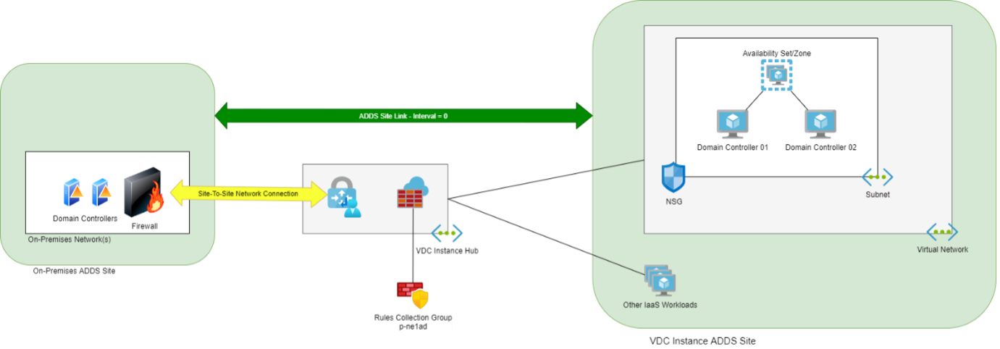

## Active Directory Domain Services (ADDS)

This section of the document will describe the *Active Directory Domain Services (ADDS)* Domain Controllers workload in the Virtual Data Centre instance.

### Purpose

The Domain Controllers workload serves several functions:

* Provide ADDS services to domain members in the same Virtual Data Centre instance.
* Offer DNS name resolution to the Virtual Data Centre instance networks, including forwarding to Azure DNS (Internet Azure Public DNS zones and Azure Private DNS zones).
* Optionally synchronise with Azure AD through the use of Azure AD Connect.

### Functional Design

Here you will find a high-level description of the architecture for this workload.

#### Domain Controller Requirement

Virtual machines may connect to Virtual Networks in a Virtual Data Centre instance. If those virtual machines are a member of a domain, then that domain will require Domain Controllers in the Virtual Data Centre instance. This is to ensure that any services, such as SQL Server or Azure Virtual Desktop, that are depending on ADDS services will be able to access those services if the Virtual Data Centre instance is no longer able to reach a location that contains Domain Controllers.

If a Virtual Data Centre instance contains virtual machines that are in 3 domains, then there should be 3 ADDS workloads for those domains. Each ADDS workload will have 2 domain controllers for that domain.

#### Site-to-Site Networking

If the ADDS domain will replicate with domain controllers in other networks (on-premises or Virtual Data Centre instances) then a site-to-site network connection will be required. The site-to-site networking connection will connect the remote ADDS site and the Virtual Data Centre instance’s ADDS site.

On-premises firewall rules must be configured to allow communications to/from the domain controllers in the Virtual Data Centre instance to the domain controllers in the on-premises location:

| Protocol | TCP Ports                                                                                                                             |
| -------- | ------------------------------------------------------------------------------------------------------------------------------------- |
| TCP      | 53 (DNS), 88 (Kerberos), 135 (CIFS), 139 (CIFS), 389, 445 (SMB), 464, 636 (Secure DNS), 3268, 3269, 5722, 9389, 49152-65535 (Netbios) |
| UDP      | 53 (DNS), 88 (Kerberos), 123 (NTP), 137 (SMB), 138 (SMB), 389, 464,636 (Secure DNS), 49152-65535 (Netbios)                            |

If the ADDS FSMO roles are moved to the Virtual Data Centre instance, then all remote (outside the Virtual Data Centre instance) domain controllers must be able to reach the Virtual Data Centre instance domain controllers on the above protocols & ports.

#### ADDS Site

An ADDS site provides important functions:

* Guide domain members in the same site to use local domain controllers for authentication and authorisation.
* Control ADDS replication between domain controllers.

Each Virtual Data Centre instance should be defined as an ADDS site to provide isolation and independence from external failure.

The configuration will be as follows:

* The `/16` address space of the Virtual Data Centre instance will be used to create an ADDS Subnet, called `#_datacenter.001.name_#-Subnet01`.
* An ADDS site, called `#_datacenter.001.name_#-Site` will be created and linked to the ADDS subnet.

If the ADDS domain will replicate with domain controllers in other networks (on-premises or Virtual Data Centre instances) then a site link will be required for each remote ADDS site:

1. Identify the remote ADDS site.
1. Create a site link called `<Remote ADDS Site Name>-#_datacenter.001.name_#-Site-Link`.
1. Enable Change Notification for the Site Link: https://techcommunity.microsoft.com/t5/ask-the-directory-services-team/configuring-change-notification-on-a-manually-created/ba-p/400188

If the ADDS domain will not replicate with domain controllers in other networks (on-premises or Virtual Data Centre instances) then the default Site Link should be used.

##### Multiple Virtual Data Centre instances

If a domain will have domain controllers in multiple Virtual Data Centre instances then ADDS replication should be configured between the Virtual Data Centre instances. This will require:

* ADDS Site Links
* Firewall rules
* NSG rules

#### Azure Firewall & NSG

The **Azure Firewall** in the Virtual Data Centre instance hub must allow traffic to/from any ADDS workloads in the Virtual Data Centre instance. The remote sources/destinations will be any domain controllers replicating with the Virtual Data Centre instance. The firewall rules will be contained in a **Rules Collection Group** for the ADDS workload, stored in the repository for the workload.

The **Network Security Group (NSG)** for the Domain Controller subnet must allow traffic from any ADDS workloads in the Virtual Data Centre instance. The remote sources will be any domain controllers replicating with the Virtual Data Centre instance.

The NSG will allow all traffic outbound - outbound filtering is handled by the Azure Firewall in the hub.

::: warning
The sources and destinations of the firewall and NSG rules for an ADDS workload must be always updated to include all external domain controllers. Despite the use of AD DS Sites and Services, Replication must be allowed at the network layer for the services to function. Failure to allow this traffic will result in AD DS replication failures, and potential Domain Controller isolation.
:::

#### Domain Controller Promotion

A data disk is provided to store all domain controller data. This is following [best practices for creating ADDS domain controllers in Microsoft Azure](https://learn.microsoft.com/en-us/azure/architecture/reference-architectures/identity/adds-extend-domain)

When the Domain Controller promotion is being done, place all ADDS data on the data disk:

* SYSVOL
* Database file
* Log file

The data disk should not use host-based (any) caching.

Not following this guidance may result in a USN rollback in the ADDS domain.

#### Backup

As with all domain controllers (not just Azure), care must be taken about the use of restore from backup. Retention of domain controller backups should be no longer than 180 days by default.

The backup age should never be older than the [tombstone lifetime (TSL)](https://learn.microsoft.com/en-us/azure/backup/active-directory-backup-restore#best-practices) because objects older than the TSL will be "tombstoned" and no longer considered valid

A second data disk is deployed to the virtual machine. After the domain controller promotion is successful, Windows Server Backup should be configured to perform a daily **System State Backup**, storing the backup data on this disk.

### Detailed Design

#### Subscription Configuration

The ADDS workload name is `p-#_datacenter.001.name_#dc`. It is placed in the Management Group called `#_datacenter.001.name_# Production Spokes`.

##### Role-Based Access Control

Access to this subscription should be restricted to those supporting and operating the contained components. There are 3 Azure AD access groups to control access to the subscription and the contained resource groups and resources.:

| Group Name                                            | Role        | Description                                                                                            |
| ----------------------------------------------------- | ----------- | ------------------------------------------------------------------------------------------------------ |
| `AZ RBAC sub p-#_datacenter.001.name_#dc Owner`       | Owners      | Members have full permissions, including permissions. This group is ideally empty.                     |
| `AZ RBAC sub p-#_datacenter.001.name_#dc Contributor` | Contributor | Members have full permissions, excluding permissions. This group has as few human members as possible. |
| `AZ RBAC sub p-#_datacenter.001.name_#dc Reader`      | Reader      | Members are limited to read permissions only. Ideally, this is where most human members are placed.    |

##### Microsoft Defender for Cloud

Security and compliance features are provided by Microsoft Defender for Cloud. There are two tiers:

* **Free**: Basic features and configurations are possible.
* **Paid**: Special security monitoring features for resources can be enabled per-support resource type.

The configurations for this subscription are configured as follows:

###### Defender Plans

The plans that will be activated will depend on the workload architecture and security classification. The following plans should be considered:

* Defender CSPM: `Off`
* Servers: `On`
* App Service: `Off`
* Databases: `Off`.
* Storage: `On`.
* Key Vault: `On`.
* Resource Manager: `On`.
* DNS: `On`.

###### Auto Provisioning

The deployment of extensions is configured as follows:

* Log Analytics Agent/Azure Monitor Agent: `On`
  * Agent Type: `Log Analytics`
  * Custom Workspace: `p-mgt-montijczky7je-ws`
  * Security Events Storage: `Minimal`
* Vulnerability Assessment for Machines: `Off`
* Guest Configuration Agent: `Off`
* Microsoft Defender for Containers Components: `Off`

###### Email Notifications

Notifications are configured as follows:

* Email Recipients:
  * All Users With The Following Roles: `Owner`, `Contributor`
  * Additional Email Addresses: ***A distribution list to be provided***
* Notification Types:
  * Notify About Alerts With The Following Severity (Or Higher): `Medium`

###### Integrations

The following integrations are configured:

* Enable Integrations:
  * Allow Microsoft Defender for Cloud Apps To Access My Data: `True`
  * Allow Microsoft Defender for Endpoint To Access My Data: `True`

###### Workflow Automation

No configurations are included.

###### Continuous Export

No configurations are included.

##### Auditing

The diagnostics setting for the subscription is configured as follows:

* Logs:
  * Categories:
    * Administrative: `Enabled`
    * Security: `Enabled`
    * ServiceHealth: `Enabled`
    * Alert: `Enabled`
    * Recommendation: `Enabled`
    * Policy: `Enabled`
    * Autoscale: `Enabled`
    * ResourceHealth: `Enabled`
* Destination Details:
  * Send To Log Analytics Workspace: `Enabled`
    * Subscription: `p-mgt`
    * Log Analytics Workspace: `p-mgt-montijczky7je-ws`
  * Archive To Storage Account: `Enabled`
    * Subscription: `p-gov`
    * Storage Account: `pgovlogauditxnlolmbkkxb`

##### Resource Groups

There are three Resource Groups in the design. The first Resource Group contains the network resources:

* **Resource Group**: `<workload name>-network`
  * **Flow Log**: `FrontendSubnet-flowlog`
    * Purpose: `Enable NSG Traffic Analytics for the FrontendSubnet`
    * Flow Logs Version: `Version 2`
    * Select Storage Account:
      * Subscription: `p-#_datacenter.001.name_#dc`
      * Storage Account: `p#_datacenter.001.name_#dcnetworkdiag<random string>`
      * Retention (Days): `30`
    * Traffic Analytics: `Enabled`
      * Traffic Analytics Processing Interval: `Every 10 mins`
      * Subscription: `p-mgt`
      * Log Analytics Workspace: `p-mgt-montijczky7je-ws`
  * **Application Security Group**: `p-#_datacenter.001.name_#dc-network-dc-asg`
    * **Purpose**: `Group the NICs of the domain controller VMs for NSG rules`
  * **Network Watcher**: `p-#_datacenter.001.name_#dc-network-networkwatcher`
    * **Purpose**: `Enable Network Watcher for the workload subscription in the Azure region of the Virtual Data Centre instance.`
  * **Virtual Network**: `p-#_datacenter.001.name_#dc-network-vnet`
    * Purpose: `Provide a virtual network for the workload virtual machines to connect to`.
    * Address Space: `The first available /25 in the Virtual Data Centre instance after the first /22`
    * DNS Servers: `The IP address of the hub firewall`
    * Subnets:
      * FrontendSubnet:
        * Address Space: ***The first /26 in the VNet /25***
        * Network Security Group: `p-#_datacenter.001.name_#dc-network-vnet-FrontendSubnet-nsg`
        * Route Table: `p-#_datacenter.001.name_#dc-network-vnet-FrontendSubnet-rt`
        * Service Endpoints:
          * `Microsoft.KeyVault`
          * `Microsoft.Storage`
    * DDoS Protection Standard: `Disabled`
    * Peerings:
      * `p-#_datacenter.001.name_#net-network-vnet`:
        * Traffic To Remote Virtual Network: `Allow`
        * Traffic Forwarded From Remote Virtual Network: `Block traffic that originates from outside this virtual network`
        * Virtual Network Gateway Or Route Server: *Use the remote virtual network gateway or Route Server*
  * **Network Security Group**: `p-#_datacenter.001.name_#dc-network-vnet-FrontendSubnet-nsg`
    * Purpose: `Control traffic into and inside the FrontendSubnet`.
    * Inbound Security Rules (Custom):
      * AllowTcpForAddsFromWanToAdservers:
        * Source: `IP Addresses`
        * Source IP Addresses: `<Virtual Data Centre instance /16 address>`, `<IP Addresses of remote domain controllers>`
        * Source Port Ranges: `*`
        * Destination: `Application Security Group`
          * `p-#_datacenter.001.name_#dc-network-dc-asg`
        * Service: `Custom`
        * Destination Port Ranges: `53, 88, 135, 139, 389, 445, 464, 636, 3268, 3269, 5722, 9389, 49152-65535`
        * Protocol: `TCP`
        * Action: `Allow`
        * Priority: `1100`
      * AllowUdpForAddsFromWanToAdservers:
        * Source: `IP Addresses`
        * Source IP Addresses: `<Virtual Data Centre instance /16 address>`, `<IP Addresses of remote domain controllers>`
        * Source Port Ranges: `*`
        * Destination: `Application Security Group`
          * `p-#_datacenter.001.name_#dc-network-dc-asg`
        * Service: `Custom`
        * Destination Port Ranges: `53, 88, 123, 137, 138, 389, 464, 636, 49152-65535`
        * Protocol: `UDP`
        * Action: `Allow`
        * Priority: `1200`
      * AllowDnsFromFirewallToFrontendSubnet:
        * Source: `IP Addresses`
        * Source IP Addresses: `<IP address of hub firewall>`
        * Source Port Ranges: `*`
        * Destination: `Application Security Group`
          * `p-#_datacenter.001.name_#dc-network-dc-asg`
        * Service: `DNS (UDP)`
        * Destination Port Ranges: `53`
        * Protocol: `UDP`
        * Action: `Allow`
        * Priority: `1300`
      * AllowDnsFromAzureToAdservers:
        * Source: `IP Addresses`
        * Source IP Addresses: `168.63.129.16`
        * Source Port Ranges: `*`
        * Destination: `Application Security Group`
          * `p-#_datacenter.001.name_#dc-network-dc-asg`
        * Service: `DNS (UDP)`
        * Destination Port Ranges: `53`
        * Protocol: `UDP`
        * Action: `Allow`
        * Priority: `1400`
      * AllowRdpFromAzureBastionSubnetToFrontendSubnet:
        * Source: `IP Addresses`
        * Source IP Addresses: `<CIDR of hub AzureBastionSubnet>`
        * Source Port Ranges: `*`
        * Destination: `IP Addresses`
        * Destination IP Addresses: `<CIDR of FrontendSubnet>`
        * Service: `RDP`
        * Destination Port Ranges: `3899`
        * Protocol: `TCP`
        * Action: `Allow`
        * Priority: `1500`
      * DenyAll:
        * Source: `Any`
        * Source Port Ranges: `*`
        * Destination: `IP Addresses`
        * Destination IP Addresses: `<The domain controller subnet CIDR>`
        * Service: `Custom`
        * Destination Port Ranges: `*`
        * Protocol: `Any`
        * Action: `Allow`
        * Priority: `4000`
      * Outbound Security Rules (Custom): `None`
      * Diagnostic Settings:
        * `p-mgt-montijczky7je-ws`
          * Logs: `All Logs`
          * Destination Details:
            * Send To Log Analytics: `Enabled`
              * Subscription: `p-mgt`
              * Log Analytics Workspace: `p-mgt-montijczky7je-ws`
            * Archive To A Storage Account: `Disabled`
  * **Route Table**: `p-#_datacenter.001.name_#dc-network-vnet-FrontendSubnet-rt`
    * Purpose: `Override default and BGP routing for the FrontendSubnet`
    * Propagate Gateway Routes: `No`
    * Routes:
      * `Internet`:
        * Address Prefix Destination: `IP Addresses`
        * Destination IP Addresses: `0.0.0.0/0`
        * Next Hop Type: `Appliance`
        * Next Hop IP Address: `<Address of the hub firewall>`
  * **Storage Account**: `p#_datacenter.001.name_#dcnetworkdiag<random string>`
    * Purpose: `Provides blob storage NSG Traffic Analytics`
    * Performance: `Standard`
    * Replication: `LRS`
    * Account Kind: `StorageV2`

The second resource group contains the resources for the workload:

* **Resource Group**: `<workload name>`
  * **Key Vault**: `p-#_datacenter.001.name_#dc<random string>-kv`
    * SKU: `Premium`
    * Soft Delete: `Enabled, 90 days, Enable Purge Protection`
    * Access Policy:
      * `Backup Management Service`:
        * Key: `Get, List, Backup`
        * Secret: `Get, List, Backup`
        * Certificate: `None`
  * **Recovery Services Vault**: `p-#_datacenter.001.name_#dc<random string>-rsv`
    * **Backup Policy**: 
      * Settings: `?`
      * Assigned: `p-#_datacenter.001.name_#dc-dc01`, `p-#_datacenter.001.name_#dc-dc02`
  * **Virtual Machine**: `p-#_datacenter.001.name_#dc-dc01`:
    * Image Reference:
      * Publisher: `MicrosoftWindowsServer`
      * Offer: `WindowsServer`
      * SKU: `2019-Datacenter`
      * Version: `Latest`
    * Availability Zone: `1`
    * SKU: `B2ms`
    * Disks:
      * **Standard SSD**: `p-#_datacenter.001.name_#dc-dc01-osdisk`, 128 GiB, Read/Write Caching, SSE with PMK & ADE Encryption
      * **Standard SSD**: `p-#_datacenter.001.name_#dc-dc01-data001`, 32 GiB (ADDS data), No Caching, SSE with PMK & ADE Encryption
      * **Standard SSD**: `p-#_datacenter.001.name_#dc-dc01-data002`, 32 GiB (WSB System State Backup), No Caching, SSE with PMK & ADE Encryption
    * NIC:
      * **Subnet**: `p-#_datacenter.001.name_#dc-network-vnet-FrontendSubnet`
      * **Static IP Address**: `x.x.x.4`
      * **DNS**: `x.x.x.5`, `x.x.x.4`
    * Diagnostics:
      * Boot Diagnostics: `Enabled`
      * Insights: `Enabled`
    * Updates: 
      * Association: `p-mgt-auto-auto`
      * Deployment Schedules: 
        * `WE, H6, 00, Windows` (Weekly, Hour 6, Starting Midnight, Windows - Definition Updates)
        * `WE, W7, 20, Windows` (Weekly, Sunday, Starting 20:00, Windows - All Updates)
    * Extensions:
      * `IaaSAntimalwareDependencyAgent`
      * `ConfigurationforWindows`
      * `CustomScriptExtension`
      * `DependencyAgentWindows`
      * `AzureDiskEncryption`
      * `IaaSDiagnostics`
      * `AzureDefenderForServers`
      * `MicrosoftMonitoringAgent`
      * `NetworkWatcherAgentWindows`
  * **Virtual Machine**: `p-#_datacenter.001.name_#dc-dc02`:
    * Image Reference:
      * Publisher: `MicrosoftWindowsServer`
      * Offer: `WindowsServer`
      * SKU: `2019-Datacenter`
      * Version: `Latest`
    * Availability Zone: `1`
    * SKU: `B2ms`
    * Disks:
      * **Standard SSD**: `p-#_datacenter.001.name_#dc-dc02-osdisk`, 128 GiB, Read/Write Caching, SSE with PMK & ADE Encryption
      * **Standard SSD**: `p-#_datacenter.001.name_#dc-dc02-data001`, 32 GiB (ADDS data), No Caching, SSE with PMK & ADE Encryption
      * **Standard SSD**: `p-#_datacenter.001.name_#dc-dc02-data002`, 32 GiB (WSB System State Backup), No Caching, SSE with PMK & ADE Encryption
    * NIC:
      * **Subnet**: `p-#_datacenter.001.name_#dc-network-vnet-FrontendSubnet`
      * **Static IP Address**: `x.x.x.5`
      * **DNS**: `x.x.x.4`, `x.x.x.5`
    * Diagnostics:
      * Boot Diagnostics: `Enabled`
      * Insights: `Enabled`
    * Updates:
      * Association: p-mgt-auto-auto
      * Deployment Schedules: 
        * `WE, H6, 00, Windows` (Weekly, Hour 6, Starting Midnight, Windows - Definition Updates)
        * `WE, W6, 20, Windows` (Weekly, Sunday, Starting 20:00, Windows - All Updates)
    * Extensions:
      * `IaaSAntimalwareDependencyAgent`
      * `ConfigurationforWindows`
      * `CustomScriptExtension`
      * `DependencyAgentWindows`
      * `AzureDiskEncryption`
      * `IaaSDiagnostics`
      * `AzureDefenderForServers`
      * `MicrosoftMonitoringAgent`
      * `NetworkWatcherAgentWindows`

The third resource group contains resources that play a role in monitoring and operations:

* **Resource Group**: `<workload name>-mon`
  * **Action Group**: `<workload name>-mon-budget-ag`
    * Purpose: `Action(s) in response to workload budget alerts`
  * **Action Group**: `<workload name>-mon-ops-critical-ag`
    * Purpose: `Action(s) in response to workload critical operations alerts`
  * **Action Group**: `<workload name>-mon-ops-error-ag`
    * Purpose: `Action(s) in response to workload error operations alerts `
  * **Action Group**: `<workload name> mon-ops-warning-ag`
    * Purpose: `Action(s) in response to workload warning operations alerts`
  * **Action Group**: `<workload name>-mon-ops-info-ag`
    * Purpose: `Action(s) in response to workload informational operations alerts`
  * **Shared Dashboard**: `p-#_datacenter.001.name_#dc`
  * **Azure Workbook**: `p-#_datacenter.001.name_#dc`

The Action Groups should be customised as required by the organisation to send notifications or trigger actions.

##### Azure Firewall Rules Collection Group

The Azure Firewall rules for this workload are stored in a Rules Collection Group called `p-#_datacenter.001.name_#dc`. The Rules Collection Group is a sub-resource of the Azure Firewall Policy, `p-#_datacenter.001.name_#net-network-fw-firewallpolicy`, which is deployed to the `p-#_datacenter.001.name_#net` subscription (the Virtual Data Centre instance hub).

The following are the Rules Collections in the Rules Collection Group:

* **Rules Collection**: `Nat-Dnat-p-#_datacenter.001.name_#dc`
  * Purpose: `Enable DNAT from The Internet to private IP addresses`
  * Type: `DNAT`
  * Priority: `100`
  * Action: `Allow`
  * Rules: `None`
* **Rules Collection**: `Network-Deny-p-#_datacenter.001.name_#dc`
  * Purpose: `Create specific overrides for rules in Network-Allow-p-#_datacenter.001.name_#dc`
  * Type: `Network`
  * Priority: `200`
  * Action: `Deny`
  * Rules: `None`
* **Rules Collection**: `Network-Allow-p-#_datacenter.001.name_#dc`
  * Purpose: `Allow TCP, UDP ICMP flows.`
  * Type: `Network`
  * Priority: `300`
  * Action: `Allow`
  * Rules:
    * `AllowUdpforaddsFromAllworkloadsToAdservers`:
      * Source Type: `IP Address`
      * Source: `<Virtual Data Centre instance CIDR>`, `<Remote Domain Controllers>`
      * Protocol: `UDP`
      * Destination Ports: `53, 88, 123, 137, 138, 389, 464, 636, 49152-65535`
      * Destination Type: `IP Address`
      * Destination: `<x.x.x.4>`, `<x.x.x.5>`
    * AllowUdpforaddsFromAdserversToAllworkloads:
      * Source Type: `IP Address`
      * Source: `<x.x.x.4>`, `<x.x.x.5>`
      * Protocol: `UDP`
      * Destination Ports: `53, 88, 123, 137, 138, 389, 464, 636, 49152-65535`
      * Destination Type: `IP Address`
      * Destination: `<Virtual Data Centre instance CIDR>`, `<Remote Domain Controllers>`
    * AllowTcpforaddsFromAllworkloadsToAdservers:
      * Source Type: `IP Address`
      * Source: <Virtual Data Centre instance CIDR>, `<Remote Domain Controllers>`
      * Protocol: TCP
      * Destination Ports: `53, 88, 135, 139, 389, 445, 464, 636, 3268, 3269, 5722, 9389, 49152-65535`
      * Destination Type: `IP Address`
      * Destination: `<x.x.x.4>`, `<x.x.x.5>`
    * AllowTcpforaddsFromAdserversToAllworkloads:
      * Source Type: `IP Address`
      * Source: `<x.x.x.4>`, `<x.x.x.5>`
      * Protocol: `TCP`
      * Destination Ports: `53, 88, 135, 139, 389, 445, 464, 636, 3268, 3269, 5722, 9389, 49152-65535`
      * Destination Type: `IP Address`
      * Destination: `<Virtual Data Centre instance CIDR>`, `<Remote Domain Controllers>`
    * AllowDnsRequestsFromFirewallToDnsservers:
      * Source Type: `IP Address`
      * Source: `<Hub Firewall IP Address>`
      * Protocol: `UDP`
      * Destination Ports: 53
      * Destination Type: `IP Address`
      * Destination: `<x.x.x.4>`, `<x.x.x.5>`
    * AllowDnsRepliesFromDnsserversToFirewall:
      * Source Type: `IP Address`
      * Source: `<x.x.x.4>`, `<x.x.x.5>`
      * Protocol: `UDP`
      * Destination Ports: 53
      * Destination Type: `IP Address`
      * Destination: `<Hub Firewall IP Address>`
    * AllowDnsRepliesFromAzureToDnsservers:
      * Source Type: `IP Address`
      * Source: 168.63.129.16
      * Protocol: `UDP`
      * Destination Ports: 53
      * Destination Type: `IP Address`
      * Destination: `<x.x.x.4>`, `<x.x.x.5>`
    * AllowDnsRequestsFromDnsserversToAzure:
      * Source Type: `IP Address`
      * Source: `<x.x.x.4>`, `<x.x.x.5>`
      * Protocol: `UDP`
      * Destination Ports: 53
      * Destination Type: `IP Address`
      * Destination: 168.63.129.16
    * AllowNtpFromAdserversToEverywhere:
      * Source Type: `IP Address`
      * Source: `<x.x.x.4>`, `<x.x.x.5>`
      * Protocol: `UDP`
      * Destination Ports: 123
      * Destination Type: `IP Address`
      * Destination: *
    * AllowNtpFromEverywhereToAdservers:
      * Source Type: `IP Address`
      * Source: *
      * Protocol: `UDP`
      * Destination Ports: 123
      * Destination Type: `IP Address`
      * Destination: `<x.x.x.4>`, `<x.x.x.5>`
* **Rules Collection**: `Application-Deny-p-#_datacenter.001.name_#dc`
  * Purpose: `Create specific overrides for rules in Application-Allow-p-#_datacenter.001.name_#dc`
  * Type: `Application`
  * Priority: `400`
  * Action: `Deny`
  * Rules: `None`
* **Rules Collection**: `Application-Allow-p-#_datacenter.001.name_#dc`
  * Purpose: `Allow outbound flows to HTTP/HTTPS/SQL Server`
  * Type: `Application`
  * Priority: `500`
  * Action: `Allow`
  * Rules: `None`
  
##### Monitoring

This section describes the standard configuration for the systems management of the workload.

###### Resource Monitoring

The following resources should have diagnostics settings enabled:

* **Resource Group**: `p-#_datacenter.001.name_#dc-network`
  * **Network Security Group**: `p-#_datacenter.001.name_#dc-network-vnet-FrontendSubnet-nsg`
* **Resource Group**: `p-#_datacenter.001.name_#dc`
  * **Recovery Services Vault**: `p-#_datacenter.001.name_#dc<random string>-rsv`
  * **Key Vault**: `p-#_datacenter.001.name_#dc<random string>-kv`
  * **Network Interface**: `p-#_datacenter.001.name_#dc01-nic00`
  * **Network Interface**: `p-#_datacenter.001.name_#dc02-nic00`

Diagnostics Settings should be configured as follows:

* **Diagnostics Setting**: `p-mgt-montijczky7je-ws`
  * Purpose: `Send log and performance data for resources to the central platform monitoring Log Analytics Workspace.`
  * Logs: `All Logs`
  * Metrics: `Enabled`
  * Destination Details:
    * Send To Log Analytics Workspace: `Enabled`
      * Subscription: `p-mgt`
      * Log Analytics Workspace: `p-mgt-montijczky7je-ws`

###### Action Groups

Any alerts for a workload may trigger an Action Group. General Action Groups are in the Platform Monitoring component in p-mgt-mon. Action Groups that are specific to the workload are placed in the workload subscription, in the Resource Group called `<workload name>-mon`.

###### Workbooks
A common desire for a workload is to be able to view essential data about the health and performance of the workload in a central place. Data that is collected by Azure Monitor and Log Analytics (platform monitoring/p-mgt-mon and application monitoring/p-mgt-apm) can be queried and presented through an Azure Monitor visualisation called a Workbook.

At least one Workbook should be created for each workload. The precise design of the workload depends on the architecture, the resource used, the available data, and the desired outputs of the Workbook. 

The Workbook resources should be stored in the `<workload name>-mon` Resource Group.

###### Dashboards

A Dashboard is a form of resource that appears as a custom background in the Azure Portal. The purpose of a Dashboard is to present widgets, referred to as Tiles, that provide some kind of functionality, including but not limited to:

* A pinned shortcut to a resource
* A KQL query of Log Analytics
* Pinned Azure Monitor metrics visualisations
* Pinned Workbook visualisations
* Markdown text

Where possible, a Dashboard should be created to aid operations. The Dashboard should be:

* Shared.
* Placed in the `<workload name>-mon` resource group.

The placement of the Dashboard in the above resource group will make it available to all users of the workload.

###### Cost Management

Azure uses the subscription as a logical boundary for many things, including cost management. The Azure subscription is a common boundary for cost management across all Azure offers (MCA, CSP, and so on). Using the Azure subscription as a boundary simplifies cost management - the cost of the subscription is the cost of the workload.

The Cloud is a self-service environment with an operational expenditure model - costs are accrued as resources are used. This is very different to traditional on-premises capital expenditure where it is impossible to use something that is not already purchased and accounted for. For this reason, it is critical that governance includes pro-active cost management.

Each workload subscription should include cost management alerting. The concept is that a workload will have a predefined monthly budget - this figure must be estimated at first, but can be tuned once the workload implementation is tuned by retrieving actual cost figures from Azure Cost Management.

Cost Management alerting is implemented as follows:

::: warning
At this time, the following configuration must be implemented in the Azure Portal in Cost Management.
:::

* **Budget**: `<workload name>`
  * Purpose: `Provide a budget and alerts for cost management of the workload subscription`
  * Create A Budget:
    * Scope: `<The workload subscription>`
    * Reset Period: `Monthly`
    * Creation Date: `<Today>`
    * Expiration Date: `<As late as Azure allows>`
    * Budget Amount: `<The predefined per-month budget for the workload>`
  * Set Alerts:
    * Alert Conditions:
      * Type: `Actual`
        * % of Budget: `100`
        * Action Group: `<workload name>-mon-budget-ag`
      * Type: `Forecasted`
        * % of Budget: `100`
        * Action Group: `<workload name>-mon-budget-ag`
          * Alert Recipients (Email):
            * `<Email distribution list>`
          * Language Preference:
            * `<Preferred langage>`

## Test Workloads

Two test workloads are deployed in a Virtual Data Centre instance to enable testing of the Virtual Data Centre instance functionality. A secondary purpose is to provide an example workload for the organisation.

