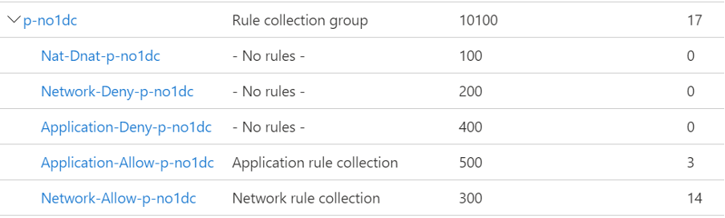

# Workloads

This section of the document will discuss the detailed design for workloads. This document will not discuss every workload design; instead it will provide:

* A skeleton for a standard workload design
* Detailed design for the workloads that will be included as standard

Additional workloads that will be added after the initial delivery will have their own design documentation.

## Standard Workload Design

This section of the document will provide a skeleton for a standard workload design. This is a standard design; it will provide guidance on how to maintain the security, governance, and management of the overall solution, including the components that reside in the workload. However, a standard is not always appropriate. This standard should be considered as a starting point for the design of all workloads and decisions should be made on a per-workload basis within the guidelines provided through the Azure Cloud Framework.

### Infrastructure-as-Code (IaC)

A principal of the overall solution is that workloads are architected, developed, secured, operated, and improved using DevSecOps. The tooling for DevSecOps involves the use of Infrastructure-as-Code.

#### Language

The IaC language that is used for the Azure Cloud Framework and the Virtual Data Centre instances is Azure Resource Manager (ARM) JSON. However, the workloads can be developed using any language - it is necessary that the workload deployments can still integrate with the resources of the Virtual Data Centre instance or that they are a part of and the Azure Cloud Framework.

Innofactor will use Terraform as the standard language for custom workloads that are built after the core deployment.

#### Repository

Each workload will have a dedicated repository. The workload will use the same naming standard as the workload’s Azure subscription. For example, if a workload is called `p-biztlk` *(production BizTalk)* then:

* The **subscription** will be called `p-biztlk`
* The **repository** will be called `p-biztlk`

The repository should have 3 sets of permissions assigned to it:

| Role          | Name                                         | Purpose                                                                                                                                                                                                                                                                                                                                                                                                                                     |
| ------------- | -------------------------------------------- | ------------------------------------------------------------------------------------------------------------------------------------------------------------------------------------------------------------------------------------------------------------------------------------------------------------------------------------------------------------------------------------------------------------------------------------------- |
| Administrator | `AZ RBAC repo <workload name> Administrator` | This group will have full rights over the repository. The membership should be limited to as few people as possible.                                                                                                                                                                                                                                                                                                                        |
| Contributor   | `AZ RBAC repo <workload name> Contributor`   | This group will have enough rights to be able to write code and contribute to the repository. Normal developers, security staff, and operators that make up the workload virtual team should be in this group.                                                                                                                                                                                                                              |
| Reviewer      | `AZ RBAC repo <workload name> Reviewer`      | This group will have the responsibility to review pull requests. This is the team that reviews the workload code (platform and application), including firewall rules, Azure Private DNS Zone records, connections to the hub, and so on. Members should include those with responsibilities for change control, workload architects, central architects, central security, central networking, central compliance, and central governance. |

#### Branches

The code that will be deployed from the repository is stored in the `Main` branch of the repository. The `Main` branch will be protected (read only).

All code engineering must be done through additional “feature” branches. A staff member wishing to edit/contribute code must create a branch in their editing tool (such as VS Code on their device) and edit the code in the branch.

The branch can be committed to the repo. Once all editing is ready for review, a pull request will be made to merge the feature branch to the Main branch. The members of the Review group will have responsibility to review the changes:

* If the changes are acceptable, the pull request is merged, updating the Main branch.
* If the changes are not acceptable, comments are made by the reviewers and the pull request is sent back to the original contributor for update.

#### Pipeline

The code is deployed automatically using a pipeline. The pipeline will using the *Azure DevOps* service connection which authenticates against the Azure tenant using the Service Principal, `[customername]-innofactor-vdc-deploy-app`.

### Azure Firewall Rules

The firewall rules for each workload will be created and edited with the code of the workload.

**Rules** a part of a grouping called a **Rules Collection Group** act as a filter to match traffic patterns, for example, traffic from X to Y using protocol A on port B. 

A **Rules Collection** uses those filters (rules) to apply a specific action (Deny or Allow) to matching traffic.

**Rules Collections** are always deployed as a part of a **Rules Collection Group**. Each workload will have 1 Rules Collection Group; the code for this Rules Collection Group will be in the repository for the workload.

::: tip
The repository design ensures that all attempted changes to firewall rules must be created in a code branch and go through a pull request review by suitably skilled and authorised persons.
:::

### Azure Private DNS Zone Records

A workload may have two kinds of Private DNS records:

* **Active Directory Domain Services (ADDS) DNS**
  
  If a virtual machine is a domain member, it will auto-generate and update DNS records on the DNS servers (ADDS Domain Controllers). The design of the DNS solution will ensure that resources connected to a virtual network will be able to resolve these names. 
  
  No infrastructure-as-code is required to generate the DNS records.

* **Private Link/Private Endpoint**
  
  A resource or workload that is connected to a virtual network using **Private Link** or **Private Endpoint** will require one or more (depending on the resource type) private DNS records. These records should be created in the appropriate **Azure Private DNS zone** in the `p-dns-pri` component of the Azure Cloud Framework. This will enable agile creation/operations of workloads.

The code for the Azure Private DNS Zone resources is controlled by the centrally managed repository for `p-net`.

However, records for the **Azure Private DNS Zones** should be created and maintained in the repository/code for the relevant workload. If a workload called `p-biztlk` requires two Azure Private DNS Zone records, then the code for those records should be in the repository for `p-biztlk`.

::: tip
The repository design ensures that all attempted changes to firewall rules must be created in a code branch and go through a pull request review by suitably skilled and authorised persons.
:::

### Azure Public DNS Zone Records

A workload may require one or more **Azure Public DNS Zone** records. The code for the **Azure Public DNS Zone** resources is controlled by the centrally managed repository for `p-net`.

However, records for the **Azure Public DNS Zones** should be created and maintained in the repository/code for the relevant workload. If a workload called `p-biztlk` requires an **Azure Public DNS Zone** record, then the code for that record should be in the repository for `p-biztlk`.

::: tip
The repository design ensures that all attempted changes to firewall rules must be created in a code branch and go through a pull request review by suitably skilled and authorised persons.
:::

### Hub Connection

A workload may have one or more resources with a Virtual Network Connection. If this is the case then virtual network, termed a spoke, must be connected to the hub of the Virtual Data Centre instance that it is a member of.

A network-connected workload that is an Edge Data Centre does not require a hub connection.

The Virtual Network Connection will be implemented in the code of the workload, stored in the repository of the workload.

The repository design ensures that all attempted changes to Virtual Network Connections must be created in a code branch and go through a pull request review by suitably skilled and authorised persons.

### Subscription Configuration

Each workload shall have its own subscription. If the workload is called p-biztlk then the Azure subscription will be called `p-biztlk`.

The configuration of the subscription is described below.

#### Management Group

All workload subscriptions will reside in one of two Management Groups that are contained within the Management Group for the Virtual Data Centre instance.

Workloads that are Edge Data Centres will reside in the Management Group called Edge Data Centre.

There are two possible locations to place the workload subscription:

* **Production workloads**
  
  All production workloads (prefixed with “p-“) will be placed in the Management Group called `#_datacenter.001.name_# Production Spokes`.

* **Non-production workloads**:
  
  All other workloads will be placed in the Management Group called `#_datacenter.001.name_# Non Production Spokes`.

This approach caters for the fact that production and non-production workloads should have different governance (including Azure Policy, which can be assigned to Management Groups) which will continue to diverge over time.

#### Auditing

The diagnostics settings of the subscription are configured to send the Activity Log data of this subscription to two destinations:

* **Long-term audit logging**: Blob storage in the `p-gov-log` resource group in the `p-gov` subscription that is configured for read only, economic, long-term storage for legal and compliance purposes.
* **Platform monitoring**: A Log Analytics Workspace in the `p-mgt-mon` resource group in the `p-mgt` subscription for query-enabled functionality such as searching, reporting, and security monitoring.

The diagnostics setting for the subscription is configured as follows:

* Logs:
  * Categories:
    * Administrative: `Enabled`
    * Security: `Enabled`
    * ServiceHealth: `Enabled`
    * Alert: `Enabled`
    * Recommendation: `Enabled`
    * Policy: `Enabled`
    * Autoscale: `Enabled`
    * ResourceHealth: `Enabled`
* Destination Details:
  * Send To Log Analytics Workspace: `Enabled`
    * Subscription: `p-mgt`
    * Log Analytics Workspace: `p-mgt-montijczky7je-ws`
  * Archive To Storage Account: `Enabled`
    * Subscription: `p-gov`
    * Storage Account: `pgovlogauditxnlolmbkkxb`

#### Role-Based Access Control

Access to this subscription should be restricted to those supporting and operating the contained components. There are 3 Azure AD access groups to control access to the subscription and the contained resource groups and resources.:

| Group Name                                | Role        | Description                                                                                            |
| ----------------------------------------- | ----------- | ------------------------------------------------------------------------------------------------------ |
| `AZ RBAC sub <workload name> Owner`       | Owners      | Members have full permissions, including permissions. This group is ideally empty.                     |
| `AZ RBAC sub <workload name> Contributor` | Contributor | Members have full permissions, excluding permissions. This group has as few human members as possible. |
| `AZ RBAC sub <workload name> Reader`      | Reader      | Members are limited to read permissions only. Ideally, this is where most human members are placed.    |

#### Resource Groups

The precise Resource Group architecture of a workload depends on the architecture of the workload:

* A workload may require many Resource Groups
* A workload may or may not have a Virtual Network

All workloads will use the name of the workload as the root of their name. The suggested Resource Group design for a workload is as follows:

* **Resource Group**: `<workload name>`
  * Purpose: `The core resources of the workload are placed here.`
* **Resource Group**: `<workload name>-network`
  * Purpose: `The resources for a virtual network are placed here.`
* **Resource Group**: `<workload name>-mon`
  * Purpose: `The resources for monitoring and alerting are placed here.`

::: warning
There are no security groups for the resource groups. Role-based access control is configured at the subscription level, not at the Resource Group level.
:::

#### Monitoring

This section describes the standard configuration for the systems management of the workload.

#### Resource Monitoring

Any IaaS or PaaS resource that provides the ability to configure Diagnostics Settings should be configured as follows:

* **Diagnostics Setting**: `p-mgt-montijczky7je-ws`
  * Purpose: `Send log and performance data for resources to the central platform monitoring Log Analytics Workspace`.
  * Logs: `All Logs`
  * Metrics: `Enabled`
  * Destination Details:
    * Send To Log Analytics Workspace: `Enabled`
* Subscription: `p-mgt`
* Log Analytics Workspace: `p-mgt-montijczky7je-ws`

Any instances of Application Insights should be configured to send data to the application monitoring Log Analytics Workspace, `p-mgt-apmpfdxpugzrb-ws`.

##### Action Groups

Any alerts for a workload may trigger an **Action Group**. General **Action Groups** are in the Platform Monitoring component in `p-mgt-mon`. Action Groups that are specific to the workload are placed in the workload subscription, in the Resource Group called `<workload name>-mon`.

The following Action Groups should exist and be customised as required for the organisation:

* **Action Group**: `<workload name>-mon-budget-ag`
  * Purpose: `Action(s) in response to workload budget alerts`
* **Action Group**: `<workload name>-mon-ops-critical-ag`
  * Purpose: `Action(s) in response to workload critical operations alerts`
* **Action Group**: `<workload name>-mon-ops-error-ag`
  * Purpose: `Action(s) in response to workload error operations alerts`
* **Action Group**: `<workload name> mon-ops-warning-ag`
  * Purpose: `Action(s) in response to workload warning operations alerts`
* **Action Group**: `<workload name>-mon-ops-info-ag`
  * Purpose: `Action(s) in response to workload informational operations alerts`

##### Workbooks

A common desire for a workload is to be able to view essential data about the health and performance of the workload in a central place. Data that is collected by **Azure Monitor** and Log Analytics (platform monitoring in `p-mgt-mon` and application monitoring in `p-mgt-apm`) can be queried and presented through an **Azure Monitor** visualisation called a **Workbook**.

At least one **Workbook** should be created for each workload. The precise design of the workload depends on the architecture, the resource used, the available data, and the desired outputs of the Workbook.

The Workbook resources should be stored in the `<workload name>-mon` Resource Group.

##### Dashboards

A **Dashboard** is a form of resource that appears as a custom background in the Azure Portal. The purpose of a **Dashboard** is to present widgets, referred to as Tiles, that provide some kind of functionality, including but not limited to:

* A pinned shortcut to a resource
* A `KQL` query of Log Analytics
* Pinned Azure Monitor metrics visualisations
* Pinned Workbook visualisations
* Markdown text

Where possible, a Dashboard should be created to aid operations. The Dashboard should be:

* Shared.
* Placed in the `<workload name>-mon` resource group.

The placement of the Dashboard in the above resource group will make it available to all users of the workload.

##### Cost Management

Azure uses the subscription as a logical boundary for many things, including cost management. The Azure subscription is a common boundary for cost management across all Azure offers (MCA, CSP, and so on). Using the Azure subscription as a boundary simplifies cost management - the cost of the subscription is the cost of the workload.

The Cloud is a self-service environment with an operational expenditure model - costs are accrued as resources are used. This is very different to traditional on-premises capital expenditure where it is impossible to use something that is not already purchased and accounted for. For this reason, it is critical that governance includes pro-active cost management.

Each workload subscription should include cost management alerting. The concept is that a workload will have a predefined monthly budget - this figure must be estimated at first, but can be tuned once the workload implementation is tuned by retrieving actual cost figures from Azure Cost Management.

Cost Management alerting is implemented as follows:

At this time, the following configuration must be implemented in the Azure Portal in Cost Management.

* **Budget**: `<workload name>`
  * Purpose: `Provide a budget and alerts for cost management of the workload subscription`
  * Create A Budget:
    * Scope: `<The workload subscription>`
    * Reset Period: `Monthly`
    * Creation Date: `<Today>`
    * Expiration Date: `<As late as Azure allows>`
    * Budget Amount: `<The predefined per-month budget for the workload>`
  * Set Alerts:
    * Alert Conditions:
      * Type: `Actual`
        * % of Budget: `100`
        * Action Group: `<workload name>-mon-budget-ag`
      * Type: `Forecasted`
        * % of Budget: `100`
        * Action Group: `<workload name>-mon-budget-ag`
    * Alert Recipients (Email):
      * `<Email distribution list>`
    * Language Preference:
      * `<Preferred language>`

#### Microsoft Defender for Cloud

Security and compliance features are provided by Microsoft Defender for Cloud. There are two tiers:

* **Free**: Basic features and configurations are possible.
* **Paid**: Special security monitoring features for resources can be enabled per-support resource type.

The configurations for this subscription are configured as follows:

##### Defender Plans

The plans that will be activated will depend on the workload architecture and security classification. The following plans should be considered:

* Defender CSPM: `Off`
* Servers: `If virtual machines are used.`
* App Service: `If Azure App Services are used.`
* Databases: `If SQL Server or Azure databases are used`.
* Storage: `If Storage Account accounts are used.`
* Key Vault: `If Azure Key Vault is used.`
* Resource Manager: `On`.
* DNS: `If the workload is connected to Azure DNS zones`.

##### Auto Provisioning

The deployment of extensions is configured as follows:

* Log Analytics Agent/Azure Monitor Agent: `On`
  * Agent Type: `Log Analytics`
  * Custom Workspace: `p-mgt-montijczky7je-ws`
  * Security Events Storage: `Minimal`
* Vulnerability Assessment for Machines: `Off`
* Guest Configuration Agent: `Off`
* Microsoft Defender for Containers Components: `Off`

##### Email Notifications

Notifications are configured as follows:

* Email Recipients:
  * All Users With The Following Roles: `Owner`, `Contributor`
  * Additional Email Addresses: `A distribution list to be provided`
* Notification Types:
  * Notify About Alerts With The Following Severity (Or Higher): `Medium`

##### Integrations

The following integrations are configured:

* Enable Integrations:
  * Allow Microsoft Defender for Cloud Apps To Access My Data: `True`
  * Allow Microsoft Defender for Endpoint To Access My Data: `True`

##### Integrations

The following integrations are configured:

* Enable Integrations:
  * Allow Microsoft Defender for Cloud Apps To Access My Data: `True`
  * Allow Microsoft Defender for Endpoint To Access My Data: `True`

##### Workflow Automation

No configurations are included.

##### Continuous Export

No configurations are included.

### Fault Tolerance

This section of the document discusses how a workload can be made highly available. The possibilities for fault tolerance will depend upon:

* Business decisions
* Available budget
* Desired availability
* Azure region selection
* Resource type
* Application architecture
* Desired performance levels

#### Disaster Recovery

The concept of disaster recovery is where a workload or an entire footprint (Virtual Data Centre instance) can be lost but restored in another Azure region. With Azure, this can be achieved in two ways:

* **Replication:**
  
  Resources/data are replicated from a production Azure region to a secondary or failover Azure region. This typically results in an active/passive deployment. This approach is typical with legacy workloads hosted on virtual machines.

* **Scale-out:**
  
  Workloads are deployed across resources in different Azure regions in an active/active configuration. All replicas are active and may be used at once, providing capacity, performance, fault tolerance, and disaster recovery.

* **Backup/Restore:**
  
  Disaster recovery usually implies a short time for recovery (recovery time objective or RTO). If the business can sustain a longer outage, then backup/restore can be used to bring back a lost system, although with a significantly larger recovery point objective (data loss since the last backup).

Ideally, additional replicas of a workload will result in new workloads in Virtual Data Centre instances for each workload. For example, virtual machines replicated from a Virtual Data Centre instance called *WE1 (West Europe 1)* in *Azure West Europe* to *Azure North Europe* should result in a new workload in a Virtual Data Centre instance called *NE1 (North Europe 1)*.

Any workloads that require a network connection should be connected to a hub in the local region, therefore a Virtual Data Centre instance is required in that region. This is to comply with the design objective of independence and resilience - a secondary replica workload that has network connections should not depend on the failed hub in the primary region.

Some replica resources must deploy into the same resource group as the primary resources. In these cases, the secondary replicas will be a part of the primary (only) workload.

The following are recommended:

* Technologies such as Traffic Manager or Azure Front Door are used to abstract the Public IP Addresses of workloads with a Disaster Recovery architecture.
* A business continuity plan is created and maintained to describe how the business will respond to a failure.
* A technology focused disaster recovery plan is created. This should include human and technology processes. The plan should be written with the most basic instructions possible, assuming that the reader has little Azure or workload knowledge.
* An automated process for failing over should be created.
* The failover process should always be initiated by a human. The decision makers should be documented in advance.
* Ideally, the failover process should be tested on a regular basis - this is not always possible.

The choice of secondary Azure Region will impact the possible options for disaster recovery design. Many platform resources are limited to replication to the paired region:

* Storage Accounts
* Recovery Services Vaults (Azure Backup)

Replication to a paired region is not always possible. If the paired region is restricted, such as with Azure Norway West, then replication is either pointless (Storage Accounts) or not possible (Recovery Services Vaults).

Replication of resources in a workload should match the pairing of regions. For example, if a workload with virtual machines replicates to a non-paired region, then any data in Storage Accounts or Recovery Services Vaults will be unavailable to the workload after failover - they can only replicated to a paired region, if available to the organisation.

Therefore, the selection of primary regions impacts the possibilities of disaster recovery and should be strongly considered.

#### High Availability

The concept of high availability is where a service can suffer resource outages (failure or scheduled maintenance) and the workload can continue to function.

High availability is typically impossible for classic legacy workloads where the application is restricted to a single compute instance. Modern or cloud-native workloads should be designed with high availability, where compute and data tiers run on multiple instances:

* Availability Sets
* Availability Zones
* Storage Replication

Performance issues may impact this design and require the use of Proximity Placement Groups.

##### Availability Sets

Normally, Availability Sets are considered something that is only used with Virtual Machines. But in reality, all platform resources in Azure are eventually running on virtual machines and Availability Sets are used to achieve a higher level of availability.

All compute instances run on one or more compute clusters. A compute cluster is a cluster of physical virtualisation hosts in a single room, in a single data centre, in a single Azure region.

When more a workload tier has more than one compute instance (such as load balanced web servers) then the compute instances can be assigned to same Availability Set. This ensures that the compute instances are spread across different:

* **Fault domains**: Units of hardware that share single points of hardware failure.
* **Update domains**: Units of hardware that are scheduled to receive updates at the same time.

When a workload tier is configured with Availability Sets, the tier can survive:

* A local failure that affects a single physical host or “rack”.
* A scheduled update that reboots a “slice” of physical hosts across an Azure region

It is strongly recommended that all virtual machines are placed into Availability Sets:

* A workload tier with a single virtual machine should have a dedicated **Availability Set** for the virtual machine. This configuration has no impact on availability or SLA from Microsoft, but allows for later update to the architecture of the tier, subject to the compatibility of the application.
* A workload tier with more than one replica virtual machine should have a dedicated **Availability set** for the tier. This configuration ensures a higher SLA from Microsoft for the virtual machines.

There is no cost for using Availability Sets.

##### Availability Zones

Most Azure regions have been deployed with Availability Zones. The concept is that an organisation has access to 3 independent zones in an Azure region. Each Availability Zone has independent power and networking for the contained data centre(s). The Data Centres in the Availability Zones are physically close to each other offering low network latency. If an Availability Zone goes down, it should have no impact on the other Availability Zones.

A tier of a workload can be spread across the Availability Zones of a region. If there are 3 load-balanced web servers, each replica can be in a different Availability Zone. If two of those data centres burn down, the web service should remain online.

Using Availability Zones can increase the SLA of the Azure resource. Where the workload and the resource types support it, Availability Zones are recommended.

##### Storage Replication

By default, data is typically deployed with Locally Redundant Storage (LRS). With LRS, each block of storage in a data set is stored in with triplicate fault tolerance across a single storage cluster. If that storage cluster, room, or data centre goes offline then the data is offline.

Data can be replicated to other Availability Zones in a region; this is often known as Zone Redundant Storage. Many resource types support ZRS, but this can come with slightly lower write performance, including:

* Managed disks for virtual machines
* Storage Accounts
* Some tiers of Azure SQL

Where possible, and where degraded performance will not impact the workload, ZRS availability should be used to increase availability and SLA for data storage.

##### Proximity Placement Groups

One has limited control over where a resource is placed in Azure; the only control is the use and selection of **Availability Zones**. Even when resources are placed in an **Availability Zone**, the resources can be in different compute clusters or rooms, resulting in increased latency. For most workloads, the resulting latency is not an issue. For extreme workloads, such as high performance computing (HPC) or automated trading, the latency can be fatal.

Virtual machines can be placed into a common **Proximity Placement Group** to ensure low uniform deployment and low latency; note that Accelerated Networking should be enabled on the virtual machine NICs during creation to minimise latency.

**Proximity Placement Groups** are the opposite of **Availability Zones**. The virtual machines will be placed as close together as possible. Host maintenance may result in a Proximity Placement Group becoming unaligned, requiring monitoring and maintenance by the organisation.

### Workload Networking

A workload may have a Virtual Network where it is required:

* Resource requirement: The Azure resource requires it, such as virtual machines.
* Security or compliance requirement: The classification of the workload or data requires the privacy provided by a Virtual Network.

All virtual network resources will be placed into the `<workload name>-network` Resource Group in the workload subscription.

#### The Virtual Network

The workload shall have a virtual network called `<workload name>-network-vnet`. The address space of the virtual network will be sized according to the unique requirements of the workload.

#### Subnets

There will be at least one subnet. The number of subnets is ideally minimised to just:

* **Frontend**:
  
  The resources that are directly accessible to clients outside of the workload should be connected here.
* **Backend**:
  
  All other workloads should be connected here.

The classic on-premises approaches of having one subnet per workload tier is not necessarily required. For example, virtual machines of a common tier can be aggregated into an **Application Security Group** to enable micro-segmentation based on rules in a **Network Security Group**; this flattens and simplifies the Virtual Network design while retaining the same levels of security and isolation.

Some Azure resources will require dedicated subnets if they are connected to a Virtual Network, including:

* App Services regional VNet integration (egress networking from the resource, often used with Private Endpoint)
* App Service Environment
* API Management
* SQL Managed Instance
* Azure Bastion

Dedicated subnets often have other requirements for the subnet affecting the use of Network Security Groups and Route Tables.

Each subnet will be called `<workload name>-network-vnet-<SubnetName>`.

#### Network Security Groups

Every subnet should have a dedicated **Network Security Group (NSG)**. This is a simple form of firewall implemented using Port ACLs, controlling transport protocols (TCP, UDP, ICMP)  with 5-tuple rules.

The use of an NSG will ensure micro-segmentation:

* At the subnet edge
* Between resources connected to the subnet
* Potentially, affecting outbound connections from the subnet

::: tip
Ideally, outbound filtering is performed by the hub firewall. 
:::

The name of the NSG will be `<workload name>-network-vnet-<SubnetName>-nsg`.

The following custom inbound rules will be added to the NSG as a minimum:

* Rule Priority: `4000`
  * Rule Name: `DenyAll`
  * Source: `Any`
  * Source Port Ranges: `*`
  * Destination: `IP Addresses`
  * Destination IP Addresses: `<subnet CIDR>`
  * Service: `Custom`
  * Destination Port Ranges: `*`
  * Protocol: `Any`
  * Action: `Deny`
  * Description: `Deny all other traffic and override the default AllowVnetInBound rule`

The primary purpose of the **DenyAll** rule is to deny traffic from outside of the subnet. The default rule, **AllowVnetInBound**, allows traffic from “**VirtualNetwork**”, which allows all traffic from the Virtual Network, peered networks, networks connected by site-to-site networking, and any network that has a route in the subnet’s route tables in the fabric (not limited to user-defined routes).

The above rule has a secondary purpose: inbound traffic in a subnet also includes traffic from one endpoint in a subnet to another endpoint in the same subnet. **This implements micro-segmentation within the subnet**.

A rule must be configured for each required flow:

* Between sources and destinations inside of the subnet.
* From external sources to destinations inside of the subnet.

Traffic Analytics should be enabled for each NSG resource to enable monitoring and troubleshooting:

* **Storage Account**: `<workloadname>networkdiag<randomstring>`
  * Purpose: `Provides blob storage for NSG Traffic Analytics`
  * Performance: `Standard`
  * Replication: `ZRS`
  * Account Kind: `StorageV2`
* **NSG Flow Log**: `<SubnetName>-flowlog`
  * Purpose: `Enable Traffic Analytics for the subnet`
  * Flow Logs Version: `Version 2`
  * Select Storage Account:
    * Subscription: `<workload subscription>`
    * Storage Account: `<workloadname>networkdiag<randomstring>`
    * Retention (Days): `30`
  * Traffic Analytics: `Enabled`
    * Traffic Analytics Processing Interval: `Every 10 mins`
    * Subscription: `p-mgt`
    * Log Analytics Workspace: `p-mgt-montijczky7je-ws`

#### Virtual Network Connection

The virtual network will be connected to the **Azure Virtual WAN Hub**. The configuration of the Virtual Network Connection will be as follows:

* **Virtual Network Connection**: `<workload Virtual Network name>`
  * Purpose: Connect `<workload name> to the Virtual WAN Hub`
  * Propagate Default Route: `Enabled`
  * Associate Route Table: `Default`
  * Propagate To None: `Yes`

The above configuration will:

* Name the Virtual Network Connection after the workload’s virtual network, for example, `p-biztalk-network-vnet`.
* Connect the spoke to the hub.
* Disable the propagation of the spoke virtual network prefix (None Route Table).
* Advertise the static routes from the **Default Route Table** to the subnet(s) of the spoke virtual network, forcing egress traffic through the **Azure Firewall** in the hub.

#### Routing

The primary purpose of routing in the subnet is to force egress flows through the **Azure Firewall** in the **Azure Virtual WAN Hub**; this configuration is handled by the association of the **Default Route Table** in the **Virtual Network Connection**.

The secondary purpose of routing is to bypass the **Azure Firewall** in the **Azure Virtual WAN Hub** for platform resources that require a unfiltered management/control plane, such as **Azure Managed Instance** or **Azure Bastion**.

Resources such as **Azure Managed Instance** will require a **Route Table** to be associated with the subnet. Such a (subnet) Route Table shall be named `<workload name>-network-vnet-<SubnetName>-rt`.

Resource such as **Azure Bastion** will require a custom Hub Route Table will be named after the workload.

#### Firewall Rules

The firewall rules for a workload are stored in a **Rules Collection Group** that is dedicated to the workload and kept in the repository of the workload.

The name of the **Rules Collection Group** will match the name of the workload. If the workload name is `p-biztalk` then the name of the **Rules Collection Group** will be `p-biztalk`; this naming standard will group and easily identify the firewall rules in **Azure Firewall Manager** for a particular workload.

A **Rules Collection Group** for a workload called `p-no1dc` in Azure Firewall Manager

The **Rules Collection Group** shall have a processing order. Processing orders or priorities from 100 to 9999 are reserved for the parent **Azure Firewall Policy**. The available priorities for workloads are 10000 to 65000. Processing orders should be staggered by 100 to enable easier insertion if required at a later time. For example:

* Workload 1: 10000
* Workload 2: 10100
* Workload 3: 10200
* And so on …

The Rules Collection Group shall be deployed as a sub-resource to the child firewall policy - the Azure Firewall Policy that is associated with the Azure Firewall for the workload’s Virtual Data Centre instance.

The Rules Collection Group will contain at least one Rules Collection:

* **Rules Collection**: `Nat-Dnat-<workload name>`
  * Purpose: `Enable DNAT from The Internet to private IP addresses`
  * Type: `DNAT`
  * Priority: `100`
  * Action: `Allow`
  * Rules Collection Group: `<workload name>`
* **Rules Collection**: `Network-Deny-<workload name>`
  * Purpose: `Create specific overrides for rules in Network-Allow-<workload name>`
  * Type: `Network`
  * Priority: `200`
  * Action: `Deny`
  * Rules Collection Group: `<workload name>`
* **Rules Collection**: `Network-Allow-<workload name>`
  * Purpose: `Allow TCP, UDP ICMP flows.`
  * Type: `Network`
  * Priority: `300`
  * Action: `Allow`
  * Rules Collection Group: `<workload name>`
* **Rules Collection**: `Application-Deny-<workload name>`
  * Purpose: `Create specific overrides for rules in Application-Allow-<workload name>`
  * Type: `Application`
  * Priority: `400`
  * Action: `Deny`
  * Rules Collection Group: `<workload name>`
* **Rules Collection**: `Application-Allow-<workload name>`
  * Purpose: `Allow outbound flows to HTTP/HTTPS/SQL Server`
  * Type: `Application`
  * Priority: `500`
  * Action: `Allow`
  * Rules Collection Group: `<workload name>`

#### DNS

The Virtual Network will use the IP Address of the firewall as the DNS server. This will enable resolution of names from:

* Azure Private DNS zones
* The Internet
* DNS servers in the Virtual Data Centre instance which, depending on the configuration, will enable resolution of ADDS domain members and on-premises FQDNs.

If the workload is connecting PaaS resources to virtual networks using **Private Endpoint**, then the workload should follow Microsoft instructions for the resource type to create the required DNS records. Those DNS records will be created in the zones hosted in the **Azure Private DNS Zones** component in `p-dns-pri`.

#### Azure Bastion

The secure way to remotely sign into Azure virtual machines (Windows or Linux) is to use **Azure Bastion**. There is an **Azure Bastion** in the hub and this will be the primary method to sign in.

If a workload has a security or compliance issue with using a shared Azure Bastion then a dedicated Azure Bastion resource may be added to the workload.

### Configuration Management

This section describes how the following will be done for virtual machines - if there are virtual machines in the workload.

#### Update Management

Virtual machines must be associated with the **Azure Automation Update Management** service provided by `p-mgt-auto`.

A suitable deployment schedule should be identified and associated with the virtual machines. A number of schedules are included in `p-mgt-auto`. If other deployment schedules are required, then `p-mgt-auto` should be expanded.

### Backup

Backup is required for data and virtual machines. Azure Backup can provide backup for:

* Azure virtual machines (Windows or Linux)
* SQL Server in Azure virtual machines
* Azure Storage Accounts - Files
* Azure Storage Account - Blob
* SAP HANA in Azure virtual machines

When **Azure Backup** is going to be used, the **Recovery Services Vault (RSV)** will be deployed into the same resource group as the resource being protected. The Recovery Services Vault will be called `<resource group name><randomstring>-rsv`.

One or more backup policies will be created in the **Recovery Services Vault (RSV)** to schedule backups and describe retention.

Other resource types also feature native backup solutions, including:

* Azure SQL Database
* Azure SQL Managed Instance
* Azure Cosmos DB
* Azure Database for PostgreSQL
* Azure Database for MySQL

The backup policy/policies for those resources/data should be configured with those resources.

The backup scheduling and retention policy should be dictated by an organisation backup policy document. The workload should be classified, and the classification should dictate how the backup policy will be configured.

### Cost Optimisation

Cost optimisation should be scheduled for a workload 2-4 weeks after going live. The performance data and information from Azure Recommendations will provide guidance on whether tuning is required.

Cost optimisation will include actions such as:

1. Review resource performance data.
1. Resize workloads and review the impact.
   * Repeat as required
1. Purchase “reserved instances” for possible resources that are running 24 * 7.

The use of reserved instances will minimise spending for resources that are always running by committing to use the resources for 1 year (some savings) or 3 years (most savings).

This is a simplification of the reserved instance concept but it is still correct.

