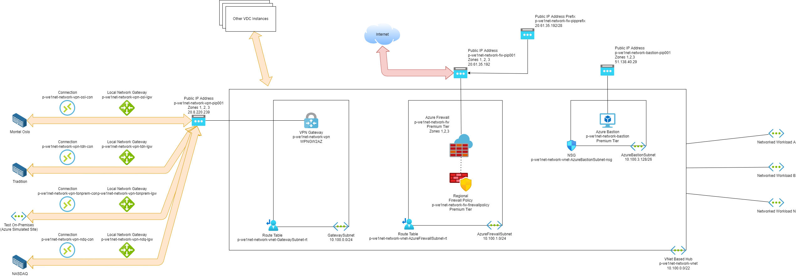

# p-we1net Subscription

This workload subscription hosts the network hub of the WE1 Virtual Data Centre (VDC) instance.

## High-Level Design

### Concept

A VDC Instance is based on a hub-and-spoke architecture. The hub is the network core providing connectivity to the external world. Spokes networks that are connected to the hub, using virtual network peering, and host network-connected workloads or resources.

The hub provides:

* VPN Gateway for site-to-site networking over a private and encrypted VPN connection.
* A firewall to control and inspect traffic:
  * **From connected sites**: Preventing attacks from remote PCs or servers.
  * **To connected sites**: Preventing attacks or data leakage to remote PCs or servers.
  * **From the Internet**: Non-web services can optionally be shared on the Internet through the firewall.
  * **To the Internet**: Preventing remote control by attackers, unwanted downloads from the Internet, and data leakage.
  * **Between spokes**: Reducing the size of blast areas should one spoke become compromised.
* A solution for RDP and SSH to virtual machines: Enabling secure RDP and SSH without exposing virtual machines or appliances directly.

A number of resources to support the Function App are deployed:

* **Azure Bastion**: Azure Bastion provides a secure RDP/SSH solution for Azure virtual machiens and virtual appliances.
* **Azure Firewall**: Azure Firewall is used as the hub firewall.
  * **Child Firewall Policy**: A firewall policy (Azure Firewall Manager) is associated with the Azure Firewall.
    * Inherits global settings and rules from the parent Azure Firewall Policy in p-net.
    * Configures the unique settings and rules for WE1 and workloads in WE1.
  * **IP Prefix**: A reserved /28 public IP address prefix to create up to 16 IP addresses for the Azure Firewall for DNAT (inbound) and SNAT (outbound).
* **The virtual network**: The virtual network of the hub.
  * **Network Security Group**: An NSG for the AzureBastionSubnet.
  * **Route Tables**: Enabling user-defined routing for the GatewaySubnet and the AzureFirewallSubnet.
* **VPN Gateway** Used to enable private and encrypted VPN connections to remote locations. Support for NAT is required and the minimum spec in VPNGW2/VPNGW2AZ.
* **Diagnostics Storage Account**: Stores logs with data to be ingested by Log Analytics.

### Network Architecture

The design for the hub is illustrated below:

The logical functions of the network are described below:

#### GatewaySubnet

It is the goal that all private site-to-site connectivity with WE1 should be terminated in the GatewaySubnet - exceptions may exist (ICE) for architectural reasons. Ingress traffic is routed to the Azure Firewall for control and inspection. Every networked workload is deployed in a spoke that is peered with the hub. Each spoke is a virtual network with a unique set of one or more IP prefix(es) in the /16 address space that is assigned to WE1. A route to each spoke is created in the GatewaySubnet to override the default route which directs ingress traffic to the peered spoke - the next hop of each spoke route is the private IP address of the firewall.

The Public IP address is deployed across three availability zones. The Gateway(s) are deployed zone redundant resources.

#### AzureFirewallSubnet

The Azure Firewall is the security and connectivity hub of the WE1 hub-and-spoke architecture. Each subnet in the spokes uses the firewall as the next hop for traffic leaving the spoke virtual network. This will ensure that the firewall controls and inspects all flows leaving a spoke:

* On-premises
* The Internet, including Azure
* Other spokes
* Other potential peered VDC instances

The Azure Firewall is capable of publishing services to the Internet using DNAT (web services should typically be published using the Web Application Firewall in p-we1waf). A NAT rule is used to publish services using one or more public IP addresses assigned to the Azure Firewall. All traffic leaving WE1 for the Internet will, by default, exist through the public IP address(es) of the Azure Firewall (a process called SNAT, using round robin selection of the public IP address). A single public IP address has a limited pool of SNAT ports. Should SNAT port exhaustion occur or overlapping NAT rules are required, additional IP addresses can be created from the IP Prefix. Any firewall rules being created for the public IP address of the WE1 firewall should use the address of the public IP prefix.

The Azure Firewall will force traffic with public IP address destinations to the Internet. Some of these destinations must route via ExpressRoute or VPN connections instead. In this case, additional non_RFS-1918 addresses will be added to the Azure Firewall, instructing the firewall to route them via the private IP address instead.

Some services exist on connections reached via connections outside of WE1. In this case, user-defined routes are added to a route table that is associated with the AzureFirewallSubnet.

The public IP address(es) and the firewall are deployed across three availability zones.

#### AzureBastionSubnet

Azure Bastion is deployed in the hub, following guidance from Microsoft for a hub-and-spoke architecture. A Network Security Group (NSG) limits traffic into and out of the Azure Bastion. Traffic from the Bastion must flow directly to virtual machines in the spoke virtual networks without flowing through the hub firewall, following Microsoft requirements for routing in this scenario (a route table to control flows is not permitted in the AzureBastionSubnet).

The Public IP address is deployed across three availability zones.

### Connections

The following external connections are present:

#### Test On-Premises (t-onprem)

A simulated remote location is created called t-onprem (test on-premises). A VPN connection with BGP support enables end-to-end validation that all elements of connectivity are working, without access to any physical locations. The resources for the simulated remote site are the in the t-onprem Azure subscription.

#### Montel Oslo

A VPN connection is configured to the Montel Holbergs Gate 1 office in Oslo. Static routes (not BGP) are configured in the Local Network Gateway. A custom IKE Policy is configured to match the VPN configuration of the on-premises firewall.

#### Montel AI

Another company in the Montel Group, Montel AI, connects to services in WE1 via the Montel Oslo VPN connection. Those services use public IP addresses over the private VPN connection. To enable communications, those Montel AI addresses are added as private SNAT IP addresses to the Azure Firewall, overriding default routing to the Internet.

#### ICE

A connection with ICE requires:

* **An ExpressRoute circuit**: Currently deployed in the legacy Ironstone-CSP-Montel-Hub subscription.
* **NAT**: A NAT rule must translate traffic from a frontend address (assigned by ICE) to a backend address of an Azure resource in WE1.

ICE provides services on this privately accessed public IP addresses:

* 156.48.15.25/32
* 156.48.15.26/32
* 156.48.15.23/32
* 156.48.15.24/32

A legacy hub was deployed in the legacy Ironstone-CSP-Montel-Hub subscription to handle this scenario:

* An ExpressRoute Gateway to connect to the ICE via an ExpressRoute circuit.
* A Palo Alto firewall to implement NAT using a frontend subnet (the ICE-assigned address) and a backend subnet (that connects to WE1 resources).

The WE1 hub is peered with the virtual network, vnet-h-weu-transit. In addition, routes for the ICE service prefixes are added to the AzureFirewallSubnet route table to redirect traffic destined to ICE to a Palo Alto firewall in the legacy virtual network.

A route table was added to each subnet in vnet-h-weu-transit. A user-defined route was added to the route tables - all traffic to the /16 IP prefix of WE1 will use the Azure Firewall in the WE1 hub as the next hop.

#### Deutsche Börse

Deutsche Börse provides data to Montel over a private VPN connection. Deutsche Börse has two requirements:

1. A Cisco appliance is used on the Montel side: A virtual appliance can be supported with custom engineering.
2. GRE is used on the Montel public IP address: This is not supported by Microsoft Azure.

Services provided by Deutsche Börse are shared on the following prefixes:

* 91.251.33.10/32
* 91.251.33.11/32
* 91.251.33.13/32
* 91.251.33.14/32
* 91.251.34.10/32
* 91.251.34.11/32
* 91.251.34.13/32
* 91.251.34.14/32

The interim solution is that a Cisco appliance is deployed in the Montel office in Oslo. A VPN connection exists between Deutsche Börse and the Montel office in Oslo. The Cisco appliance routes to/from the Palo Alto firewall in the Montel office. Traffic to/from Deutsche Börse relays through the VPN connection between the Montel office in Oslo and WE1.

To support this the prefixes for Deutsche Börse are added as:

1. Private SNAT IP ranges in the WE1 Azure Firewall.
2. Address spaces in the Local Network Gateway of the Montel Office VPN connection.

A future solution will redeploy the Cisco appliance to one of three locations and enabling a direct VPN connection from the appliance to WE1 to relay the traffic independently of the Montel office in Oslo:

1. A physical appliance in an Oslo data centre, enabling easy access. Latency between Deutsche Börse (Frankfurt, Germany) and WE1 (Middenmeer, Netherlands) will include the indirect hop to the Montel office in Oslo.
2. A physical appliance in a data centre in Frankurt or near Middenmeer. Latency will be lowered by placing the Cisco appliance "in the path" between Deutsche Börse and WE1. However, maintenance of the appliance will require travel or a support agreement with the hosting company.
3. A virtual appliance in AWS Frankfurt. Latency will be lowered by placing the Cisco appliance close to Deutsche Börse. This will require additional cloud skills and an agreement with support (AWS).

#### Tradition

Tradition provides data to Montel over a private VPN connection with the VPN Gateway in the WE1 hub. This connection uses:

* A custom IKE policy in the Connection to match the firewall requirements of Tradition.
* Static routes in the Local Network Gateway to the IP addresses of the Tradition services.
* A NAT rule in the VPN Gateway.

The Tradition services are shared on the following address prefixes:

* 94.142.185.215/32
* 94.142.185.216/32

Montel uses the external NAT address of 129.212.80.80/32 on port 21003.

#### NASDAQ *(To Be Deployed)*

The requirements of this connection have not been confirmed. It is expected that there will be a VPN connection from the VPN Gateway in the WE1 hub.

### Operations

#### Code Deployment

All code for the component is stored in the p-we1net repo in Azure DevOps. A pipeline, called p-we1net, deploys the code to the Azure subscription, p-we1net.

### Security

Role-based access control will limit who can see the resources of this workload and who can access them.

Microsoft Defender for Cloud is configured with:

* All plans enabled
* Alerts to be sent to a specified email address
* Logs to be sent to Log Analytics

An Azure Key Vault will store secrets for the workload, including the default administrator username and password for virtual machines in this workload. The Key Vault is connected to the virtual network using a Private Endpoint.

Access to this subscription should be restricted to those supporting and operating the contained components. There are 3 Azure AD access groups to control access to the subscription and the contained resource groups and resources:

| Group Name                         | Role        | Description                                                                                                     |
| ---------------------------------- | ----------- | --------------------------------------------------------------------------------------------------------------- |
| `AZ RBAC sub p-we1net Owner`       | Owners      | Members have full permissions, including permissions & policy. This group is ideally empty.                     |
| `AZ RBAC sub p-we1net Contributor` | Contributor | Members have full permissions, excluding permissions & policy. This group has as few human members as possible. |
| `AZ RBAC sub p-we1net Reader`      | Reader      | Members are limited to read permissions only. Ideally, this is where most human members are placed.             |

### Governance

A budget for the workload is configured and alerts are be enabled.

Auditing of the subscription is enabled for short-term (usable) and long-term (compliance) purposes.

## Detailed Design

The detailed design for the workload is contained in Terraform code which is stored in the p-we1net repo in Azure DevOps.
