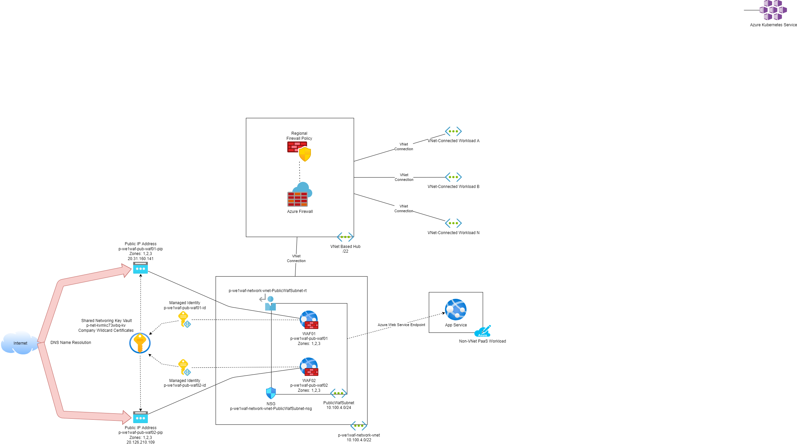

# p-we1waf Subscription

This subscription hosts the shared Web Application Firewalls (WAFs) of the WE1 Virtual Data Centre (VDC) instance.

## High-Level Design

### Concept

An Application Gateway provides a way to share HTTP/HTTPS applications on the Internet. A regional WAF can be enabled on the Application Gateway to inspect the traffic for threats. The use of a central WAF ensures that there is limited usage of public IP addresses and controls ingress into the VDC instance networks.

The Application Gateway is a reverse proxy:

* DNS names for applications shared by the application gateway resolve to the public IP address of the Application Gateway.
* A routing rule is created for each application:
  * A backend pool defines the web server(s).
  * A backend setting configures how the Application Gateway will communicate with the member(s) of the backend pool. This includes an optional health probe to test instances of the backend pool for application availability (also useful for troubleshooting).
  * A listener is configured to listen to requests for a particular hostname.
  * Redirects can optionally be used to forward requests to a different destination. For example, traffic received by a HTTP listener can redirect to a HTTPS listener.
* SSL can be terminated by the Application Gateway in the Listener to offload CPU from the backend.
* Traffic can be re-encrypted between the Application Gateway and the backend - configured in the backend settings. Note that HTTP traffic to all backend types can be inspected by a firewall IDPS feature - the backend must support HTTP traffic to support this design.

The Web Application Firewall (WAF_v2) add security functionality to the Application Gateway. There are two possible rulesets:

* **OWASP**: Version 3.2 is selected.
* **Microsoft Bot Net**: This ruleset is disabled because of frequent false positives that created very expensive logs.

There are two tiers of WAF policy to configure security settings:

* A "global" WAF Policy is associated with the WAF to configure settings that will apply to all applications. The OWASP rules are disabled to prevent double inspection.
* A "workload" WAF Policy is created for each workload. The workload policy is associated with the listeners of the workload. All OWASP rules are enabled by default. False positives for a workload can be eliminated by doing any of the following in a single workload policy:
  * Creating custom rules, which bypass all inspection by the OWASP ruleset.
  * Disabling individual OWASP rules, which prevents inspection of that type for all requests to the listeners associated with the workload policy.
  * Creating exclusions, which disables inspection by selected rules for particular parts of requests.

A WAF policy has two modes:

* **Detection**: The Detection mode creates log entries for detected issues but does not block traffic. This mode is recommended for a new/migrated workload to detect false positives.
* **Prevention**: The Prevention mode blocks requests when issues are detected and logs the issues. This mode is recommended after false positives have been filtered out.

### WAF Deployments

There are two WAFs:

* WAF01:
  * Purpose: Sharing the "big 3" workloads:
    * Montel Online
    * XL Feeder
    * Montel Web API
  * Scaling:
    * Manual: 5 instances
* WAF02:
  * Purpose: Everything else
  * Scaling: 2 instances

### Resources

A number of resources to support the Function App are deployed:

* **WAF01**: p-we1waf-pub-waf01
  *  **WAF01 Managed Identity**: p-we1waf-pub-waf01
  *  **WAF01 Public IP Address**: p-we1waf-pub-waf01-pip
  *  **WAF01 Global WAF Policy**: pwe1wafpubwaf01policy
  *  **WAF01 Workload WAF Policies**: p-we1waf-pub-waf01-X-XXXXXX-waf - one per workload, assigned to the listener(s) of the workload.
* **WAF02**: p-we1waf-pub-waf02
  *  **WAF02 Managed Identity**: p-we1waf-pub-waf02
  *  **WAF02 Public IP Address**: p-we1waf-pub-waf02-pip
  *  **WAF02 Global WAF Policy**: pwe1wafpubwaf02policy
  *  **WAF02 Workload WAF Policies**: p-we1waf-pub-waf02-X-XXXXXX-waf - one per workload, assigned to the listener(s) of the workload.

### Network Architecture

The design for the hub is illustrated below:

Each WAF is placed in the PublicWafSubnet of the virtual network. Each WAF consumes IP addresses as follows:

* 1 per WAF for the load balancer.
* 1 per instance in the WAF.

Each WAF has a public IP address. The DNS record of any application shared by a WAF should resolve to the IP address of the WAF, either directly (A record) or indirectly (CNAME record, Azure Traffic Manager, Azure Front Door, or some other service).

The PublicWafSubnet has a Network Security Group (NSG) to limit traffic to the subnet. Only HTTP, HTTPS and Azure-required traffic is allowed.

Service endpoints are enabled in the PublicWafSubnet to allow private communications to:

* Azure Key Vault
* Azure Storage Accounts
* Azure App Services

The PublicWafSubnet route table configures two user-defined routes:

1. Everywhere: Force all traffic to 0.0.0.0/0 to Internet.
2. WE1: Force all traffic to the address space(es) of the VDC instance to use the hub firewall as the next hop.

Communications via virtual network to backend pools will require:

1. A firewall rule in the hub firewall (network rule in Azure Firewall).
2. A NSG rule for the spoke subnet.
3. Potentially an access rule in a PaaS resource.

### Operations

#### Code Deployment

All code for the component is stored in the p-we1waf repo in Azure DevOps. A pipeline, called p-we1waf, deploys the code to the Azure subscription, p-we1waf.

*Note: Deployments to WAF01 should be scheduled for out-of-hours operations. This is because the workloads on WAF01 are based on WebSockets - an update will result in a data plane reset which will terminate existing WebSocket connections. A data plane reset can be deferred by up to 15 minutes but this is not enough for the affected Montel workloads.*

### Security

#### Role-Based Access Control

Role-based access control will limit who can see the resources of this workload and who can access them.

Microsoft Defender for Cloud is configured with:

* All plans enabled
* Alerts to be sent to a specified email address
* Logs to be sent to Log Analytics

An Azure Key Vault will store secrets for the workload, including the default administrator username and password for virtual machines in this workload. The Key Vault is connected to the virtual network using a Private Endpoint.

Access to this subscription should be restricted to those supporting and operating the contained components. There are 3 Azure AD access groups to control access to the subscription and the contained resource groups and resources:

| Group Name                         | Role        | Description                                                                                                     |
| ---------------------------------- | ----------- | --------------------------------------------------------------------------------------------------------------- |
| `AZ RBAC sub p-we1waf Owner`       | Owners      | Members have full permissions, including permissions & policy. This group is ideally empty.                     |
| `AZ RBAC sub p-we1waf Contributor` | Contributor | Members have full permissions, excluding permissions & policy. This group has as few human members as possible. |
| `AZ RBAC sub p-we1waf Reader`      | Reader      | Members are limited to read permissions only. Ideally, this is where most human members are placed.             |

#### SSL Certificates

The Application Gateway performs SSL Termination for HTTPS applications. The Application Gateway requires access to the private/server certificates for the web applications. Each WAF has an Azure Managed Identity. This identity will require Secrets:[Get,List] permissions to any Key Vault storing the certificate(s). There are two possible Key Vaults:

* **The shared network Key Vault**: Company wildcard certificates should be stored in the Key Vault, p-net-kvmkc73wbq-kv in the p-net subscription.
* **Workload Key Vault**: If a workload has a dedicated certificate, then the certificate should be stored in a Key Vault that is a resource in the workload deployment.

The WAF may optionally re-encrypt traffic to the backend pool - this is controlled by:

* The configuration of backend pool
* The Listener for the workload application in the Application Gateway

Re-encrypting the traffic prevents IDPS inspection.

#### IDPS

The firewall in the hub is capable of Intrusion Detection and Prevention (IDPS). This additional scanning at the network level enables the detection of attacks between the WAF and the backend pool. Note that this can be useful when OWASP rules must be disabled to prevent false-positive alerts, such as for SQL Injection attacks.

If traffic from the WAF to the backend pool is encrypted, then IDPS is not possible:

* There is no PKI to create the necessary certificate on the firewall.
* It is impossible to create trust for a custom certificate on PaaS resources.

Traffic from the WAF to the backend pools is on a private virtual network. There is no need for re-encryption:

* Unless there are compliance requirements, such as PCI-DSS or the transmission of health data.
* The backends can be configured to allow HTTP, although this does impact the Azure Secure Score.

### Governance

A budget for the workload is configured and alerts are be enabled.

Auditing of the subscription is enabled for short-term (usable) and long-term (compliance) purposes.

## Detailed Design

The detailed design for the workload is contained in Terraform code which is stored in the p-we1waf repo in Azure DevOps.
